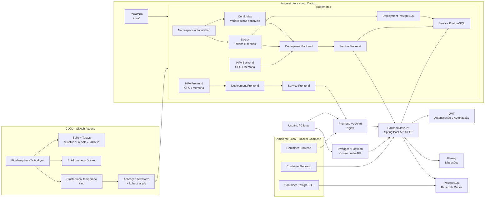

# AutoCare Hub

## Tech Challenge FIAP — Fase 2

AutoCare Hub é uma solução acadêmica para gestão de oficina mecânica. O projeto centraliza o cadastro de clientes,
veículos, serviços, peças, estoque e Ordens de Serviço, permitindo que a oficina registre uma OS, gere orçamento,
aprove o atendimento e acompanhe o fluxo operacional pela API.

Na Fase 1, o projeto entregou um MVP backend em Java/Spring Boot com API REST, autenticação JWT, persistência em
PostgreSQL, migrações Flyway, Swagger/OpenAPI, Docker, testes automatizados, cobertura JaCoCo e evidências de
segurança. O feedback da fase indicou que a documentação da API já estava detalhada no OpenAPI/Swagger, mas que o
README precisava trazer exemplos mais diretos de uso.

Na Fase 2, o projeto evolui para qualidade, escalabilidade, resiliência, automação e deploy. O objetivo é preparar a
aplicação para Clean Architecture ou Arquitetura Hexagonal, revisar Docker, adicionar Kubernetes, Terraform, CI/CD,
deploy automatizado, escalabilidade automática e documentação atualizada.

O repositório também inclui um frontend demonstrativo em Vue/Vite em [frontend/](frontend/). Ele não substitui a API,
mas torna o produto mais visual e palpável, mostrando como pessoas e empresas poderiam consumir os fluxos do backend.

## Objetivos da Fase 2

- Refatorar pontos do código com Clean Code.
- Consolidar Clean Architecture ou Arquitetura Hexagonal.
- Melhorar testes unitários, integração e fluxo de API.
- Revisar Dockerfile e Docker Compose.
- Criar manifestos Kubernetes.
- Criar scripts Terraform.
- Evoluir CI/CD para build, testes, imagem Docker e deploy.
- Preparar escalabilidade automática, incluindo HPA no Kubernetes.
- Automatizar deploy da aplicação e aplicação dos manifests.
- Ajustar APIs conforme roteiro da Fase 2, sem quebrar o contrato existente sem necessidade.

## Funcionalidades principais

### Funcionalidades da Fase 1

- Clientes.
- Veículos.
- Serviços.
- Peças e insumos.
- Controle de estoque.
- Criação de Ordem de Serviço.
- Geração e aprovação de orçamento.
- Acompanhamento da Ordem de Serviço.
- Autenticação e autorização com JWT.
- Swagger/OpenAPI.

### Evoluções da Fase 2

- Abertura de OS retornando identificador único: já existe no fluxo `POST /api/v1/service-orders`.
- Consulta de status da OS: já existe via `GET /api/v1/service-orders/{serviceOrderId}` e tracking.
- Endpoint de aprovação de orçamento: já existe em `POST /api/v1/service-orders/{serviceOrderId}/budget/approve`.
- Endpoints explícitos de aprovação e recusa de orçamento por notificação externa em `POST /api/v1/service-orders/{serviceOrderId}/budget/external-approval` e `POST /api/v1/service-orders/{serviceOrderId}/budget/external-rejection`.
- Listagem de OS ordenada por prioridade/status e data.
- Exclusão lógica da listagem principal de OS finalizadas e entregues.
- Atualização de status via ferramenta externa, como email, em `POST /api/v1/service-orders/{serviceOrderId}/status/external`.
- Preparação para Kubernetes, Terraform e CI/CD de deploy.

## Arquitetura da aplicação

O backend atual é um monolito Spring Boot organizado com Arquitetura Hexagonal/Clean Architecture: `domain` concentra
modelos e regras, `application` orquestra casos de uso e portas, `infrastructure` implementa adaptadores de persistência
é segurança, e `interfaces` adapta o contrato REST/OpenAPI para a aplicação.

Na refatoração da Fase 2, regras de gestão de usuários foram removidas do `UsersController` e movidas para casos de uso
é política de aplicação. A autenticação e o hash de senhas também passaram a depender das portas
`AuthenticationGateway` e `PasswordHasher`, implementadas por adaptadores em `infrastructure/security`, evitando
dependência direta de Spring Security nos casos de uso.

Arquitetura atual:

- Backend monolitico Java/Spring Boot.
- Banco de dados PostgreSQL.
- Migrações com Flyway.
- API REST documentada por Swagger/OpenAPI.
- Autenticação JWT.
- Frontend demonstrativo Vue/Vite.
- Dockerfile e Docker Compose para execução local.
- Pipeline GitHub Actions de qualidade, testes, build frontend e build Docker.

Arquitetura consolidada na Fase 2:

- Clean Architecture/Hexagonal Architecture dentro do monolito.
- Domínio independente de frameworks sempre que possível.
- Camada de aplicação com casos de uso e portas.
- Infraestrutura com adaptadores de banco, segurança e integrações externas.
- Interfaces REST e futuras entradas externas desacopladas da regra de negócio.
- Kubernetes para deploy, Services, ConfigMaps, Secrets e HPA.
- Terraform para provisionamento da infraestrutura.
- CI/CD com build, testes, imagem Docker e deploy automatizado.

Desenho da arquitetura:

[docs/architecture/PHASE2_ARCHITECTURE.md](docs/architecture/PHASE2_ARCHITECTURE.md)

O desenho contempla os três pontos pedidos na Fase 2:

- Componentes da aplicação: frontend demonstrativo, API backend e PostgreSQL.
- Infraestrutura provisionada: Docker local, Kubernetes, ConfigMap, Secret, Deployments, Services, HPAs e Terraform.
- Fluxo de deploy: GitHub Actions cria cluster `kind`, carrega imagens, executa Terraform e aplica manifests.



Documentação detalhada:

- [docs/architecture/ARCHITECTURE.md](docs/architecture/ARCHITECTURE.md)
- [docs/domain/DDD_DOCUMENTATION.md](docs/domain/DDD_DOCUMENTATION.md)
- [docs/domain/EVENT_STORMING.md](docs/domain/EVENT_STORMING.md)
- [docs/architecture/TECHNICAL_REFINEMENT.md](docs/architecture/TECHNICAL_REFINEMENT.md)

## Estrutura de pastas

```text
.
|-- backend/                        # API Spring Boot monolitica modular
|   |-- pom.xml
|   `-- src/
|       |-- main/java/              # Código backend
|       |-- main/resources/         # Configuração, Flyway e assets estáticos
|       `-- test/java/              # Testes unitários e de integração
|-- frontend/                       # Frontend demonstrativo Vue/Vite
|   |-- Dockerfile                  # Dockerfile frontend
|   `-- src/
|-- k8s/                            # Manifests Kubernetes exigidos na Fase 2
|-- docs/
|   |-- README.md                   # Guia da documentação
|   |-- api/                        # OpenAPI e Postman
|   |-- architecture/               # Arquitetura e desenho técnico
|   |-- delivery/                   # Entrega, roteiro e evidências da fase
|   |-- domain/                     # DDD, requisitos e modelagem
|   |-- security/                   # Segurança e scans
|   `-- testing/                    # Testes e análise estática
|-- infra/
|   |-- main.tf                     # Terraform local/acadêmico da Fase 2
|   |-- variables.tf
|   |-- outputs.tf
|   |-- versions.tf
|   `-- README.md
|-- security-reports/               # Evidências de segurança versionadas
|-- scripts/                        # Scripts auxiliares de validação
|-- .github/workflows/
|   |-- quality.yml                 # Pipeline de qualidade complementar
|   |-- qodana_code_quality.yml     # Análise estática complementar
|   `-- phase2-ci-cd.yml            # Pipeline principal da Fase 2
|-- Dockerfile                       # Dockerfile backend para comandos pela raiz
|-- docker-compose.yml               # Compose local exigido na Fase 2
|-- .env.example                     # Template local sem secrets reais
`-- README.md
```

## Tecnologias utilizadas

- Java 21.
- Spring Boot.
- Spring Web MVC.
- Spring Security.
- Spring Data JPA.
- Maven.
- PostgreSQL 16.
- Flyway.
- Docker.
- Docker Compose.
- Swagger/OpenAPI com Springdoc.
- JWT com JJWT.
- JUnit 5, Mockito, MockMvc e H2.
- JaCoCo.
- OWASP Dependency-Check.
- Spotless.
- Vue 3, Vite, Pinia, Vue Router e Lucide Vue no frontend demonstrativo.
- ESLint no frontend.
- GitHub Actions para pipeline de qualidade.
- Kubernetes.
- Terraform.
- CI/CD de deploy com GitHub Actions.

## Pré-requisitos

- Java 21.
- Maven.
- Docker.
- Docker Compose.
- Node.js 22 ou versão compatível com o frontend.
- npm.
- kubectl.
- Terraform.
- GitHub Actions como ferramenta atual de CI/CD.

## Variáveis de ambiente

Copie os arquivos de exemplo antes de rodar localmente:

```bash
cp .env.example .env
cp frontend/.env.example frontend/.env
```

No PowerShell:

```powershell
Copy-Item .env.example .env
Copy-Item frontend/.env.example frontend/.env
```

Não versione o `.env` real. Ele deve conter valores locais ou de ambiente seguro.

Variáveis principais do backend:

| Variável                   | Objetivo                                                                                          |
|----------------------------|---------------------------------------------------------------------------------------------------|
| `POSTGRES_DB`              | Nome do banco local.                                                                              |
| `POSTGRES_USER`            | Usuário do PostgreSQL.                                                                            |
| `POSTGRES_PASSWORD`        | Senha local do PostgreSQL.                                                                        |
| `POSTGRES_PORT`            | Porta exposta do PostgreSQL.                                                                      |
| `APP_PORT`                 | Porta da API no Docker Compose.                                                                   |
| `FRONTEND_PORT`            | Porta do frontend no Docker Compose.                                                              |
| `JWT_SECRET`               | Segredo usado para assinar tokens JWT.                                                            |
| `JWT_EXPIRATION_MINUTES`   | Tempo de expiração do token.                                                                      |
| `EXTERNAL_SERVICE_TOKEN`   | Token compartilhado exigido no header `X-External-Service-Token` dos webhooks externos simulados. |
| `APP_CORS_ALLOWED_ORIGINS` | Origens liberadas no CORS.                                                                        |
| `DB_URL`                   | URL JDBC usada ao rodar o backend fora do container.                                              |
| `DB_USERNAME`              | Usuário do banco ao rodar com Maven.                                                              |
| `DB_PASSWORD`              | Senha do banco ao rodar com Maven.                                                                |

Variáveis principais do frontend:

| Variável             | Objetivo                                                      |
|----------------------|---------------------------------------------------------------|
| `VITE_API_BASE_URL`  | URL da API. Pode ficar vazia para usar o proxy do Vite/Nginx. |
| `VITE_DEMO_PASSWORD` | Senha demonstrativa opcional para a interface.                |

## Como rodar localmente com Docker

O projeto pode ser iniciado inteiro com um único comando a partir da raiz:

```powershell
.\scripts\start-local.ps1 -Rebuild -Reset
```

Esse comando usa `.env`, remove containers antigos do próprio projeto se existirem, sobe PostgreSQL,
backend e frontend, e mostra o estado dos containers ao final.
O arquivo local já pode existir com seus valores pessoais; caso ele não exista, o script cria uma cópia a partir de
`.env.example`.

Para acompanhar os logs depois de subir:

```powershell
.\scripts\start-local.ps1 -FollowLogs
```

Comandos úteis de limpeza e acompanhamento:

```powershell
docker compose config --quiet
docker compose down
docker compose down --remove-orphans
docker compose down -v
docker compose up -d --build
docker compose ps
docker compose logs --tail=100 app
```

URLs locais:

| Recurso             | URL                                     |
|---------------------|-----------------------------------------|
| Frontend            | <http://localhost:5173>                 |
| API                 | <http://localhost:8080>                 |
| Swagger UI          | <http://localhost:8080/swagger-ui.html> |
| Healthcheck backend | <http://localhost:8080/actuator/health> |
| PostgreSQL          | `localhost:5432`                        |

O `docker-compose.yml` sobe PostgreSQL, backend e frontend. O backend aguarda o banco ficar saudável antes de iniciar,
executa as migrations Flyway no startup e expõe `/actuator/health` para healthcheck. O frontend Nginx encaminha `/api`,
`/v3/api-docs`, `/swagger-ui` e `/openapi.yaml` para o backend, então a aplicação web funciona em
`http://localhost:5173` sem configurar uma URL absoluta de API.

Para desenvolvimento fora do Nginx, o CORS de dev vem de `APP_CORS_ALLOWED_ORIGINS` no `.env.example`:

```text
http://localhost:5173,http://127.0.0.1:5173
```

## Como rodar backend localmente

Suba apenas o PostgreSQL pelo Docker Compose:

```bash
docker compose --env-file .env -f docker-compose.yml up -d postgres
cd backend
mvn spring-boot:run
```

O backend usa as variáveis `DB_URL`, `DB_USERNAME`, `DB_PASSWORD`, `JWT_SECRET` e demais configurações do `.env` ou do
ambiente local.

## Como rodar frontend localmente

```bash
cd frontend
npm install
npm run dev
```

O frontend le `VITE_API_BASE_URL` de `frontend/.env`. Deixe vazio para usar o proxy configurado no Vite/Nginx, ou defina
a URL da API quando necessário.

## Como rodar fora do notebook com Codespaces

Use está opção quando o notebook não suportar Docker Desktop localmente. A configuração em [.devcontainer](.devcontainer)
prepara um ambiente remoto com Java 21, Maven, Node.js 22, Terraform e PostgreSQL.

Passos:

1. Faça push do repositório para o GitHub.
2. No GitHub, abra `Code > Codespaces > Create codespace on main` ou na branch que estiver usando.
3. Aguarde o `postCreateCommand` baixar dependências Maven e npm.
4. No terminal do Codespace, rode o backend:

```bash
cd backend
mvn spring-boot:run
```

5. Em outro terminal do Codespace, rode o frontend:

```bash
cd frontend
npm run dev -- --host 0.0.0.0
```

O Codespaces expõe as portas `8080` e `5173` pelo painel `Ports`. O PostgreSQL roda dentro do ambiente remoto, então o
notebook usa apenas navegador/terminal e não precisa abrir Docker Desktop.

## Swagger/OpenAPI

- Swagger UI local: <http://localhost:8080/swagger-ui.html>
- Contrato OpenAPI: [docs/api/openapi/openapi.yaml](docs/api/openapi/openapi.yaml)
- Collection: [docs/api/postman/autocarehub-phase2.postman_collection.json](docs/api/postman/autocarehub-phase2.postman_collection.json)

Para autenticar no Swagger:

1. Execute `POST /api/v1/auth/login`.
2. Copie o token retornado.
3. Clique em `Authorize`.
4. Informe `Bearer <token>`.

## Fluxo rapido da API

Os exemplos abaixo são mínimos e usam dados seed quando possível. Para detalhes completos de schemas, consulte o
OpenAPI.

### 1. Login e token JWT

- Objetivo: autenticar usuário e obter token.
- Método: `POST`.
- Endpoint: `/api/v1/auth/login`.
- Bearer token: não.

```bash
curl -X POST http://localhost:8080/api/v1/auth/login \
  -H "Content-Type: application/json" \
  -d '{"username":"admin@autocarehub.com","password":"autocare123"}'
```

Guarde o token retornado:

```bash
TOKEN="[TOKEN_RETORNADO]"
```

### 2. Criar cliente

- Objetivo: cadastrar cliente.
- Método: `POST`.
- Endpoint: `/api/v1/customers`.
- Bearer token: sim.

```bash
curl -X POST http://localhost:8080/api/v1/customers \
  -H "Authorization: Bearer $TOKEN" \
  -H "Content-Type: application/json" \
  -d '{
    "name": "Yasmin Barcelos",
    "document": "52998224725",
    "phone": "11987654321",
    "email": "yasmin.cliente@example.com",
    "address": {
      "street": "Avenida Paulista",
      "number": "1000",
      "neighborhood": "Bela Vista",
      "city": "São Paulo",
      "state": "SP",
      "zipCode": "01310-100"
    }
  }'
```

### 3. Listar clientes

- Objetivo: consultar clientes cadastrados.
- Método: `GET`.
- Endpoint: `/api/v1/customers?page=0&size=10`.
- Bearer token: sim.

```bash
curl http://localhost:8080/api/v1/customers?page=0\&size=10 \
  -H "Authorization: Bearer $TOKEN"
```

### 4. Criar veiculo

- Objetivo: cadastrar veiculo vinculado a cliente existente.
- Método: `POST`.
- Endpoint: `/api/v1/vehicles`.
- Bearer token: sim.

```bash
curl -X POST http://localhost:8080/api/v1/vehicles \
  -H "Authorization: Bearer $TOKEN" \
  -H "Content-Type: application/json" \
  -d '{
    "customerId": "10000000-0000-0000-0000-000000000001",
    "plate": "TST1A23",
    "brand": "Honda",
    "model": "Civic Touring",
    "year": 2021,
    "mileage": 42000
  }'
```

### 5. Listar veículos

- Objetivo: consultar veículos.
- Método: `GET`.
- Endpoint: `/api/v1/vehicles?page=0&size=10&active=true`.
- Bearer token: sim.

```bash
curl "http://localhost:8080/api/v1/vehicles?page=0&size=10&active=true" \
  -H "Authorization: Bearer $TOKEN"
```

### 6. Listar serviços

- Objetivo: consultar catalogo de serviços.
- Método: `GET`.
- Endpoint: `/api/v1/workshop-services?page=0&size=10`.
- Bearer token: sim.

```bash
curl "http://localhost:8080/api/v1/workshop-services?page=0&size=10" \
  -H "Authorization: Bearer $TOKEN"
```

### 7. Listar peças

- Objetivo: consultar peças e insumos.
- Método: `GET`.
- Endpoint: `/api/v1/parts?page=0&size=10&active=true`.
- Bearer token: sim.

```bash
curl "http://localhost:8080/api/v1/parts?page=0&size=10&active=true" \
  -H "Authorization: Bearer $TOKEN"
```

### 8. Abrir Ordem de Serviço

- Objetivo: criar OS e receber identificador único na resposta.
- Método: `POST`.
- Endpoint: `/api/v1/service-orders`.
- Bearer token: sim.

```bash
curl -X POST http://localhost:8080/api/v1/service-orders \
  -H "Authorization: Bearer $TOKEN" \
  -H "Content-Type: application/json" \
  -d '{
    "customerDocument": "12345678909",
    "vehicleId": "20000000-0000-0000-0000-000000000001",
    "diagnosticNotes": "Cliente relata ruido ao frear e vibração no pedal.",
    "services": [
      {
        "serviceId": "30000000-0000-0000-0000-000000000004",
        "quantity": 1
      }
    ],
    "parts": [
      {
        "partId": "40000000-0000-0000-0000-000000000005",
        "quantity": 1
      }
    ],
    "generateBudget": true
  }'
```

### 9. Gerar orçamento

- Objetivo: gerar orçamento para OS existente.
- Método: `POST`.
- Endpoint: `/api/v1/service-orders/{serviceOrderId}/budget/generate`.
- Bearer token: sim.

```bash
SERVICE_ORDER_ID="[ID_DA_OS]"

curl -X POST "http://localhost:8080/api/v1/service-orders/$SERVICE_ORDER_ID/budget/generate" \
  -H "Authorization: Bearer $TOKEN"
```

### 10. Aprovar orçamento

- Objetivo: aprovar orçamento gerado.
- Método: `POST`.
- Endpoint: `/api/v1/service-orders/{serviceOrderId}/budget/approve`.
- Bearer token: sim.

```bash
curl -X POST "http://localhost:8080/api/v1/service-orders/$SERVICE_ORDER_ID/budget/approve" \
  -H "Authorization: Bearer $TOKEN"
```

### 11. Aprovar ou recusar orçamento por notificação externa

- Objetivo: permitir que uma ferramenta externa, como email, registre aprovação ou recusa por webhook demonstrável.
- Método: `POST`.
- Endpoints:
  - `/api/v1/service-orders/{serviceOrderId}/budget/external-approval`.
  - `/api/v1/service-orders/{serviceOrderId}/budget/external-rejection`.
- Bearer token: não. Este webhook é chamado por ferramenta externa simulada.
- Header externo: `X-External-Service-Token` com o valor de `EXTERNAL_SERVICE_TOKEN`.
- Body:

```json
{
  "source": "email",
  "reason": "Cliente respondeu a notificação externa."
}
```

Exemplo de aprovação:

```bash
curl -X POST "http://localhost:8080/api/v1/service-orders/$SERVICE_ORDER_ID/budget/external-approval" \
  -H "X-External-Service-Token: $EXTERNAL_SERVICE_TOKEN" \
  -H "Content-Type: application/json" \
  -d '{"source":"email","reason":"Cliente aprovou pelo webhook."}'
```

No PowerShell, usando os valores locais do `.env`:

```powershell
$login = Invoke-RestMethod -Method Post `
  -Uri "http://localhost:8080/api/v1/auth/login" `
  -ContentType "application/json" `
  -Body '{"username":"admin@autocarehub.com","password":"autocare123"}'

$token = $login.accessToken
$externalServiceToken = "replace-with-local-external-service-token"

$createdOrder = Invoke-RestMethod -Method Post `
  -Uri "http://localhost:8080/api/v1/service-orders" `
  -Headers @{ Authorization = "Bearer $token" } `
  -ContentType "application/json" `
  -Body '{
    "customerDocument": "12345678909",
    "vehicleId": "20000000-0000-0000-0000-000000000001",
    "diagnosticNotes": "OS para demonstrar aprovação externa por email.",
    "services": [
      { "serviceId": "30000000-0000-0000-0000-000000000004", "quantity": 1 }
    ],
    "generateBudget": true
  }'

Invoke-RestMethod -Method Post `
  -Uri "http://localhost:8080/api/v1/service-orders/$($createdOrder.id)/budget/external-approval" `
  -Headers @{ "X-External-Service-Token" = $externalServiceToken } `
  -ContentType "application/json" `
  -Body '{"source":"email","reason":"Cliente aprovou o orçamento pelo link enviado."}'
```

O endpoint legado `/api/v1/service-orders/{serviceOrderId}/budget/decision` permanece disponível por compatibilidade,
recebendo `decision` como `APPROVED` ou `REJECTED` e exigindo o mesmo header externo.

### 12. Consultar status da OS

- Objetivo: consultar andamento pelo identificador da OS.
- Método: `GET`.
- Endpoint: `/api/v1/service-orders/{serviceOrderId}`.
- Bearer token: sim.

```bash
curl "http://localhost:8080/api/v1/service-orders/$SERVICE_ORDER_ID" \
  -H "Authorization: Bearer $TOKEN"
```

Também existe tracking por id da OS, CPF/CNPJ ou placa:

```bash
curl "http://localhost:8080/api/v1/service-orders/tracking?serviceOrderId=$SERVICE_ORDER_ID" \
  -H "Authorization: Bearer $TOKEN"
```

### 13. Listar OS por filtros atuais

- Objetivo: listar Ordens de Serviço.
- Método: `GET`.
- Endpoint: `/api/v1/service-orders?page=0&size=10&status=IN_PROGRESS`.
- Bearer token: sim.

```bash
curl "http://localhost:8080/api/v1/service-orders?page=0&size=10&status=IN_PROGRESS" \
  -H "Authorization: Bearer $TOKEN"
```

Listagem ordenada por prioridade/status e data:

- Objetivo: atender requisito da Fase 2.
- Método: `GET`.
- Endpoint: `/api/v1/service-orders?page=0&size=10`.
- Status: implementado. A fila principal retorna `IN_PROGRESS`, `WAITING_APPROVAL`, `IN_DIAGNOSIS` e `RECEIVED`, nessa ordem de prioridade; dentro do mesmo status, retorna as OS mais antigas primeiro. A ordenação e os filtros da fila operacional são executados no repositório para evitar carregar toda a base no caso PostgreSQL.

### 14. Atualizar status por ferramenta externa

- Objetivo: simular ferramenta externa, como email, notificando nova etapa da OS.
- Método: `POST`.
- Endpoint: `/api/v1/service-orders/{serviceOrderId}/status/external`.
- Bearer token: não. Este webhook é chamado por ferramenta externa simulada.
- Header externo: `X-External-Service-Token` com o valor de `EXTERNAL_SERVICE_TOKEN`.

```bash
curl -X POST "http://localhost:8080/api/v1/service-orders/$SERVICE_ORDER_ID/status/external" \
  -H "X-External-Service-Token: $EXTERNAL_SERVICE_TOKEN" \
  -H "Content-Type: application/json" \
  -d '{
    "status": "FINISHED",
    "source": "email",
    "message": "Mecânico informou finalização pelo fluxo externo."
  }'
```

## Endpoints principais

| Método   | Endpoint                                                            | Protegido por JWT                   | Objetivo                                                                             |
|----------|---------------------------------------------------------------------|-------------------------------------|--------------------------------------------------------------------------------------|
| `POST`   | `/api/v1/auth/login`                                                | Não                                 | Autenticar usuário e emitir JWT.                                                     |
| `POST`   | `/api/v1/customers`                                                 | Sim                                 | Criar cliente.                                                                       |
| `GET`    | `/api/v1/customers`                                                 | Sim                                 | Listar clientes.                                                                     |
| `GET`    | `/api/v1/customers/{customerId}`                                    | Sim                                 | Buscar cliente por id.                                                               |
| `PUT`    | `/api/v1/customers/{customerId}`                                    | Sim                                 | Atualizar cliente.                                                                   |
| `DELETE` | `/api/v1/customers/{customerId}`                                    | Sim                                 | Remover lógicamente cliente.                                                         |
| `POST`   | `/api/v1/vehicles`                                                  | Sim                                 | Criar veiculo.                                                                       |
| `GET`    | `/api/v1/vehicles`                                                  | Sim                                 | Listar veículos.                                                                     |
| `PUT`    | `/api/v1/vehicles/{vehicleId}`                                      | Sim                                 | Atualizar quilometragem/status; placa, marca, modelo e ano permanecem imutáveis.     |
| `GET`    | `/api/v1/customers/{customerId}/vehicles`                           | Sim                                 | Listar veículos de um cliente.                                                       |
| `POST`   | `/api/v1/workshop-services`                                         | Sim                                 | Criar servico da oficina.                                                            |
| `GET`    | `/api/v1/workshop-services`                                         | Sim                                 | Listar serviços.                                                                     |
| `POST`   | `/api/v1/parts`                                                     | Sim                                 | Criar peca ou insumo.                                                                |
| `GET`    | `/api/v1/parts`                                                     | Sim                                 | Listar peças e insumos.                                                              |
| `PATCH`  | `/api/v1/parts/{partId}/stock`                                      | Sim                                 | Atualizar estoque.                                                                   |
| `POST`   | `/api/v1/parts/{partId}/stock-movement`                             | Sim                                 | Registrar movimento de estoque.                                                      |
| `POST`   | `/api/v1/service-orders`                                            | Sim                                 | Abrir Ordem de Serviço e retornar identificador único.                               |
| `GET`    | `/api/v1/service-orders`                                            | Sim                                 | Listar Ordens de Serviço com filtros atuais.                                         |
| `GET`    | `/api/v1/service-orders/{serviceOrderId}`                           | Sim                                 | Consultar OS e status.                                                               |
| `GET`    | `/api/v1/service-orders/tracking`                                   | Sim                                 | Acompanhar progresso da OS.                                                          |
| `POST`   | `/api/v1/service-orders/{serviceOrderId}/services`                  | Sim                                 | Adicionar servico a OS.                                                              |
| `POST`   | `/api/v1/service-orders/{serviceOrderId}/parts`                     | Sim                                 | Adicionar peca a OS.                                                                 |
| `POST`   | `/api/v1/service-orders/{serviceOrderId}/budget/generate`           | Sim                                 | Gerar orçamento.                                                                     |
| `POST`   | `/api/v1/service-orders/{serviceOrderId}/budget/approve`            | Sim                                 | Aprovar orçamento.                                                                   |
| `POST`   | `/api/v1/service-orders/{serviceOrderId}/budget/external-approval`  | Não, usa `X-External-Service-Token` | Registrar aprovação externa de orçamento.                                            |
| `POST`   | `/api/v1/service-orders/{serviceOrderId}/budget/external-rejection` | Não, usa `X-External-Service-Token` | Registrar recusa externa de orçamento.                                               |
| `PATCH`  | `/api/v1/service-orders/{serviceOrderId}/status`                    | Sim                                 | Atualizar status da OS.                                                              |
| `GET`    | `/api/v1/service-orders/metrics/average-execution-time`             | Sim                                 | Consultar tempo medio de execução.                                                   |
| `POST`   | `/api/v1/service-orders/{serviceOrderId}/budget/decision`           | Não, usa `X-External-Service-Token` | Endpoint legado para aprovar ou recusar orçamento por notificação externa.           |
| `POST`   | `/api/v1/service-orders/{serviceOrderId}/status/external`           | Não, usa `X-External-Service-Token` | Atualizar status por ferramenta externa simulada.                                    |
| `GET`    | `/api/v1/service-orders`                                            | Sim                                 | Listar OS ordenadas por prioridade/status e data, ocultando finalizadas e entregues. |

## Testes

Executar a suite rapida de testes unitarios e de contexto:

```bash
cd backend
mvn test
```

Executar verificação completa com testes de integração e cobertura:

```bash
cd backend
mvn clean verify
```

Relatório JaCoCo local:

```text
backend/target/site/jacoco/index.html
```

Cobertura minima configurada no projeto:

- 90% de instruções.
- 90% de linhas.
- 90% de branches.

Documentação complementar de testes:

- [docs/testing/TESTING.md](docs/testing/TESTING.md)
- [docs/testing/STATIC_ANALYSIS.md](docs/testing/STATIC_ANALYSIS.md)

## Simulação de carga

O script [scripts/load-test-service-orders.ps1](scripts/load-test-service-orders.ps1) cria várias Ordens de Serviço em
paralelo para demonstrar volume de requisições e apoiar a gravação da escalabilidade automática.

Com a API local ativa em Docker Compose ou via `kubectl port-forward`:

```powershell
.\scripts\load-test-service-orders.ps1 -Requests 100 -Concurrency 10
```

Para gerar orçamento automaticamente em cada OS criada:

```powershell
.\scripts\load-test-service-orders.ps1 -Requests 100 -Concurrency 10 -GenerateBudget
```

Parâmetros úteis:

| Parâmetro      | Uso                                                                    |
|----------------|------------------------------------------------------------------------|
| `BaseUrl`      | URL da API. Padrão: `http://localhost:8080`.                           |
| `Requests`     | Total de requisições de criação de OS.                                 |
| `Concurrency`  | Quantidade de requisições simultâneas por lote.                        |
| `GenerateBudget` | Cria OS já com orçamento gerado, deixando o status em aprovação.     |

Durante a demonstração em Kubernetes, rode em outro terminal:

```powershell
kubectl get hpa -n autocarehub --watch
kubectl get deploy -n autocarehub
```

Última validação registrada após as correções da Fase 2:

- `mvn clean test`: passou com 146 testes, 0 falhas, 0 erros e 0 ignorados pelo Maven Surefire.
- `mvn clean verify`: executa 146 testes pelo Surefire + 26 testes pelo Failsafe, totalizando 172 testes, e valida o gate JaCoCo.
- O percentual JaCoCo atualizado não é citado aqui sem consultar o relatório real em `backend/target/site/jacoco`.

Validação desta revisão de infraestrutura:

- `mvn spotless:check`: passou.
- `mvn clean test`: passou com 146 testes, 0 falhas, 0 erros e 0 ignorados pelo Maven Surefire.
- `mvn clean verify`: passou executando 146 testes pelo Surefire + 26 testes pelo Failsafe, totalizando 172 testes, e gate JaCoCo.
- Resultado detalhado: [docs/PHASE2_INFRA_CICD_REPORT.md](docs/PHASE2_INFRA_CICD_REPORT.md).

## Segurança

O projeto possui:

- Autenticação e autorização com JWT.
- Validação de CPF/CNPJ.
- Validação de placa.
- Configuração de CORS por variável de ambiente.
- Uso de `.env.example` para evitar versionamento de secrets reais.
- `.gitignore` cobrindo `.env`, arquivos locais de chave/certificado, kubeconfig local e estado sensível do Terraform.
- Kubernetes Secrets com placeholders no repositório e criação de valores reais por ambiente/CI.
- Relatórios de vulnerabilidades e evidências de scans em `security-reports/`.
- OWASP Dependency-Check no backend.
- `npm audit` no frontend.
- Evidências complementares de Docker Scout, OWASP ZAP, Gitleaks e Semgrep documentadas na entrega.
- Último `npm audit --json` executado após as correções do frontend: 0 vulnerabilidades.

Resultados de scan devem ser atualizados somente após execução real das ferramentas. A revisão da Fase 2 fica
consolidada no relatório abaixo, incluindo pendências quando alguma ferramenta local não estiver disponível.

Documentos:

- [docs/security/SECURITY_REPORT.md](docs/security/SECURITY_REPORT.md)
- [docs/security/SECURITY_SCAN_GUIDE.md](docs/security/SECURITY_SCAN_GUIDE.md)

## Docker

Arquivos atuais:

- [Dockerfile](Dockerfile)
- [docker-compose.yml](docker-compose.yml)
- [.env.example](.env.example)
- [frontend/Dockerfile](frontend/Dockerfile)

Comandos principais:

```bash
docker compose config --quiet
docker compose build
docker compose up -d --build
docker compose logs -f
docker compose down
```

Docker na Fase 2:

- Dockerfile backend com build multi-stage.
- Dockerfile frontend em [frontend/Dockerfile](frontend/Dockerfile).
- Docker Compose para execução local com PostgreSQL, backend e frontend.
- Variáveis por ambiente via `.env.example`.
- Build de imagens preparado no workflow [.github/workflows/phase2-ci-cd.yml](.github/workflows/phase2-ci-cd.yml).

## Kubernetes

Status: implementado para demonstração local/acadêmica.

Local:

```text
k8s/
```

Manifestos principais:

- `namespace.yaml`: namespace `autocarehub`.
- `configmap.yaml`: variáveis não sensíveis.
- `secret.example.yaml`: exemplo sem secrets reais para senha do banco, JWT e token externo.
- `postgres-deployment.yaml` e `postgres-service.yaml`: PostgreSQL demonstrativo no cluster.
- `backend-deployment.yaml`, `backend-service.yaml` e `backend-hpa.yaml`: API Spring Boot, Service interno e HPA por CPU/memória.
- `frontend-deployment.yaml`, `frontend-service.yaml` e `frontend-hpa.yaml`: frontend Vue/Nginx e HPA por CPU/memória.

Antes de aplicar, crie um Secret real a partir de valores seguros do ambiente local ou deixe a pipeline gerar esse
recurso com variáveis temporárias de CI. Não versione secrets reais.

Se o `kubectl` retornar `the server has asked for the client to provide credentials`, o problema é o contexto
Kubernetes sem autenticação válida. No Docker Desktop, habilite Kubernetes e selecione o contexto local:

```bash
kubectl config get-contexts
kubectl config use-context docker-desktop
kubectl get nodes
```

Deploy local recomendado:

```bash
.\scripts\apply-k8s-local.ps1 -Wait
```

O script constrói e tagueia as imagens locais esperadas pelos manifests (`autocarehub-api:local` e
`autocarehub-web:local`), aplica os arquivos na ordem correta, cria o Secret real a partir do `.env` ou de variáveis de
ambiente locais e evita aplicar `k8s/secret.example.yaml` com placeholders.

Comandos principais:

```bash
kubectl get pods -n autocarehub
kubectl get svc -n autocarehub
kubectl get hpa -n autocarehub
kubectl logs -n autocarehub deploy/autocarehub-api
kubectl delete namespace autocarehub
```

Acesso local para demonstração:

```bash
kubectl port-forward -n autocarehub svc/backend 8080:8080
kubectl port-forward -n autocarehub svc/autocarehub-web 5173:8080
```

Limitações: o PostgreSQL em Kubernetes é demonstrativo para a Fase 2; ambientes produtivos devem avaliar banco gerenciado,
backup e replicação. O HPA depende do Metrics Server instalado no cluster. As imagens precisam estar carregadas no
runtime local do cluster, como ocorre no CI com `kind load docker-image`.

## Terraform

Status: implementado para demonstração local/acadêmica.

Local:

```text
infra/
```

Decisão de ambiente: o projeto não assume AWS, Azure, GCP ou outro provedor cloud. A infraestrutura da Fase 2 foi
modelada para Kubernetes local/acadêmico. O modo padrão usa um cluster já existente, como `kind`, `minikube` ou cluster
disponibilizado para avaliação; opcionalmente, o Terraform cria um cluster local com `kind`.

Arquivos:

- `infra/main.tf`: criação opcional de cluster `kind`, provider Kubernetes, recursos base e PostgreSQL demonstrativo.
- `infra/variables.tf`: variáveis parametrizáveis.
- `infra/outputs.tf`: outputs úteis para conferência e deploy.
- `infra/versions.tf`: providers e versões.
- `infra/terraform.tfvars.example`: exemplo seguro com placeholders.
- `infra/README.md`: instruções detalhadas.

Recursos provisionados:

- Namespace `autocarehub`.
- ConfigMap `autocarehub-config`.
- Secret `autocarehub-secret`, com valores recebidos por variáveis locais/CI.
- PVC `autocarehub-postgres-data` para o PostgreSQL demonstrativo.
- Deployment e Service `autocarehub-postgres` do banco de dados demonstrativo.

Comandos:

```bash
cd infra
terraform init
terraform fmt
terraform validate
terraform plan
terraform apply
terraform destroy
```

Para criar também um cluster local com `kind`, instale Docker Desktop e `kind`, depois execute:

```bash
terraform apply -var="create_kind_cluster=true"
```

Variáveis sensíveis devem ser informadas fora do repositório, por exemplo:

```bash
export TF_VAR_postgres_password="substituir-localmente"
export TF_VAR_jwt_secret="segredo-com-pelo-menos-32-bytes"
```

Depois do `terraform apply`, aplique apenas os workloads Kubernetes da aplicação que não são gerenciados pelo Terraform,
conforme detalhado em [infra/README.md](infra/README.md). Se o Terraform criar o Secret real, não aplique outro Secret
com placeholders por cima dele.

Limitações: o modo `kind` cria cluster local, não cluster gerenciado em cloud. O Terraform não cria banco gerenciado em
cloud; ele provisiona a base necessária para o PostgreSQL demonstrativo dentro do cluster configurado no kubeconfig local
ou no cluster `kind` criado. Os Deployments, Services e HPAs da aplicação continuam nos manifests em `k8s/` e são
aplicados depois do provisionamento da base e do banco.

Última validação registrada: `terraform fmt -check`, `terraform init -backend=false` e `terraform validate` passaram em
`infra`.

## CI/CD

Pipelines atuais:

- [.github/workflows/quality.yml](.github/workflows/quality.yml)
- [.github/workflows/phase2-ci-cd.yml](.github/workflows/phase2-ci-cd.yml)
- [docs/CI_CD.md](docs/CI_CD.md)

`quality.yml` executa:

- Spotless no backend.
- `mvn verify` em `backend/`.
- `npm ci`.
- Lint frontend.
- Build frontend.
- `npm audit`.
- Validação do Docker Compose.
- Build das imagens Docker.

`phase2-ci-cd.yml` executa:

- Build e testes unitarios do backend com `mvn -B test` em `backend/`.
- Testes de integracao e gate JaCoCo com `mvn -B verify` em `backend/`.
- Instalação, lint e build do frontend.
- Validação estrutural dos YAMLs de `k8s/`.
- `terraform fmt -check`, `terraform init -backend=false` e `terraform validate`.
- Build das imagens Docker do backend e frontend.
- Criação de cluster Kubernetes local e temporário com `kind` no runner do GitHub Actions.
- Carga das imagens locais no cluster `kind`.
- Aplicação de namespace, ConfigMap, Secret, PVC e PostgreSQL com Terraform.
- Aplicação do backend, frontend, Services e HPAs.
- Verificação de rollout e listagem de pods, services e HPAs.

Não há publicação em nuvem, GHCR ou cluster externo nesta entrega. O deploy automatizado é local/efêmero dentro do
GitHub Actions, usando variáveis seguras de CI apenas para criar o Secret no cluster temporário.

O deploy do banco é demonstrável pelo manifesto do PostgreSQL em Kubernetes e pelas migrations Flyway executadas no
startup do backend. A pipeline aplica o PVC e o Deployment do PostgreSQL antes dos workloads da aplicação.

Execução:

```bash
git push origin main
```

Também é possível executar manualmente pela aba GitHub Actions, selecionando o workflow `Phase 2 CI/CD` e acionando
`Run workflow`. Detalhes de variáveis, secrets e demonstração estão em [docs/CI_CD.md](docs/CI_CD.md).

`phase2-ci-cd.yml` e o workflow principal da Fase 2 para o roteiro da banca. Ele executa checkout, Java 21, cache Maven,
build/testes/cobertura backend, Node 22, `npm ci`, lint, build, `npm audit`, build das imagens Docker, validação do
Docker Compose, validação do Terraform e deploy Kubernetes local em `kind`.

## Documentação complementar

| Documento                    | Link                                                                                                                       |
|------------------------------|----------------------------------------------------------------------------------------------------------------------------|
| Índice da documentação       | [docs/README.md](docs/README.md)                                                                                           |
| DDD                          | [docs/domain/DDD_DOCUMENTATION.md](docs/domain/DDD_DOCUMENTATION.md)                                                       |
| Event Storming               | [docs/domain/EVENT_STORMING.md](docs/domain/EVENT_STORMING.md)                                                             |
| Domain Storytelling          | [docs/domain/DOMAIN_STORYTELLING.md](docs/domain/DOMAIN_STORYTELLING.md)                                                   |
| Requisitos                   | [docs/domain/REQUIREMENTS.md](docs/domain/REQUIREMENTS.md)                                                                 |
| Arquitetura                  | [docs/architecture/ARCHITECTURE.md](docs/architecture/ARCHITECTURE.md)                                                     |
| Refinamento técnico          | [docs/architecture/TECHNICAL_REFINEMENT.md](docs/architecture/TECHNICAL_REFINEMENT.md)                                     |
| OpenAPI                      | [docs/api/openapi/openapi.yaml](docs/api/openapi/openapi.yaml)                                                             |
| Collection Postman           | [docs/api/postman/autocarehub-phase2.postman_collection.json](docs/api/postman/autocarehub-phase2.postman_collection.json) |
| Testes                       | [docs/testing/TESTING.md](docs/testing/TESTING.md)                                                                         |
| Análise estática             | [docs/testing/STATIC_ANALYSIS.md](docs/testing/STATIC_ANALYSIS.md)                                                         |
| CI/CD                        | [docs/CI_CD.md](docs/CI_CD.md)                                                                                             |
| Segurança                    | [docs/security/SECURITY_REPORT.md](docs/security/SECURITY_REPORT.md)                                                       |
| Guia de scan de segurança    | [docs/security/SECURITY_SCAN_GUIDE.md](docs/security/SECURITY_SCAN_GUIDE.md)                                               |
| Documento de entrega         | [docs/delivery/DELIVERY_DOCUMENT.md](docs/delivery/DELIVERY_DOCUMENT.md)                                                   |
| Documento final Fase 2       | [docs/PHASE2_DELIVERY_DOCUMENT.md](docs/PHASE2_DELIVERY_DOCUMENT.md)                                                       |
| Relatório Infra/CI-CD Fase 2 | [docs/PHASE2_INFRA_CICD_REPORT.md](docs/PHASE2_INFRA_CICD_REPORT.md)                                                       |
| Frontend demonstrativo       | [frontend/README.md](frontend/README.md)                                                                                   |
| Desenho da arquitetura       | [docs/architecture/PHASE2_ARCHITECTURE.md](docs/architecture/PHASE2_ARCHITECTURE.md)                                       |
| Roteiro do vídeo             | [docs/delivery/PHASE2_VIDEO_SCRIPT.md](docs/delivery/PHASE2_VIDEO_SCRIPT.md)                                               |
| Vídeo                        | [https://youtu.be/DXzse67yQqs]                                                                                             |

Artefatos técnicos principais:

| Artefato                 | Caminho                                                                                |
|--------------------------|----------------------------------------------------------------------------------------|
| Pipeline principal CI/CD | [.github/workflows/phase2-ci-cd.yml](.github/workflows/phase2-ci-cd.yml)               |
| Pipeline de qualidade    | [.github/workflows/quality.yml](.github/workflows/quality.yml)                         |
| Pipeline Qodana          | [.github/workflows/qodana_code_quality.yml](.github/workflows/qodana_code_quality.yml) |
| Docker Compose           | [docker-compose.yml](docker-compose.yml)                                               |
| Dockerfile backend       | [Dockerfile](Dockerfile)                                                               |
| Dockerfile frontend      | [frontend/Dockerfile](frontend/Dockerfile)                                             |
| Manifestos Kubernetes    | [k8s/](k8s/)                                                                           |
| Guia Kubernetes          | [k8s/README.md](k8s/README.md)                                                         |
| Scripts Terraform        | [infra/](infra/)                                                                       |
| Guia Terraform           | [infra/README.md](infra/README.md)                                                     |

## Entrega da Fase 2

## Vídeo demonstrativo

Link do vídeo: [https://youtu.be/DXzse67yQqs]

O vídeo deve ser publicado no YouTube ou Vimeo, em modo público ou não listado, com duração máxima de 15 minutos.

O roteiro esperado está em [docs/delivery/PHASE2_VIDEO_SCRIPT.md](docs/delivery/PHASE2_VIDEO_SCRIPT.md) e deve demonstrar:

- Deploy da aplicação com Docker/Kubernetes local.
- Execução do CI/CD no GitHub Actions.
- Consumo das APIs pelo Swagger, Postman ou chamadas equivalentes.
- Escalabilidade automática com HPA, via simulação de carga ou criação/processamento de múltiplas Ordens de Serviço.

## PDF final

O PDF enviado no portal deve conter:

- link do repositório compartilhado com `soat-architecture`;
- desenho da arquitetura;
- link do vídeo.

Checklist de preparação:

- [x] Código refatorado.
- [x] Testes automatizados unitários e de integração cobrindo fluxos críticos.
- [x] Dockerfile revisado.
- [x] `docker-compose.yml` revisado.
- [x] `k8s/` criado.
- [x] `infra/` criado.
- [x] Pipeline CI/CD de deploy criada.
- [x] README atualizado como documento principal.
- [x] Swagger/OpenAPI disponível em [docs/api/openapi/openapi.yaml](docs/api/openapi/openapi.yaml).
- [x] Collection da API adicionada ou linkada.
- [ ] Vídeo de até 15 minutos publicado e link preenchido: `[https://youtu.be/DXzse67yQqs]`.
- [ ] PDF final regenerado após preencher o link real do vídeo.
- [x] Acesso ao usuário `soat-architecture` confirmado no GitHub antes do envio.

## Histórico das fases

- Fase 1: MVP backend da oficina com API REST, JWT, Swagger/OpenAPI, Docker, testes, cobertura e relatórios de
  segurança.
- Fase 2: evolução para qualidade, arquitetura, escalabilidade, infraestrutura como código, Kubernetes, CI/CD e deploy
  automatizado.
