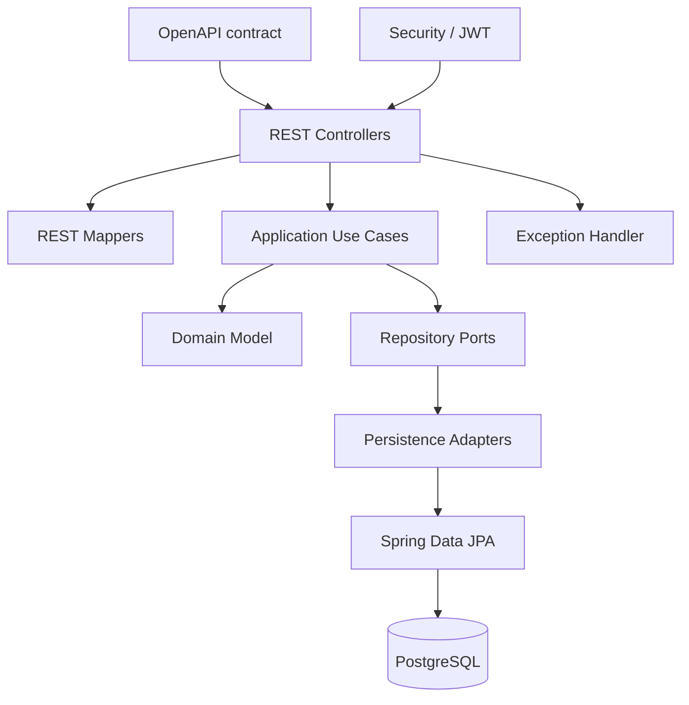
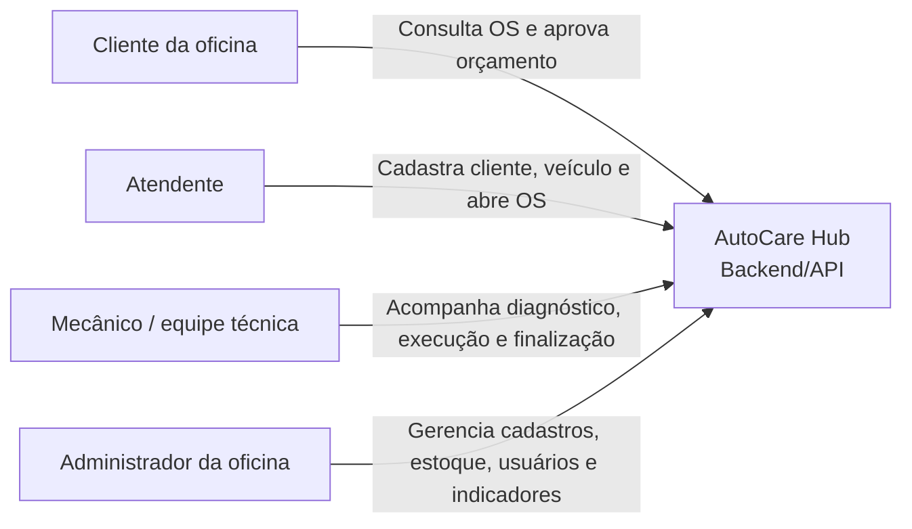
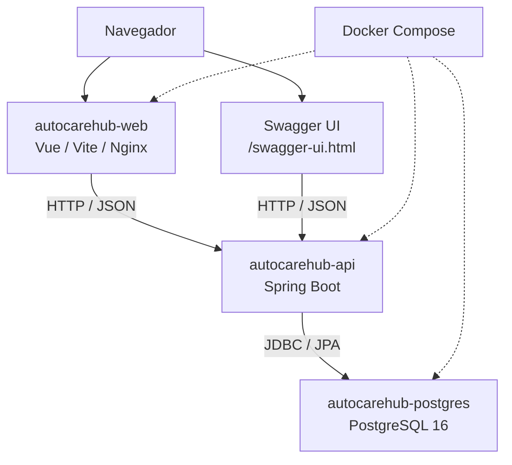
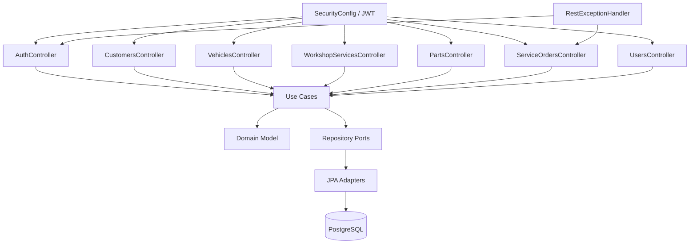
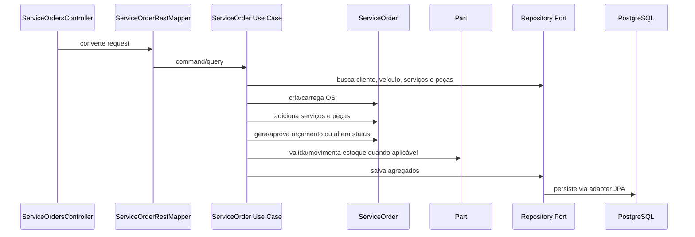

# Arquitetura - AutoCare Hub

## Visão geral da documentação

Esta documentação apresenta como o AutoCare Hub foi organizado para atender ao Tech Challenge FIAP. A ideia é facilitar a leitura da arquitetura, mostrar os principais fluxos técnicos e indicar onde a implementação pode ser conferida no repositório.

| Documento                      | Papel na entrega                                                                                     |
|--------------------------------|------------------------------------------------------------------------------------------------------|
| `README.md`                    | Entrada principal do projeto, com comandos de execução, links das documentações e resumo da solução. |
| `docs/REQUIREMENTS.md`         | Requisitos funcionais, requisitos não funcionais e matriz de rastreabilidade.                        |
| `docs/ARCHITECTURE.md`         | HLD, LLD, C4 Model, decisões arquiteturais e relação com a implementação.                            |
| `docs/DDD_DOCUMENTATION.md`    | Linguagem ubíqua, entidades, value objects, agregados, regras de domínio e diagramas DDD.            |
| `docs/DOMAIN_STORYTELLING.md`  | Histórias do domínio por ator e rotina da oficina.                                                   |
| `docs/EVENT_STORMING.md`       | Comandos, eventos, políticas e linhas do tempo dos fluxos principais.                                |
| `docs/openapi/openapi.yaml`    | Contrato REST usado pela API e pela geração das interfaces.                                          |
| `docs/TESTING.md`              | Estratégia de testes, cobertura e comandos de validação.                                             |
| `docs/SECURITY_REPORT.md`      | Vulnerabilidades encontradas, scans executados, riscos aceitos e evidências consolidadas.            |
| `docs/TECHNICAL_REFINEMENT.md` | Relação entre decisões técnicas, requisitos e implementação.                                         |

## 1. HLD: High-Level Design

### 1.1 Objetivo do sistema

O AutoCare Hub é um MVP backend para uma oficina mecânica. Ele centraliza clientes, veículos, serviços, peças, estoque, Ordens de Serviço, orçamentos, aprovação, acompanhamento pelo cliente e indicadores básicos da operação.

A Ordem de Serviço é o centro do sistema, porque conecta cliente, veículo, serviços solicitados, peças utilizadas, orçamento, aprovação e andamento do atendimento.

### 1.2 Escopo do MVP

Dentro do escopo:

- cadastro e consulta de clientes;
- identificação de cliente por CPF/CNPJ;
- cadastro e consulta de veículos;
- cadastro e consulta de serviços da oficina;
- cadastro, consulta e controle de peças e insumos;
- criação e acompanhamento de Ordem de Serviço;
- inclusão de serviços e peças na OS;
- geração automática de orçamento;
- aprovação de orçamento;
- controle de status da OS;
- monitoramento do tempo médio de execução;
- autenticação JWT nas APIs administrativas;
- documentação Swagger/OpenAPI;
- Dockerfile e Docker Compose;
- testes automatizados e cobertura;
- relatório de vulnerabilidades.

Fora do escopo do MVP:

- pagamento online;
- envio real de e-mail, SMS ou WhatsApp;
- aplicativo mobile real;
- integração com fornecedores;
- integração com ERP externo;
- microserviços;
- API Gateway;
- mensageria/Kafka;
- deploy produtivo em cloud.

Esses itens não são pendências da entrega. Eles apenas não fazem parte da primeira versão proposta para o Tech Challenge.

### 1.3 Visão macro da arquitetura

A solução é composta por:

- frontend demonstrativo em Vue/Vite servido por Nginx;
- backend monolítico em Spring Boot;
- banco de dados PostgreSQL;
- Swagger UI e contrato OpenAPI;
- Docker Compose para execução local;
- autenticação JWT para rotas protegidas;
- migrations Flyway para versionamento do schema do banco.

O backend é o sistema principal da entrega. O frontend foi incluído para facilitar a demonstração visual do fluxo, mas os requisitos obrigatórios são comprovados pela API, pelos testes, pelo contrato OpenAPI e pela documentação.

### 1.4 Principais fluxos

| Fluxo                       | Resumo                                                                                                                               |
|-----------------------------|--------------------------------------------------------------------------------------------------------------------------------------|
| Administrativo              | Usuário faz login, recebe JWT e acessa as APIs administrativas de clientes, veículos, serviços, peças, usuários e Ordens de Serviço. |
| Criação da OS               | Atendente identifica o cliente, vincula o veículo, informa serviços e peças, e cria a Ordem de Serviço.                              |
| Orçamento e aprovação       | Sistema calcula o orçamento com base nos itens da OS e registra a aprovação antes da execução.                                       |
| Estoque                     | Administrador ou funcionário registra entradas, saídas e movimentações de peças conforme o fluxo da OS.                              |
| Acompanhamento pelo cliente | Cliente consulta a OS autorizada pela API e acompanha status, itens e orçamento.                                                     |

### 1.5 Diagrama HLD

## 2. Decisões arquiteturais

| Decisão                         | Como foi aplicada                                                                                  | Justificativa                                                                                           |
|---------------------------------|----------------------------------------------------------------------------------------------------|---------------------------------------------------------------------------------------------------------|
| Backend monolítico              | Uma aplicação Spring Boot concentra o backend do MVP.                                              | Reduz complexidade e atende ao enunciado do Tech Challenge.                                             |
| Arquitetura em camadas          | O projeto separa responsabilidades entre `interfaces`, `application`, `domain` e `infrastructure`. | Facilita manutenção, testes e separação entre API, casos de uso, regras de negócio e detalhes técnicos. |
| Domínio com regras concentradas | `ServiceOrder`, `Part`, `Document`, `Plate` e `Money` concentram regras importantes do negócio.    | Evita espalhar regra de negócio em controllers, mappers ou repositories.                                |
| OpenAPI como contrato           | `docs/openapi/openapi.yaml` documenta os endpoints REST.                                           | Mantém a API documentada e facilita validação pelo Swagger.                                             |
| PostgreSQL com Flyway           | O projeto usa banco relacional com migrations versionadas.                                         | O domínio possui relações importantes entre cliente, veículo, OS, itens e estoque.                      |
| JWT e BCrypt                    | JWT protege APIs administrativas e BCrypt protege senhas.                                          | Atende aos requisitos de segurança do MVP.                                                              |
| Docker Compose                  | Sobe backend, banco e frontend demonstrativo em ambiente local.                                    | Simplifica a execução e a avaliação do projeto.                                                         |

## 3. LLD: Low-Level Design

### 3.1 Organização interna do backend

O backend está em `src/main/java/br/com/autocarehub` e segue uma separação em camadas:

- `interfaces/rest/controller`: controllers REST gerados ou implementados a partir do contrato OpenAPI;
- `interfaces/rest/mapper`: conversão entre DTOs REST e commands/responses da aplicação;
- `interfaces/rest/exception`: tratamento padronizado de erros HTTP;
- `application/usecase`: casos de uso dos fluxos de negócio;
- `application/port/out`: portas de repositório usadas pelos casos de uso;
- `domain/model`: entidades e agregados;
- `domain/valueobject`: value objects como `Document`, `Plate` e `Money`;
- `domain/enums`: enums de domínio, incluindo `ServiceOrderStatus`;
- `infrastructure/persistence`: JPA entities, repositories e adapters;
- `infrastructure/security`: JWT, filtros, autorização e configuração de segurança;
- `infrastructure/config`: beans dos casos de uso e configurações de suporte.

### 3.2 Responsabilidades por camada

| Camada         | Responsabilidade                                                                 | Exemplos no projeto                                                                                   |
|----------------|----------------------------------------------------------------------------------|-------------------------------------------------------------------------------------------------------|
| Interface REST | Receber requests, aplicar o contrato HTTP, chamar use cases e montar responses.  | `CustomersController`, `ServiceOrdersController`, `PartsController`, `ServiceOrderRestMapper`.        |
| Aplicação      | Orquestrar fluxos, validar existência de recursos e chamar domínio/repositories. | `CreateServiceOrderUseCase`, `GenerateServiceOrderBudgetUseCase`, `ApproveServiceOrderBudgetUseCase`. |
| Domínio        | Proteger regras de negócio, valores, status, orçamento e estoque.                | `ServiceOrder`, `Part`, `Document`, `Plate`, `Money`.                                                 |
| Infraestrutura | Implementar persistência, segurança, configuração e adaptadores técnicos.        | `ServiceOrderRepositoryAdapter`, `SecurityConfig`, `JwtAuthenticationFilter`.                         |
| Contrato/API   | Descrever endpoints, schemas, status codes e segurança.                          | `docs/openapi/openapi.yaml`, Swagger UI.                                                              |

Os controllers não concentram cálculo de orçamento, regra de estoque ou transição de status. Essas regras ficam nos casos de uso e nos agregados do domínio.

### 3.3 Fluxo técnico da criação da OS

1. `ServiceOrdersController` recebe `CreateServiceOrderRequest`.
2. `ServiceOrderRestMapper` converte o request para command.
3. `CreateServiceOrderUseCase` busca ou cria o cliente pelo documento.
4. O use case valida ou cria o veículo e garante o vínculo correto com o cliente.
5. O domínio valida `Document`, `Plate`, textos, quantidades e valores.
6. O use case adiciona serviços e peças solicitadas quando enviados.
7. `ServiceOrder` controla status, itens e regras internas da OS.
8. `Part` valida disponibilidade quando peças entram no fluxo.
9. Repositories salvam cliente, veículo, OS e entidades relacionadas.
10. O controller retorna `ServiceOrderResponse` conforme o contrato OpenAPI.

### 3.4 Fluxo técnico de orçamento e estoque

1. `GenerateServiceOrderBudgetUseCase` carrega a OS.
2. `ServiceOrder.generateBudget` calcula o orçamento com base nos serviços e peças.
3. O sistema valida a disponibilidade das peças quando elas fazem parte da OS.
4. A OS muda para `AGUARDANDO_APROVACAO`.
5. `ApproveServiceOrderBudgetUseCase` registra a aprovação do orçamento.
6. O estoque é movimentado conforme a regra de domínio implementada.
7. A OS fica liberada para seguir o fluxo de execução.

### 3.5 Fluxo técnico de autenticação

1. `AuthController` recebe usuário e senha em `POST /api/v1/auth/login`.
2. `LoginUseCase` delega a autenticação ao mecanismo do Spring Security.
3. A senha é conferida com `BCryptPasswordEncoder`.
4. `JwtService` gera um token assinado com segredo vindo de variável de ambiente.
5. `JwtAuthenticationFilter` valida o header `Authorization: Bearer` nas chamadas protegidas.
6. `SecurityConfig` aplica as regras de acesso por endpoint e papel.
7. Serviços de autorização validam permissões específicas nos fluxos protegidos.

### 3.6 Contratos e respostas

O contrato principal está em `docs/openapi/openapi.yaml`. Ele documenta:

- endpoints de autenticação, clientes, veículos, serviços, peças, estoque, OS, tracking e usuários;
- schemas de request/response;
- `bearerAuth` para rotas protegidas;
- respostas de erro padronizadas por `ErrorResponse`;
- Swagger UI em `/swagger-ui.html`;
- contrato bruto em `/openapi.yaml` e `/v3/api-docs`.

### 3.7 Diagrama LLD

## 4. C4 Model

### 4.1 C1 - Contexto

O MVP não possui integrações externas reais. Pagamento, e-mail, SMS, WhatsApp, fornecedores, ERP, API Gateway, mensageria e cloud produtiva não aparecem no diagrama porque não fazem parte da implementação desta entrega.

### 4.2 C2 - Contêineres

Contêineres executáveis conforme `docker-compose.yml`:

| Contêiner              | Tecnologia            | Papel                   |
|------------------------|-----------------------|-------------------------|
| `autocarehub-api`      | Spring Boot / Java 21 | API principal do MVP.   |
| `autocarehub-postgres` | PostgreSQL 16         | Banco relacional local. |
| `autocarehub-web`      | Vue/Vite/Nginx        | Frontend demonstrativo. |

### 4.3 C3 - Componentes do backend

### 4.4 C4 - Código do fluxo crítico de OS

| Classe/Componente                            | Responsabilidade                                  | Camada         | Observação                                                        |
|----------------------------------------------|---------------------------------------------------|----------------|-------------------------------------------------------------------|
| `ServiceOrdersController`                    | Recebe chamadas REST de OS.                       | Interface      | Não calcula orçamento nem manipula estoque diretamente.           |
| `ServiceOrderRestMapper`                     | Converte DTOs REST para commands/responses.       | Interface      | Mantém contrato OpenAPI separado do domínio.                      |
| `CreateServiceOrderUseCase`                  | Orquestra cliente, veículo, serviços, peças e OS. | Aplicação      | Valida o vínculo do veículo com o cliente.                        |
| `GenerateServiceOrderBudgetUseCase`          | Gera orçamento e valida itens da OS.              | Aplicação      | Coordena `ServiceOrder` e `Part` quando há peças.                 |
| `ApproveServiceOrderBudgetUseCase`           | Aprova orçamento e segue o fluxo de execução.     | Aplicação      | Protegido por autorização.                                        |
| `UpdateServiceOrderStatusUseCase`            | Atualiza status conforme regra.                   | Aplicação      | Delega transições ao agregado.                                    |
| `TrackServiceOrderUseCase`                   | Consulta acompanhamento pelo cliente.             | Aplicação      | Usa os dados definidos no contrato da API.                        |
| `GetAverageServiceOrderExecutionTimeUseCase` | Calcula tempo médio de execução.                  | Aplicação      | Considera OS finalizadas/entregues conforme a regra implementada. |
| `ServiceOrder`                               | Protege status, itens e orçamento.                | Domínio        | Agregado central da oficina.                                      |
| `Part`                                       | Protege estoque e movimentações.                  | Domínio        | Evita quantidade negativa e uso acima da disponibilidade.         |
| `Document`, `Plate`, `Money`                 | Validam conceitos de valor.                       | Domínio        | Representam dados sensíveis e valores monetários.                 |
| `ServiceOrderRepositoryAdapter`              | Implementa persistência da OS.                    | Infraestrutura | Usa Spring Data JPA.                                              |

## 5. Relação com requisitos

| Necessidade                                      | Solução técnica                                                    | Requisito relacionado          |
|--------------------------------------------------|--------------------------------------------------------------------|--------------------------------|
| Identificar cliente por documento                | `Document` e busca por repository.                                 | RF-002, RF-003                 |
| Cadastrar veículo com placa, marca, modelo e ano | `Vehicle`, `Plate` e `VehiclesController`.                         | RF-004, RF-005, RF-006         |
| Criar e acompanhar OS                            | `ServiceOrder`, use cases e endpoints de OS.                       | RF-010, RF-017, RF-018, RF-019 |
| Gerar e aprovar orçamento                        | `ServiceOrder.generateBudget`, `ApproveServiceOrderBudgetUseCase`. | RF-013, RF-014, RF-015         |
| Controlar estoque                                | `Part` e use cases de estoque/movimentação.                        | RF-008, RF-009, RF-012         |
| Monitorar tempo médio                            | `GetAverageServiceOrderExecutionTimeUseCase`.                      | RF-020                         |
| Proteger APIs                                    | `SecurityConfig`, `JwtAuthenticationFilter`, `JwtService`.         | RF-021, RNF-010                |
| Executar localmente                              | Dockerfile, Compose e `.env.example`.                              | RNF-007, RNF-008, RNF-009      |
| Documentar API                                   | OpenAPI e Swagger UI.                                              | RNF-003, RNF-004               |

## 6. Aderência ao código

A arquitetura descrita está alinhada com os principais pontos da implementação:

- os endpoints citados estão documentados em `docs/openapi/openapi.yaml`;
- os pacotes `interfaces`, `application`, `domain` e `infrastructure` organizam a aplicação em camadas;
- o banco documentado é PostgreSQL, configurado em `application.yml` e `docker-compose.yml`;
- o Compose possui os serviços `autocarehub-api`, `autocarehub-postgres` e `autocarehub-web`;
- o Swagger está documentado em `/swagger-ui.html`;
- JWT, BCrypt e autorização por papel fazem parte da camada de segurança;
- Flyway é usado para versionamento do schema do banco;
- o frontend demonstrativo existe em `frontend/`;
- os diagramas C4 não incluem sistemas externos que não fazem parte do MVP;
- o HLD mantém o projeto como monolito, sem microserviços, cloud produtiva ou mensageria.

## 7. Conclusão

A arquitetura do AutoCare Hub conecta o problema da oficina aos requisitos do Tech Challenge, apresenta a solução em alto nível, detalha a organização interna do backend e documenta o sistema usando HLD, LLD e C4 Model.

A documentação mantém o foco no que foi entregue no MVP: backend monolítico, API REST, banco PostgreSQL, autenticação JWT, controle de OS, orçamento, estoque, testes, Docker e documentação da API.
