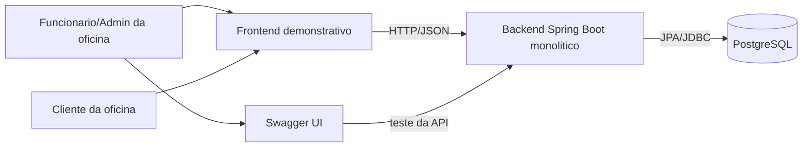
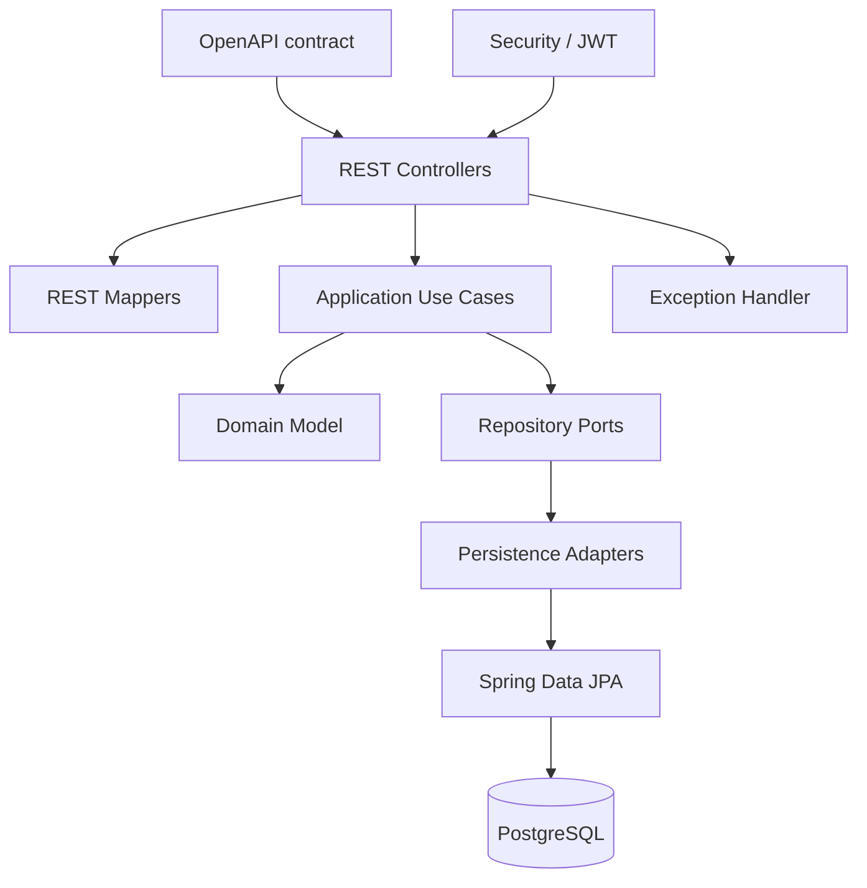
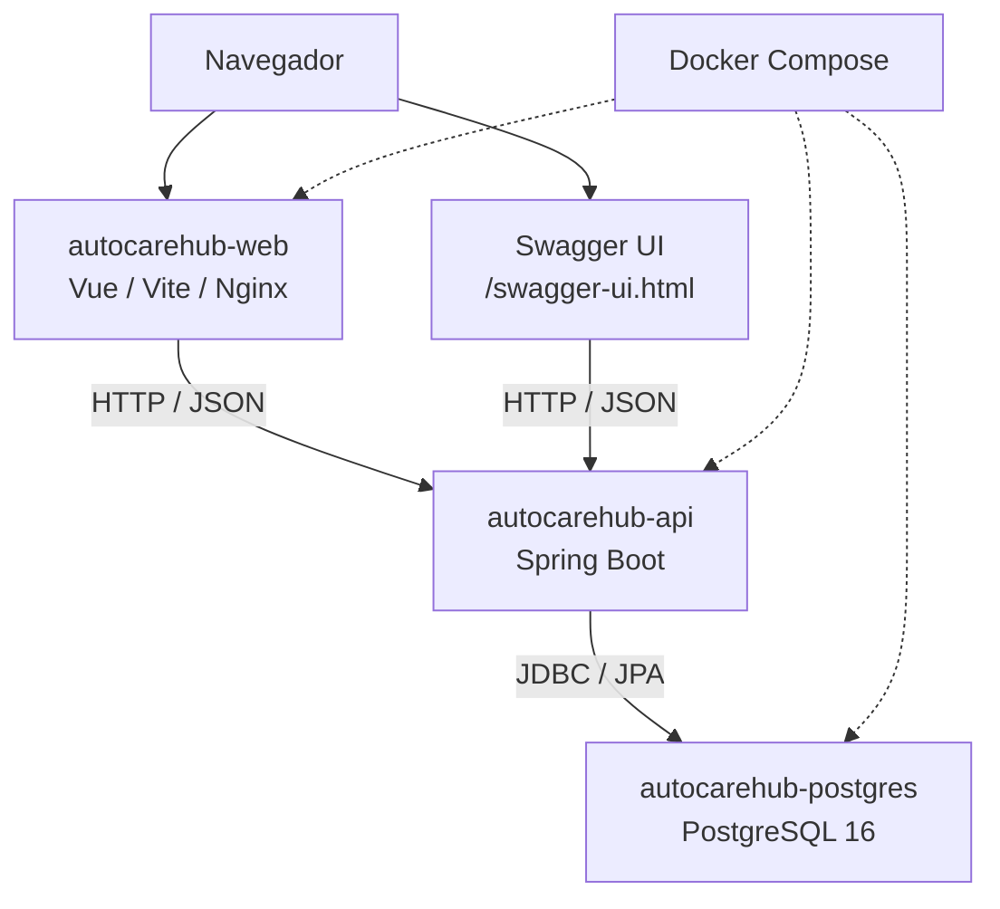
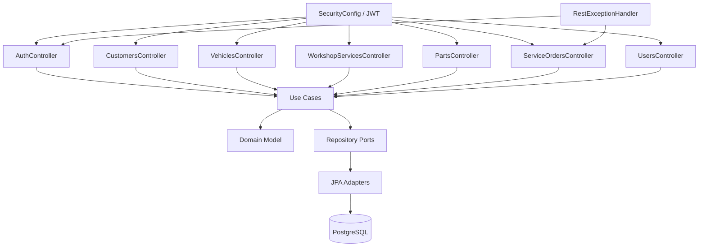

# Arquitetura - AutoCare Hub

## Visao geral da documentação

Esta documentação mostra como o AutoCare Hub foi organizado para atender ao Tech Challenge FIAP. O objetivo e deixar claro o problema, os requisitos, a arquitetura, os principais fluxos tecnicos e onde o avaliador pode conferir a implementação.

| Documento                      | Papel na entrega                                                                                  |
|--------------------------------|---------------------------------------------------------------------------------------------------|
| `README.md`                    | Entrada principal do projeto, comandos de execução, links dos documentos e resumo dos resultados. |
| `docs/REQUIREMENTS.md`         | Requisitos funcionais, requisitos nao funcionais e matriz de rastreabilidade.                     |
| `docs/ARCHITECTURE.md`         | HLD, LLD, C4 Model, decisoes arquiteturais e relação com o codigo.                                |
| `docs/DDD_DOCUMENTATION.md`    | Linguagem ubiqua, entidades, value objects, agregados, regras de dominio e diagramas DDD.         |
| `docs/DOMAIN_STORYTELLING.md`  | Historias do dominio por ator e rotina da oficina.                                                |
| `docs/EVENT_STORMING.md`       | Comandos, eventos, politicas e linhas do tempo dos fluxos principais.                             |
| `docs/openapi/openapi.yaml`    | Contrato REST usado pela API e pela geração de interfaces.                                        |
| `docs/TESTING.md`              | Estrategia de testes, cobertura e comandos de validação.                                          |
| `docs/SECURITY_REPORT.md`      | Vulnerabilidades, scans executados, riscos aceitos e evidencias consolidadas.                     |
| `docs/SECURITY_SCAN_GUIDE.md`  | Roteiro para reproduzir scans e gerar evidencias locais.                                          |
| `docs/TECHNICAL_REFINEMENT.md` | Ponte entre decisao tecnica, requisito e implementação.                                           |

## 1. HLD: High-Level Design

### 1.1 Objetivo do sistema

O AutoCare Hub e um MVP backend para uma oficina mecanica. Ele centraliza clientes, veiculos, serviços, pecas, estoque, Ordens de Serviço, orçamentos, aprovação, acompanhamento pelo cliente e indicadores basicos.

### 1.2 Escopo do MVP

Dentro do escopo:

- cadastro e consulta de clientes;
- identificação de cliente por CPF/CNPJ;
- cadastro e consulta de veículos;
- cadastro e consulta de serviços da oficina;
- cadastro, consulta e controle de pecas/insumos;
- criação e acompanhamento de Ordem de Serviço;
- inclusão de serviços e pecas na OS;
- geração automática de orçamento;
- aprovação de orçamento;
- controle de status da OS;
- tempo medio de execução;
- JWT nas APIs administrativas;
- Swagger/OpenAPI;
- Dockerfile e Docker Compose;
- testes automatizados e cobertura;
- relatorio de vulnerabilidades.

Fora do escopo do MVP:

- pagamento online;
- envio real de e-mail, SMS ou WhatsApp;
- app mobile real;
- integração com fornecedores;
- ERP externo;
- microserviços;
- API Gateway;
- mensageria/Kafka;
- cloud produtiva.

Esses itens não são pendências da entrega; apenas ficaram fora do limite do MVP.

### 1.3 Visão macro da arquitetura

A solução e composta por:

- frontend demonstrativo Vue/Vite servido por Nginx;
- backend monolítico Spring Boot;
- banco PostgreSQL;
- Swagger UI e contrato OpenAPI;
- Docker Compose para execução local;
- autenticação JWT para rotas protegidas;
- migrations Flyway para schema do banco.

O backend e o sistema principal da entrega. O frontend ajuda na demonstração, mas os requisitos obrigatórios são comprovados pela API, testes, OpenAPI e documentação.

### 1.4 Principais fluxos

| Fluxo                       | Resumo                                                                                              |
|-----------------------------|-----------------------------------------------------------------------------------------------------|
| Administrativo              | Usuário faz login, recebe JWT e acessa CRUDs de clientes, veiculos, serviços, pecas, usuários e OS. |
| Criação da OS               | Atendente identifica cliente, vincula veiculo, informa serviços/pecas e cria a OS.                  |
| Orcamento e aprovação       | Sistema calcula total com base nos itens da OS, reserva pecas e registra aprovação.                 |
| Estoque                     | Administrador/funcionario registra entrada, saida, reserva, liberação e baixa de pecas.             |
| Acompanhamento pelo cliente | Cliente consulta OS autorizada por API e acompanha status, itens e orçamento.                       |

### 1.5 Diagrama HLD

## 2. Decisões arquiteturais

| Decisao | Como foi aplicada | Justificativa |
|---|---|---|
| Backend monolitico | Uma aplicação Spring Boot concentra o backend. | Reduz complexidade para o MVP e atende ao enunciado do Tech Challenge. |
| Arquitetura em camadas | Pacotes `interfaces`, `application`, `domain` e `infrastructure`. | Separa API, casos de uso, regra de negocio e detalhes tecnicos. |
| Dominio rico | `ServiceOrder`, `Part`, `Document`, `Plate` e `Money` concentram regras importantes. | Evita espalhar regra de negocio em controllers ou repositories. |
| OpenAPI como contrato | `docs/openapi/openapi.yaml` gera interfaces REST no build. | Mantem documentação e implementação alinhadas. |
| PostgreSQL com Flyway | Banco relacional com migration versionada. | O dominio tem relações fortes entre cliente, veiculo, OS, itens e estoque. |
| JWT e BCrypt | JWT protege APIs e BCrypt protege senhas. | Atende aos requisitos de seguranca do MVP. |
| Docker Compose | Sobe backend, banco e frontend demonstrativo. | Simplifica demonstração e avaliação local. |

## 3. LLD - Low-Level Design

### 3.1 Organização interna do backend

O backend esta em `src/main/java/br/com/autocarehub` e segue uma separação em camadas:

- `interfaces/rest/controller`: controllers REST gerados/implementados a partir do contrato OpenAPI;
- `interfaces/rest/mapper`: conversao entre DTOs REST e commands/responses da aplicação;
- `interfaces/rest/exception`: tratamento padronizado de erros HTTP;
- `application/usecase`: casos de uso por fluxo de negocio;
- `application/port/out`: portas de repositorio usadas pelos casos de uso;
- `domain/model`: entidades e agregados;
- `domain/valueobject`: value objects como `Document`, `Plate` e `Money`;
- `domain/enums`: enums de dominio, incluindo `ServiceOrderStatus`;
- `infrastructure/persistence`: JPA entities, repositories e adapters;
- `infrastructure/security`: JWT, filtros, autorização e configuração de seguranca;
- `infrastructure/config`: beans de casos de uso e configurações de suporte.

### 3.2 Responsabilidades por camada

| Camada | Responsabilidade | Exemplos no projeto |
|---|---|---|
| Interface REST | Receber request, aplicar contrato HTTP, chamar use cases e montar response. | `CustomersController`, `ServiceOrdersController`, `PartsController`, `ServiceOrderRestMapper`. |
| Aplicação | Orquestrar fluxo, validar existencia de recursos e chamar dominio/repositories. | `CreateServiceOrderUseCase`, `GenerateServiceOrderBudgetUseCase`, `ApproveServiceOrderBudgetUseCase`. |
| Dominio | Proteger regras de negocio, valores, status, orçamento e estoque. | `ServiceOrder`, `Part`, `Document`, `Plate`, `Money`. |
| Infraestrutura | Implementar persistencia, seguranca, configuração e adaptadores tecnicos. | `ServiceOrderRepositoryAdapter`, `SecurityConfig`, `JwtAuthenticationFilter`. |
| Contrato/API | Descrever endpoints, schemas, status codes e seguranca. | `docs/openapi/openapi.yaml`, Swagger UI. |

Na revisao de arquitetura, os controllers nao acessam repositories diretamente e nao concentram calculo de orçamento, regra de estoque ou transição de status. Essas regras ficam nos casos de uso e nos agregados.

### 3.3 Fluxo tecnico da criação da OS

1. `ServiceOrdersController` recebe `CreateServiceOrderRequest`.
2. `ServiceOrderRestMapper` converte o request para command.
3. `CreateServiceOrderUseCase` busca ou cria o cliente pelo documento.
4. O use case valida ou cria o veiculo e garante que ele pertence ao cliente.
5. O dominio valida `Document`, `Plate`, textos, quantidades e valores.
6. O use case adiciona serviços e pecas solicitadas quando enviados.
7. `ServiceOrder` controla status, itens e regras internas da OS.
8. `Part` valida disponibilidade quando pecas entram no fluxo.
9. Repositories salvam cliente, veiculo, OS e entidades relacionadas.
10. O controller retorna `ServiceOrderResponse` conforme OpenAPI.

### 3.4 Fluxo tecnico de orçamento e estoque

1. `GenerateServiceOrderBudgetUseCase` carrega a OS.
2. `ServiceOrder.generateBudget` soma serviços e pecas.
3. O use case reserva as pecas no agregado `Part`.
4. A OS muda para `AGUARDANDO_APROVACAO`.
5. `ApproveServiceOrderBudgetUseCase` aprova o orçamento.
6. As pecas reservadas sao baixadas/confirmadas.
7. A OS avanca para execução conforme regra do dominio.

### 3.5 Fluxo tecnico de autenticação

1. `AuthController` recebe usuário e senha em `POST /api/v1/auth/login`.
2. `LoginUseCase` delega autenticação ao mecanismo do Spring Security.
3. A senha e conferida com `BCryptPasswordEncoder`.
4. `JwtService` gera token assinado com segredo vindo de variavel de ambiente.
5. `JwtAuthenticationFilter` valida `Authorization: Bearer` nas chamadas protegidas.
6. `SecurityConfig` aplica regras por endpoint e papel.
7. `AuthorizationService` valida acesso por `customerId` em fluxos de cliente.

### 3.6 Contratos e respostas

O contrato principal esta em `docs/openapi/openapi.yaml`. Ele documenta:

- endpoints de autenticação, clientes, veiculos, serviços, pecas, estoque, OS, tracking, usuários e demo leads;
- schemas de request/response;
- `bearerAuth` para rotas protegidas;
- respostas de erro padronizadas por `ErrorResponse`;
- Swagger UI em `/swagger-ui.html`;
- contrato bruto em `/openapi.yaml` e `/v3/api-docs`.

### 3.7 Diagrama LLD

## 4. C4 Model

### 4.1 C1 - Contexto

O MVP nao possui sistemas externos reais. Pagamento, e-mail, SMS, WhatsApp, fornecedores, ERP, API Gateway, mensageria e cloud produtiva nao aparecem no diagrama porque nao existem no codigo.

### 4.2 C2 - Conteineres

Conteineres executaveis conforme `docker-compose.yml`:

| Conteiner | Tecnologia | Papel |
|---|---|---|
| `autocarehub-api` | Spring Boot / Java 21 | API principal do MVP. |
| `autocarehub-postgres` | PostgreSQL 16 | Banco relacional local. |
| `autocarehub-web` | Vue/Vite/Nginx | Frontend demonstrativo. |

### 4.3 C3 - Componentes do backend

### 4.4 C4 - Codigo do fluxo critico de OS

| Classe/Componente | Responsabilidade | Camada | Observação |
|---|---|---|---|
| `ServiceOrdersController` | Recebe chamadas REST de OS. | Interface | Nao calcula orçamento nem manipula estoque diretamente. |
| `ServiceOrderRestMapper` | Converte DTOs REST para commands/responses. | Interface | Mantem contrato OpenAPI separado do dominio. |
| `CreateServiceOrderUseCase` | Orquestra cliente, veiculo, serviços, pecas e OS. | Aplicação | Valida pertencimento do veiculo ao cliente. |
| `GenerateServiceOrderBudgetUseCase` | Gera orçamento e reserva pecas. | Aplicação | Coordena `ServiceOrder` e `Part`. |
| `ApproveServiceOrderBudgetUseCase` | Aprova orçamento e confirma estoque. | Aplicação | Protegido por autorização. |
| `UpdateServiceOrderStatusUseCase` | Atualiza status conforme regra. | Aplicação | Delega transições ao agregado. |
| `TrackServiceOrderUseCase` | Consulta acompanhamento pelo cliente. | Aplicação | Usa documento/placa/OS conforme contrato. |
| `GetAverageServiceOrderExecutionTimeUseCase` | Calcula tempo medio de execução. | Aplicação | Usa OS finalizadas/entregues. |
| `ServiceOrder` | Protege status, itens e orçamento. | Dominio | Agregado central da oficina. |
| `Part` | Protege estoque, reserva e baixa. | Dominio | Evita quantidade negativa e reserva invalida. |
| `Document`, `Plate`, `Money` | Validam conceitos de valor. | Dominio | Dados sensiveis e valores monetarios. |
| `ServiceOrderRepositoryAdapter` | Implementa persistencia da OS. | Infraestrutura | Usa Spring Data JPA. |

## 5. Relação com requisitos

| Necessidade | Solução tecnica | Requisito relacionado |
|---|---|---|
| Identificar cliente por documento | `Document` e busca por repository. | RF-002, RF-003 |
| Cadastrar veiculo com placa, marca, modelo e ano | `Vehicle`, `Plate` e `VehiclesController`. | RF-004, RF-005, RF-006 |
| Criar e acompanhar OS | `ServiceOrder`, use cases e endpoints de OS. | RF-010, RF-017, RF-018, RF-019 |
| Gerar e aprovar orçamento | `ServiceOrder.generateBudget`, `ApproveServiceOrderBudgetUseCase`. | RF-013, RF-014, RF-015 |
| Controlar estoque | `Part` e use cases de estoque/reserva. | RF-008, RF-009, RF-012 |
| Monitorar tempo medio | `GetAverageServiceOrderExecutionTimeUseCase`. | RF-020 |
| Proteger APIs | `SecurityConfig`, `JwtAuthenticationFilter`, `JwtService`. | RF-021, RNF-010 |
| Executar localmente | Dockerfile, Compose e `.env.example`. | RNF-007, RNF-008, RNF-009 |
| Documentar API | OpenAPI e Swagger UI. | RNF-003, RNF-004 |

## 6. Validação contra o codigo

A revisao conferiu os pontos principais contra o repositorio:

- endpoints citados existem em `docs/openapi/openapi.yaml`;
- os pacotes `interfaces`, `application`, `domain` e `infrastructure` existem;
- o banco documentado e PostgreSQL, configurado em `application.yml` e `docker-compose.yml`;
- o Compose possui `autocarehub-api`, `autocarehub-postgres` e `autocarehub-web`;
- Swagger esta documentado em `/swagger-ui.html`;
- JWT, BCrypt e autorização por papel existem em `SecurityConfig`, `JwtService` e filtros;
- Flyway existe com migration em `src/main/resources/db/migration`;
- frontend demonstrativo existe em `frontend/`;
- C4 nao inclui sistemas externos inexistentes;
- HLD mantem o MVP como monolito, sem microserviços, cloud ou mensageria.

## 7. Conclusao

A arquitetura esta aderente ao Tech Challenge porque conecta o problema da oficina aos requisitos, mostra a solução em alto nivel, detalha a organização interna do backend, documenta C4 em niveis C1, C2, C3 e C4 simplificado, e aponta onde cada decisao aparece no codigo real.

Nao foi identificada necessidade de alterar backend nesta revisao de arquitetura.
