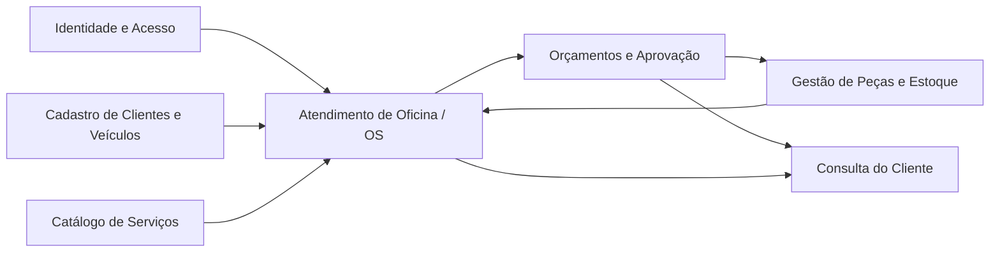
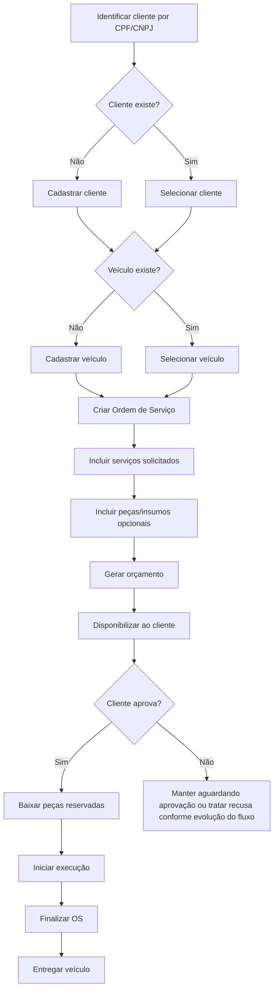
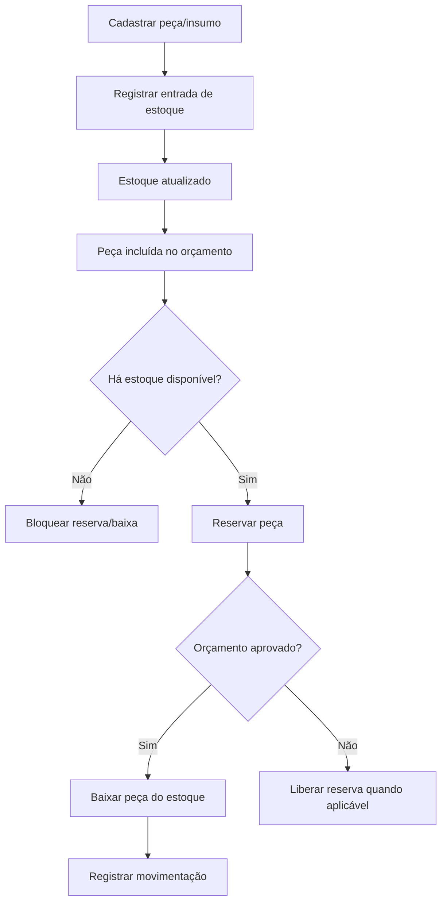
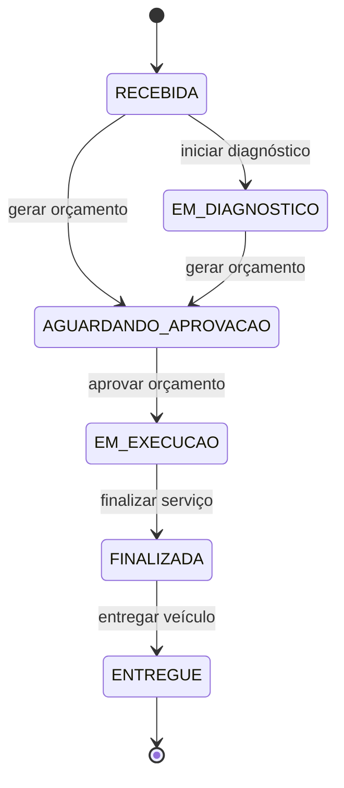
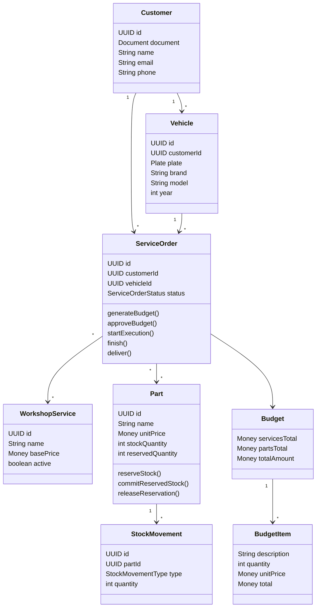

# Documentação DDD - AutoCare Hub

## 1. Introdução

Este documento descreve a aplicação de Domain-Driven Design no projeto AutoCare Hub, considerando o escopo acadêmico do Tech Challenge. O sistema é um backend monolítico em camadas, com separação entre domínio, aplicação, infraestrutura e interfaces REST.

O objetivo desta documentação é servir como base para o PDF final, para o vídeo de apresentação e para a avaliação técnica do MVP.

## 2. Contexto do problema

Oficinas mecânicas precisam controlar clientes, veículos, ordens de serviço, serviços solicitados, peças, insumos, orçamentos, aprovações e estoque. Quando esses dados ficam dispersos em planilhas, mensagens ou controles manuais, surgem problemas de rastreabilidade, perda de histórico, divergência de estoque e baixa transparência para o cliente.

O AutoCare Hub organiza o ciclo de atendimento da oficina: identificação do cliente, cadastro ou vinculação do veículo, criação da Ordem de Serviço, composição com serviços e peças, geração de orçamento, aprovação, execução, finalização e entrega do veículo.

## 3. Objetivo do MVP

O MVP entrega uma API REST para uma oficina mecânica, com foco em:

- gestão de clientes;
- gestão de veículos;
- gestão de serviços;
- gestão de peças e insumos;
- controle de estoque;
- criação e acompanhamento de Ordens de Serviço;
- geração automática de orçamento;
- aprovação de orçamento pelo cliente;
- consulta da Ordem de Serviço pelo cliente;
- autenticação JWT para APIs administrativas;
- validação de CPF/CNPJ e placa;
- documentação OpenAPI/Swagger;
- testes automatizados dos fluxos críticos.

Funcionalidades de marketplace, pagamentos, notificações, agenda e integrações externas são melhorias futuras e não fazem parte do núcleo obrigatório do MVP.

## 4. Visão geral do domínio

O domínio central é o atendimento de oficina. A Ordem de Serviço representa o agregado principal do fluxo e conecta cliente, veículo, serviços solicitados, peças/insumos, orçamento, status e datas relevantes.

A arquitetura do projeto separa responsabilidades:

- `br.com.autocarehub.domain`: entidades, value objects, enums, exceções e regras de domínio.
- `br.com.autocarehub.application`: use cases, serviços de aplicação, DTOs e portas de repositório.
- `br.com.autocarehub.infrastructure`: persistência, segurança, configuração e adapters.
- `br.com.autocarehub.interfaces`: controllers REST e mapeamento com o contrato OpenAPI.

## 5. Linguagem Ubíqua

| Termo de negócio | Nome técnico no código | Definição |
| --- | --- | --- |
| Cliente | `Customer` | Pessoa física ou jurídica atendida pela oficina, identificada por CPF ou CNPJ. |
| Documento | `Document` | CPF ou CNPJ validado, normalizado e usado para evitar duplicidade. |
| Veículo | `Vehicle` | Veículo pertencente a um cliente, identificado por placa, marca, modelo e ano. |
| Placa | `Plate` | Identificador do veículo, aceitando formato antigo brasileiro e Mercosul. |
| Ordem de Serviço | `ServiceOrder` | Registro central do atendimento da oficina. |
| Status da OS | `ServiceOrderStatus` | Estado controlado da Ordem de Serviço. |
| Serviço | `WorkshopService` | Atividade executável pela oficina. |
| Peça/Insumo | `Part` | Item físico usado em serviço ou vendido separadamente. |
| Estoque | `Part` + `StockMovement` | Quantidade total, reservada e disponível de peças ou insumos. |
| Movimentação de estoque | `StockMovement` | Registro de entrada, saída, venda, reserva confirmada ou ajuste. |
| Orçamento | `Budget` | Cálculo financeiro gerado a partir dos serviços e peças da OS. |
| Item de orçamento | `BudgetItem` | Item calculável do orçamento. |
| Aprovação | `approveBudget` | Aceite do cliente para execução do orçamento. |
| Baixa de estoque | métodos de `Part` | Redução definitiva do estoque após aprovação ou saída registrada. |

Os nomes técnicos permanecem em inglês para manter compatibilidade com o código e com o contrato REST, mas a linguagem de negócio usada na documentação é em português.

## 6. Subdomínios

### Core Domain

- Gestão da Ordem de Serviço.
- Geração e aprovação de orçamento.
- Controle de status do atendimento.
- Controle de peças vinculadas à OS e baixa de estoque.

### Supporting Domains

- Cadastro de clientes.
- Cadastro de veículos.
- Cadastro de serviços da oficina.
- Cadastro de peças e insumos.
- Gestão de usuários e preferências.

### Generic Domains

- Autenticação JWT.
- Persistência relacional.
- Documentação OpenAPI.
- Configuração de ambiente e execução local.

## 7. Bounded Contexts

### Atendimento de Oficina

Contexto principal do MVP. Contém Ordem de Serviço, diagnóstico, serviços solicitados, peças vinculadas, orçamento, aprovação, status e acompanhamento pelo cliente.

### Cadastro de Clientes e Veículos

Responsável por identificar clientes por CPF/CNPJ, manter dados básicos e vincular veículos por placa.

### Catálogo de Serviços

Responsável pelos serviços oferecidos pela oficina e que podem ser incluídos em uma Ordem de Serviço.

### Gestão de Peças e Estoque

Responsável por peças, insumos, estoque, reservas, entradas, saídas e baixa.

### Orçamentos e Aprovação

Responsável pela geração automática do orçamento, disponibilização ao cliente e aprovação. No MVP, esse contexto fica fortemente acoplado ao fluxo da Ordem de Serviço.

### Identidade e Acesso

Responsável por autenticação JWT, usuários, perfis e autorização de APIs administrativas.

## 8. Entidades

- `Customer`: cliente atendido pela oficina.
- `Vehicle`: veículo pertencente a um cliente.
- `WorkshopService`: serviço oferecido pela oficina.
- `Part`: peça ou insumo com controle de preço, estoque e reserva.
- `ServiceOrder`: Ordem de Serviço e agregado principal do atendimento.
- `StockMovement`: movimentação de estoque.
- `User`: conta autenticável e autorizável.
- `DemoLead`: interessado em parceria, usado pela área pública.

## 9. Value Objects

- `Document`: valida e normaliza CPF/CNPJ.
- `Plate`: valida e normaliza placa.
- `Money`: representa valores monetários não negativos.
- `Address`: estrutura endereço do cliente.
- `BudgetItem`: item calculável do orçamento.

O período de execução ainda não existe como value object próprio. No MVP, o tempo de execução é calculado a partir das datas registradas na Ordem de Serviço. Caso regras de SLA e prazo cresçam, uma melhoria futura é criar um value object `ExecutionPeriod`.

## 10. Agregados

### Ordem de Serviço

Raiz do agregado: `ServiceOrder`.

Responsabilidades:

- vincular cliente e veículo;
- controlar serviços solicitados;
- controlar peças e insumos vinculados;
- gerar orçamento;
- controlar aprovação;
- controlar status e transições válidas;
- registrar datas de orçamento, aprovação, execução, finalização e entrega.

Invariantes:

- uma OS não pode existir sem cliente;
- uma OS não pode existir sem veículo;
- uma OS precisa de ao menos um serviço solicitado;
- itens não podem ser alterados após geração do orçamento;
- execução exige orçamento aprovado;
- finalização exige execução;
- entrega exige finalização.

### Peça/Insumo

Raiz do agregado: `Part`.

Responsabilidades:

- controlar estoque total;
- controlar quantidade reservada;
- calcular disponibilidade;
- impedir estoque negativo;
- reservar quantidade para orçamento;
- confirmar reserva como baixa;
- liberar reserva quando aplicável.

### Cliente e Veículo

`Customer` e `Vehicle` possuem identidade própria. O veículo sempre pertence a um cliente, e a placa é tratada como identificador único do veículo.

## 11. Repositórios

As portas de repositório ficam em `br.com.autocarehub.application.repository`:

- `CustomerRepository`
- `VehicleRepository`
- `WorkshopServiceRepository`
- `PartRepository`
- `StockMovementRepository`
- `ServiceOrderRepository`
- `UserRepository`
- `UserPreferenceRepository`
- `DemoLeadRepository`

As implementações JPA ficam em `br.com.autocarehub.infrastructure.persistence.adapter`, separando persistência da regra de negócio.

## 12. Serviços de domínio

Serviços e regras de domínio identificados no projeto:

- `PlatformFeePolicy`: cálculo centralizado da taxa da plataforma por faixas de faturamento.
- `ServiceOrder`: concentra regras de transição de status, geração e aprovação de orçamento.
- `Part`: concentra regras de reserva, liberação, baixa e disponibilidade de estoque.
- `Document`, `Plate` e `Money`: protegem regras de validação e consistência de valores.

O projeto não usa um barramento de eventos de domínio no MVP. Os eventos são documentados como linguagem de modelagem e podem virar implementação explícita em evolução futura.

## 13. Serviços de aplicação

Os serviços de aplicação estão organizados como use cases em `br.com.autocarehub.application.usecase`.

Principais fluxos:

- Clientes: `CreateCustomerUseCase`, `UpdateCustomerUseCase`, `FindCustomerUseCase`, `ListCustomersUseCase`, `DeleteCustomerUseCase`.
- Veículos: `CreateVehicleUseCase`, `UpdateVehicleUseCase`, `FindVehicleUseCase`, `ListVehiclesUseCase`, `ListVehiclesByCustomerUseCase`, `DeleteVehicleUseCase`.
- Serviços: `CreateWorkshopServiceUseCase`, `UpdateWorkshopServiceUseCase`, `FindWorkshopServiceUseCase`, `ListWorkshopServicesUseCase`, `DeleteWorkshopServiceUseCase`.
- Peças/estoque: `CreatePartUseCase`, `UpdatePartUseCase`, `FindPartUseCase`, `ListPartsUseCase`, `RegisterPartStockMovementUseCase`, `ReservePartStockUseCase`, `ReleasePartReservationUseCase`, `CommitPartReservationUseCase`, `UpdatePartStockUseCase`.
- Ordens de Serviço: `CreateServiceOrderUseCase`, `AddServiceToServiceOrderUseCase`, `AddPartToServiceOrderUseCase`, `GenerateServiceOrderBudgetUseCase`, `ApproveServiceOrderBudgetUseCase`, `UpdateServiceOrderStatusUseCase`, `TrackServiceOrderUseCase`, `GetAverageServiceOrderExecutionTimeUseCase`.
- Autenticação e usuários: `LoginUseCase`, `CreateUserUseCase`, `UpdateUserUseCase`, `ChangeUserPasswordUseCase`.

## 14. Eventos de domínio

Eventos usados como linguagem de modelagem:

- `ClienteIdentificado`
- `ClienteCadastrado`
- `VeiculoCadastrado`
- `OrdemServicoCriada`
- `DiagnosticoIniciado`
- `ServicoIncluidoNaOrdem`
- `PecaIncluidaNaOrdem`
- `OrcamentoGerado`
- `OrcamentoEnviado`
- `OrcamentoAprovado`
- `OrdemServicoEmExecucao`
- `OrdemServicoFinalizada`
- `VeiculoEntregue`
- `EstoqueAtualizado`
- `PecaReservada`
- `ReservaPecaLiberada`
- `PecaBaixadaDoEstoque`
- `EstoqueInsuficienteIdentificado`

No MVP, esses eventos não são persistidos em event store. Eles orientam o Event Storming, testes e nomeação dos fluxos.

## 15. Comandos

Comandos principais do domínio:

- `IdentificarCliente`
- `CadastrarCliente`
- `CadastrarVeiculo`
- `CriarOrdemServico`
- `IncluirServicoNaOrdem`
- `IncluirPecaNaOrdem`
- `GerarOrcamento`
- `AprovarOrcamento`
- `IniciarDiagnostico`
- `IniciarExecucao`
- `FinalizarOrdemServico`
- `EntregarVeiculo`
- `CadastrarPeca`
- `RegistrarEntradaEstoque`
- `RegistrarSaidaEstoque`
- `ReservarPeca`
- `LiberarReservaPeca`
- `BaixarPecaDoEstoque`

## 16. Políticas/regras de negócio

- CPF/CNPJ inválido não pode ser salvo.
- Placa inválida não pode ser salva.
- Cliente não pode ser duplicado por diferença de formatação do documento.
- Veículo precisa estar vinculado a um cliente.
- Ordem de Serviço exige cliente, veículo e ao menos um serviço.
- O veículo da OS deve pertencer ao cliente informado.
- O orçamento é calculado automaticamente a partir dos serviços e peças.
- Após geração de orçamento, a OS fica em `AGUARDANDO_APROVACAO`.
- Orçamento só pode ser aprovado se foi gerado.
- Execução só inicia após aprovação.
- Finalização só ocorre após execução.
- Entrega só ocorre após finalização.
- Transições inválidas geram exceção de domínio.
- Estoque não pode ficar negativo.
- Reserva não pode exceder estoque disponível.
- Baixa não pode exceder estoque disponível ou reservado, conforme o fluxo.

## 17. Fluxo de criação da OS

1. Usuário administrativo identifica o cliente por CPF/CNPJ.
2. Se o cliente não existir, cadastra o cliente.
3. Usuário seleciona ou cadastra o veículo.
4. Sistema valida se o veículo pertence ao cliente.
5. Usuário informa diagnóstico ou problema percebido.
6. Usuário inclui serviços solicitados.
7. Usuário inclui peças ou insumos, se necessário.
8. Sistema cria a Ordem de Serviço.
9. Sistema pode gerar o orçamento automaticamente conforme dados informados.
10. A OS fica em status adequado ao fluxo, como `RECEBIDA` ou `AGUARDANDO_APROVACAO` quando o orçamento é gerado.

## 18. Fluxo de acompanhamento da OS

1. Cliente consulta a Ordem de Serviço via API.
2. Sistema valida se o cliente pode acessar aquela OS.
3. Sistema retorna dados básicos da OS, veículo, status, serviços, peças e orçamento.
4. O cliente acompanha a evolução pelos status:
   - `RECEBIDA`
   - `EM_DIAGNOSTICO`
   - `AGUARDANDO_APROVACAO`
   - `EM_EXECUCAO`
   - `FINALIZADA`
   - `ENTREGUE`

## 19. Fluxo de aprovação de orçamento

1. Oficina gera o orçamento.
2. Sistema calcula total de serviços, total de peças e total geral.
3. Sistema reserva peças vinculadas ao orçamento quando aplicável.
4. Orçamento fica disponível para aprovação.
5. Cliente aprova o orçamento.
6. Sistema confirma a baixa das peças reservadas.
7. Ordem de Serviço pode avançar para execução.

Recusa ou expiração de orçamento com liberação automática de reserva pode ser tratada como melhoria futura se não estiver ativa no fluxo executado.

## 20. Fluxo de gestão de peças e insumos

1. Usuário administrativo cadastra peça ou insumo.
2. Sistema valida nome, preço, quantidade e estoque mínimo.
3. Usuário registra entradas, saídas ou vendas isoladas.
4. Sistema registra a movimentação de estoque.
5. Sistema impede estoque negativo.
6. Sistema identifica peças com baixo estoque a partir do estoque mínimo.

## 21. Fluxo de baixa de estoque

1. Peça é vinculada a orçamento ou movimentação.
2. Se for orçamento, a peça pode ser reservada sem baixa imediata.
3. Quando o orçamento é aprovado, a reserva é confirmada.
4. Sistema reduz o estoque total e a quantidade reservada.
5. Sistema registra a movimentação.
6. Se não houver estoque suficiente, o sistema bloqueia a baixa.

## 22. Diagramas Mermaid

### Context Map

### Fluxo da Ordem de Serviço

### Fluxo de Estoque

### Diagrama de estados da OS

### Diagrama conceitual de classes

