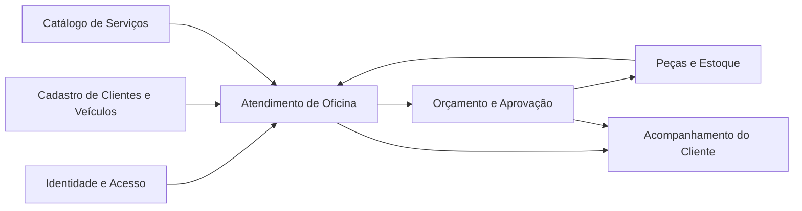
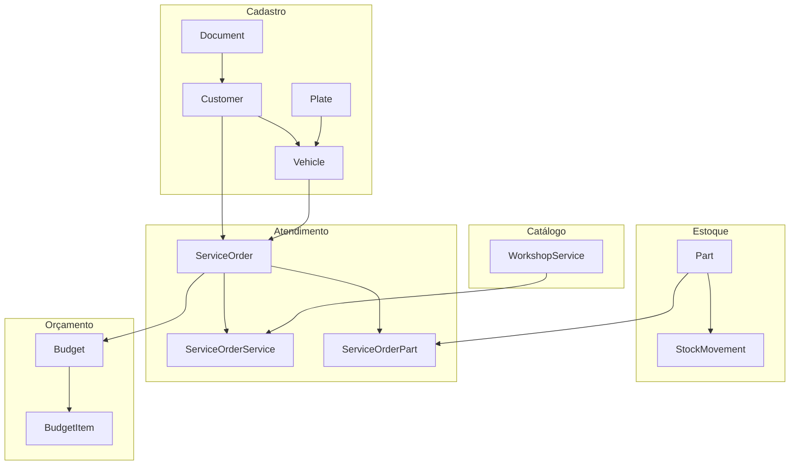
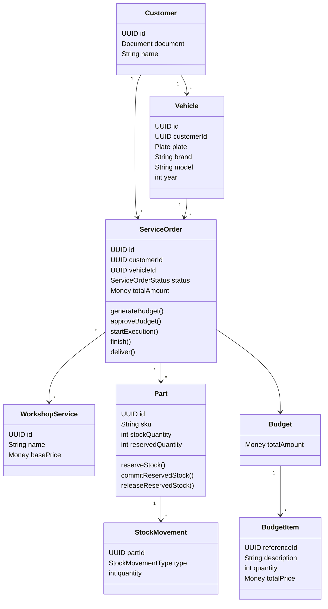

# Documentação DDD - AutoCare Hub

## 1. Introdução

O AutoCare Hub foi modelado a partir do fluxo de atendimento de uma oficina mecânica. A Ordem de Serviço é o centro do
processo, porque conecta cliente, veículo, serviços solicitados, peças utilizadas, orçamento, aprovação e acompanhamento
do atendimento.

A proposta do DDD neste projeto foi aproximar o código da linguagem usada no negócio. Em vez de organizar a solução
apenas por tabelas, controllers ou telas, os principais nomes, regras e fluxos partem do domínio da oficina.

O MVP é um backend monolítico em camadas. Mesmo assim, a modelagem separa os conceitos de negócio em contextos,
entidades, value objects e agregados para deixar claro onde cada regra pertence.

## 2. Domínio

O domínio do AutoCare Hub é o atendimento e a execução de serviços em oficina mecânica.

Esse domínio envolve:

- cadastro e identificação de clientes;
- cadastro e vínculo de veículos;
- abertura de Ordem de Serviço;
- registro de diagnóstico ou problema relatado;
- inclusão de serviços solicitados;
- inclusão de peças e insumos;
- controle de estoque;
- geração de orçamento;
- aprovação do orçamento pelo cliente;
- execução do serviço;
- finalização da Ordem de Serviço;
- entrega do veículo;
- acompanhamento da OS pelo cliente.

Dentro desse fluxo, a dor principal é controlar o atendimento sem perder o histórico da OS, sem avançar status
indevidamente e sem consumir peças sem controle de estoque.

## 3. Design Estratégico

O ponto mais importante para o negócio da oficina é controlar o ciclo da Ordem de Serviço. É nesse fluxo que a oficina
identifica o cliente, entende o veículo, registra os serviços, calcula o orçamento, aguarda aprovação, executa o
trabalho e registra a entrega.

O diferencial do MVP está em organizar esse fluxo com regras explícitas:

- a OS nasce vinculada a um cliente e a um veículo;
- serviços e peças compõem o orçamento;
- o orçamento precisa ser gerado antes da aprovação;
- a execução só começa depois da aprovação;
- a finalização e a entrega respeitam a ordem correta dos status;
- o estoque não pode ficar negativo;
- o cliente consegue acompanhar a OS pela API.

Itens como autenticação JWT, Swagger, Docker e persistência são importantes para entregar a aplicação, mas não são o
coração do domínio da oficina. Eles aparecem como suporte técnico, não como subdomínio principal.

## 4. Subdomínios

### 4.1 Subdomínio Principal

O subdomínio principal é a gestão da Ordem de Serviço e do fluxo de atendimento da oficina.

Ele cobre:

- criação e acompanhamento da OS;
- controle dos status da OS;
- geração e aprovação de orçamento;
- vínculo de serviços, peças e insumos à OS;
- início da execução, finalização e entrega.

Esse é o subdomínio principal porque resolve a dor central do enunciado: acompanhar o atendimento da oficina de ponta a
ponta, com orçamento, aprovação e status claros.

### 4.2 Subdomínios de Suporte

Os subdomínios de suporte ajudam o fluxo principal a funcionar:

| Subdomínio de suporte              | Papel no MVP                                                              |
|------------------------------------|---------------------------------------------------------------------------|
| Cadastro de clientes               | Mantém os dados do cliente e evita duplicidade por CPF/CNPJ.              |
| Cadastro de veículos               | Mantém placa, marca, modelo, ano e vínculo com o cliente.                 |
| Catálogo de serviços               | Lista os serviços oferecidos pela oficina e seus preços base.             |
| Gestão de peças e insumos          | Mantém peças, preços, SKU, categoria, marca e disponibilidade.            |
| Controle de estoque                | Controla entradas, saídas, reservas e baixas de peças.                    |
| Gestão de usuários administrativos | Permite que a oficina opere as APIs administrativas com perfis de acesso. |

Esses subdomínios não são menos importantes para a aplicação, mas apoiam o fluxo central da OS.

### 4.3 Subdomínios Genéricos

Os subdomínios genéricos são recursos comuns em muitos sistemas:

| Subdomínio genérico               | Papel no MVP                                                     |
|-----------------------------------|------------------------------------------------------------------|
| Autenticação JWT                  | Protege APIs administrativas e identifica o usuário autenticado. |
| Persistência relacional           | Armazena clientes, veículos, OS, peças, serviços e usuários.     |
| Swagger/OpenAPI                   | Documenta e permite testar a API.                                |
| Docker e configuração de ambiente | Padronizam a execução local.                                     |
| Logs e infraestrutura técnica     | Apoiam operação e diagnóstico técnico.                           |

Esses itens são necessários, mas não diferenciam o domínio de oficina.

## 5. Domain Experts

Como este é um projeto acadêmico, a modelagem foi feita a partir do enunciado do Tech Challenge e dos papéis envolvidos
no funcionamento de uma oficina. Não houve entrevista real com uma oficina específica.

Em um projeto real, os principais Domain Experts seriam:

| Domain Expert              | Conhecimento que traria para o domínio                                                              |
|----------------------------|-----------------------------------------------------------------------------------------------------|
| Dono ou gerente da oficina | Prioridades do atendimento, visão do processo completo e indicadores importantes.                   |
| Atendente                  | Fluxo de abertura da OS, identificação do cliente, cadastro do veículo e comunicação com o cliente. |
| Mecânico                   | Diagnóstico, execução do serviço, ordem das etapas e critérios para finalizar a OS.                 |
| Responsável pelo estoque   | Entrada, saída, reserva, baixa, estoque mínimo e controle de peças.                                 |
| Cliente final              | Necessidade de acompanhar a OS e aprovar o orçamento com clareza.                                   |

O atendente conhece a abertura da OS, o mecânico entende diagnóstico e execução, o responsável pelo estoque conhece as
regras de peças e o cliente final representa a visão de acompanhamento e aprovação.

### 5.1 Papéis de negócio e perfis do sistema

Os papéis citados como Domain Experts representam a visão de negócio. No código, as permissões são controladas pela
entidade `User`, pelo enum `UserRole` e pelos campos de perfil.

| Papel de negócio         | Representação no sistema                                                                             |
|--------------------------|------------------------------------------------------------------------------------------------------|
| Administrador master     | `role=ADMIN`, `profileType=MASTER_ADMIN`                                                             |
| Administrador da oficina | `role=ADMIN`, `profileType=WORKSHOP_ADMIN`                                                           |
| Responsável pelo estoque | `role=ADMIN`, `profileType=PARTS_STORE_ADMIN` ou `role=EMPLOYEE`, `profileType=PARTS_STORE_EMPLOYEE` |
| Atendente                | `role=EMPLOYEE`, com perfil operacional da oficina ou loja                                           |
| Mecânico                 | `role=EMPLOYEE`, `profileType=WORKSHOP_EMPLOYEE`, `employeeSubRole=MECHANIC`                         |
| Cliente final            | `role=CUSTOMER`, `profileType=CUSTOMER_OWNER`                                                        |

Essa separação evita confundir papel de negócio com classe de domínio. Atendente e mecânico aparecem na explicação do
processo, mas o backend autoriza as ações por perfis e permissões do usuário autenticado.

## 6. Linguagem Ubíqua

A linguagem ubíqua abaixo conecta os termos do negócio aos nomes técnicos usados no código. Os nomes técnicos foram
mantidos em inglês porque são os nomes reais das classes, métodos ou enums do projeto.

| Termo de negócio        | Nome técnico no código                       | Definição                                                     | Observação de uso                                                 |
|-------------------------|----------------------------------------------|---------------------------------------------------------------|-------------------------------------------------------------------|
| Cliente                 | `Customer`                                   | Pessoa física ou jurídica atendida pela oficina.              | Identificado por CPF ou CNPJ.                                     |
| Documento               | `Document`                                   | Objeto que valida e normaliza CPF/CNPJ.                       | Evita duplicidade por diferença de máscara.                       |
| CPF/CNPJ                | `DocumentType` e `Document`                  | Documento usado para identificar o cliente.                   | Aceita CPF e CNPJ válidos.                                        |
| Veículo                 | `Vehicle`                                    | Veículo vinculado a um cliente.                               | Possui placa, marca, modelo, ano e quilometragem.                 |
| Placa                   | `Plate`                                      | Identificador do veículo.                                     | Aceita formato antigo e Mercosul.                                 |
| Ordem de Serviço        | `ServiceOrder`                               | Registro central do atendimento da oficina.                   | Agrega cliente, veículo, serviços, peças, orçamento e status.     |
| Diagnóstico             | `diagnosticNotes`                            | Descrição inicial do problema ou diagnóstico informado na OS. | Campo usado na criação da OS.                                     |
| Status da OS            | `ServiceOrderStatus`                         | Estado atual da Ordem de Serviço.                             | Controla as transições permitidas.                                |
| Serviço                 | `WorkshopService`                            | Serviço oferecido pela oficina.                               | Entra no cálculo do orçamento.                                    |
| Peça/Insumo             | `Part`                                       | Item físico controlado em estoque.                            | Pode ser vinculado à OS e reservado.                              |
| Estoque                 | Campos de `Part`                             | Quantidade total, reservada e disponível de uma peça.         | A disponibilidade considera reservas.                             |
| Reserva de peça         | `reserveStock`                               | Bloqueio temporário de quantidade para uma OS/orçamento.      | Não permite reservar mais que o disponível.                       |
| Baixa de estoque        | `commitReservedStock` e `reduceStock`        | Consumo definitivo da peça.                                   | Reduz estoque respeitando disponibilidade e reserva.              |
| Movimentação de estoque | `StockMovement`                              | Registro de alteração no estoque.                             | Usado em entradas, saídas, ajustes e baixas.                      |
| Orçamento               | `Budget`                                     | Cálculo financeiro da OS.                                     | Soma serviços e peças.                                            |
| Item de orçamento       | `BudgetItem`                                 | Item calculável do orçamento.                                 | Possui referência, descrição, quantidade, valor unitário e total. |
| Aprovação do orçamento  | `approveBudget`                              | Aceite do cliente para seguir com a execução.                 | Exige orçamento gerado.                                           |
| Execução                | `startExecution`                             | Início do trabalho da oficina na OS.                          | Exige orçamento aprovado.                                         |
| Finalização             | `finish`                                     | Conclusão técnica do serviço.                                 | Só ocorre a partir de OS em execução.                             |
| Entrega                 | `deliver`                                    | Registro de entrega do veículo ao cliente.                    | Só ocorre após a finalização.                                     |
| Tempo médio de execução | `GetAverageServiceOrderExecutionTimeUseCase` | Métrica calculada com base em `startedAt` e `finishedAt`.     | Não existe como value object separado.                            |

### Status da Ordem de Serviço

No domínio, os status são:

| Status no domínio      | Código externo na API | Significado                           |
|------------------------|-----------------------|---------------------------------------|
| `RECEBIDA`             | `RECEIVED`            | OS criada e recebida pela oficina.    |
| `EM_DIAGNOSTICO`       | `IN_DIAGNOSIS`        | Oficina iniciou análise/diagnóstico.  |
| `AGUARDANDO_APROVACAO` | `WAITING_APPROVAL`    | Orçamento gerado e aguardando aceite. |
| `EM_EXECUCAO`          | `IN_PROGRESS`         | Serviço em execução.                  |
| `FINALIZADA`           | `FINISHED`            | Serviço finalizado pela oficina.      |
| `ENTREGUE`             | `DELIVERED`           | Veículo entregue ao cliente.          |

## 7. Bounded Contexts

Os Bounded Contexts abaixo são divisões conceituais dentro de um monolito em camadas. Eles não representam
microserviços.

| Bounded Context                 | Responsabilidade                                       | Principais conceitos                                       | Relação com outros contextos                                  |
|---------------------------------|--------------------------------------------------------|------------------------------------------------------------|---------------------------------------------------------------|
| Atendimento de Oficina          | Controlar a Ordem de Serviço e seu ciclo de vida.      | `ServiceOrder`, status, diagnóstico, datas de execução.    | Usa cliente, veículo, serviços, peças e orçamento.            |
| Cadastro de Clientes e Veículos | Identificar o cliente e seus veículos.                 | `Customer`, `Document`, `Vehicle`, `Plate`, `Address`.     | Fornece cliente e veículo para a OS.                          |
| Catálogo de Serviços            | Manter os serviços oferecidos pela oficina.            | `WorkshopService`, preço base, tempo estimado.             | Serviços entram na composição da OS e do orçamento.           |
| Gestão de Peças e Estoque       | Controlar peças, reservas, baixas e movimentações.     | `Part`, `StockMovement`, estoque, reserva.                 | Peças entram na OS e no orçamento.                            |
| Orçamentos e Aprovação          | Calcular o valor da OS e registrar aceite.             | `Budget`, `BudgetItem`, `approveBudget`.                   | Depende dos itens da OS e libera a execução.                  |
| Identidade e Acesso             | Controlar acesso às APIs administrativas e de cliente. | `User`, `UserRole`, `profileType`, `employeeSubRole`, JWT. | Protege operações internas da oficina e consultas do cliente. |

## 8. Entidades

As entidades possuem identidade própria e ciclo de vida no sistema.

| Entidade          | Papel no domínio                                         |
|-------------------|----------------------------------------------------------|
| `Customer`        | Representa o cliente da oficina.                         |
| `Vehicle`         | Representa o veículo vinculado ao cliente.               |
| `ServiceOrder`    | Representa a Ordem de Serviço e concentra o atendimento. |
| `WorkshopService` | Representa um serviço oferecido pela oficina.            |
| `Part`            | Representa peça ou insumo com estoque e preço.           |
| `StockMovement`   | Representa um registro de movimentação de estoque.       |
| `User`            | Representa usuário autenticado do sistema.               |

## 9. Value Objects

Value Objects não são definidos por identidade própria. Eles carregam valor e regra, ajudando a proteger a consistência
do domínio.

| Value Object | Por que é value object                                                        |
|--------------|-------------------------------------------------------------------------------|
| `Document`   | Valida e normaliza CPF/CNPJ. O valor importa mais que uma identidade própria. |
| `Plate`      | Valida e normaliza placa de veículo.                                          |
| `Money`      | Representa valores monetários e impede valores inválidos.                     |
| `Address`    | Agrupa os dados de endereço do cliente.                                       |
| `BudgetItem` | Representa uma linha calculável do orçamento com quantidade e preço.          |

## 10. Agregados

### 10.1 Agregado `ServiceOrder`

`ServiceOrder` é o agregado central do atendimento. Ele controla os itens da OS, o orçamento, a aprovação e as
transições de status.

Invariantes protegidas pelo agregado:

- uma OS precisa ter cliente;
- uma OS precisa ter veículo;
- o diagnóstico ou observação inicial é obrigatório;
- serviços e peças não podem ser alterados depois que a OS entra em estados de orçamento, execução, finalização ou
  entrega;
- o orçamento coloca a OS em `AGUARDANDO_APROVACAO`;
- o orçamento precisa existir antes da aprovação;
- a execução exige orçamento aprovado;
- a finalização exige OS em execução;
- a entrega exige OS finalizada.

### 10.2 Agregado `Part`

`Part` concentra as regras de estoque da peça ou insumo.

Invariantes protegidas pelo agregado:

- estoque não pode ser negativo;
- quantidade reservada não pode ser negativa;
- reserva não pode ser maior que o estoque;
- preço de venda precisa ser maior que zero;
- reserva exige quantidade disponível;
- baixa exige quantidade válida e estoque suficiente;
- reserva expirada é liberada quando a disponibilidade é avaliada.

### 10.3 Outros agregados simples

`Customer`, `Vehicle` e `WorkshopService` também possuem identidade e regras próprias, mas têm regras mais diretas. Eles
apoiam o fluxo principal da OS.

## 11. Repositórios

As portas de repositório ficam em `br.com.autocarehub.application.port.out`. Elas permitem que os casos de uso trabalhem
com o domínio sem depender diretamente do JPA.

Repositórios principais:

- `CustomerRepository`
- `VehicleRepository`
- `WorkshopServiceRepository`
- `PartRepository`
- `StockMovementRepository`
- `ServiceOrderRepository`
- `UserRepository`

As implementações ficam na infraestrutura, em adapters e repositories JPA. Isso preserva a separação entre regra de
negócio e tecnologia de persistência.

## 12. Serviços de Domínio e Serviços de Aplicação

No AutoCare Hub, a maior parte das regras de domínio fica nas entidades e value objects. O projeto não força a criação
de serviços de domínio quando a regra pertence naturalmente ao agregado.

### Regras de domínio

| Regra                        | Onde está no código |
|------------------------------|---------------------|
| CPF/CNPJ válido              | `Document`          |
| Placa válida                 | `Plate`             |
| Valores monetários válidos   | `Money`             |
| Transições válidas da OS     | `ServiceOrder`      |
| Aprovação antes da execução  | `ServiceOrder`      |
| Finalização antes da entrega | `ServiceOrder`      |
| Reserva e baixa de estoque   | `Part`              |

### Serviços de aplicação

Os use cases orquestram o fluxo entre entidades, repositórios e regras de domínio. Eles não substituem as regras do
domínio.

Exemplos:

- `CreateServiceOrderUseCase`: coordena cliente, veículo, serviços, peças e criação da OS.
- `GenerateServiceOrderBudgetUseCase`: aciona a geração do orçamento e reserva peças quando aplicável.
- `ApproveServiceOrderBudgetUseCase`: registra a aprovação do orçamento.
- `UpdateServiceOrderStatusUseCase`: aplica as transições de status permitidas.
- `TrackServiceOrderUseCase`: consulta a OS para acompanhamento pelo cliente.
- `GetAverageServiceOrderExecutionTimeUseCase`: calcula a métrica operacional de tempo médio.
- `RegisterPartStockMovementUseCase`: registra movimentações de estoque.

Controllers REST apenas recebem requisições, validam entrada no contrato da API e delegam para os use cases. Eles não
concentram regra de negócio.

## 13. Casos de Uso da Aplicação

Os casos de uso ficam em `br.com.autocarehub.application.usecase`.

| Área                    | Use cases principais                                                                                                                                                                                                                                                                 |
|-------------------------|--------------------------------------------------------------------------------------------------------------------------------------------------------------------------------------------------------------------------------------------------------------------------------------|
| Clientes                | `CreateCustomerUseCase`, `UpdateCustomerUseCase`, `FindCustomerUseCase`, `ListCustomersUseCase`, `DeleteCustomerUseCase`                                                                                                                                                             |
| Veículos                | `CreateVehicleUseCase`, `UpdateVehicleUseCase`, `FindVehicleUseCase`, `ListVehiclesUseCase`, `ListVehiclesByCustomerUseCase`, `DeleteVehicleUseCase`                                                                                                                                 |
| Serviços                | `CreateWorkshopServiceUseCase`, `UpdateWorkshopServiceUseCase`, `FindWorkshopServiceUseCase`, `ListWorkshopServicesUseCase`, `DeleteWorkshopServiceUseCase`                                                                                                                          |
| Peças e estoque         | `CreatePartUseCase`, `UpdatePartUseCase`, `ListPartsUseCase`, `RegisterPartStockMovementUseCase`, `ReservePartStockUseCase`, `ReleasePartReservationUseCase`, `CommitPartReservationUseCase`, `UpdatePartStockUseCase`                                                               |
| Ordens de Serviço       | `CreateServiceOrderUseCase`, `AddServiceToServiceOrderUseCase`, `AddPartToServiceOrderUseCase`, `GenerateServiceOrderBudgetUseCase`, `ApproveServiceOrderBudgetUseCase`, `UpdateServiceOrderStatusUseCase`, `TrackServiceOrderUseCase`, `GetAverageServiceOrderExecutionTimeUseCase` |
| Autenticação e usuários | `LoginUseCase`, `CreateUserUseCase`, `UpdateUserUseCase`, `ChangeUserPasswordUseCase`                                                                                                                                                                                                |

## 14. Fluxos de Negócio

### 14.1 Criação da Ordem de Serviço

1. O atendente identifica o cliente por CPF/CNPJ.
2. O sistema localiza o cliente ou permite seu cadastro.
3. O atendente seleciona ou cadastra o veículo.
4. O sistema valida a placa e o vínculo do veículo com o cliente.
5. O atendente registra diagnóstico ou problema relatado.
6. O atendente inclui serviços solicitados.
7. O atendente inclui peças ou insumos, quando necessário.
8. O sistema cria a OS.
9. O sistema gera o orçamento no fluxo de orçamento da OS.
10. A OS fica disponível para acompanhamento.

### 14.2 Orçamento, aprovação e execução

1. A oficina gera o orçamento a partir dos serviços e peças da OS.
2. O sistema calcula total de serviços, total de peças e valor total.
3. O sistema reserva peças quando aplicável.
4. O cliente aprova o orçamento.
5. A oficina inicia a execução.
6. O mecânico finaliza o serviço.
7. O atendente registra a entrega do veículo.

### 14.3 Peças, insumos e estoque

1. O usuário administrativo cadastra a peça ou insumo.
2. O sistema valida nome, SKU, categoria, marca, preços e estoque.
3. A oficina registra entradas, saídas, ajustes, reservas ou baixas.
4. O sistema atualiza estoque total, reservado e disponível.
5. O sistema bloqueia operações que deixariam o estoque inválido.

## 15. Diagramas DDD

### 15.1 Mapa de contextos

### 15.2 Agregados e relações principais

### 15.3 Estado da Ordem de Serviço

### 15.4 Diagrama conceitual de classes

