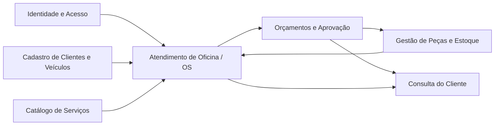
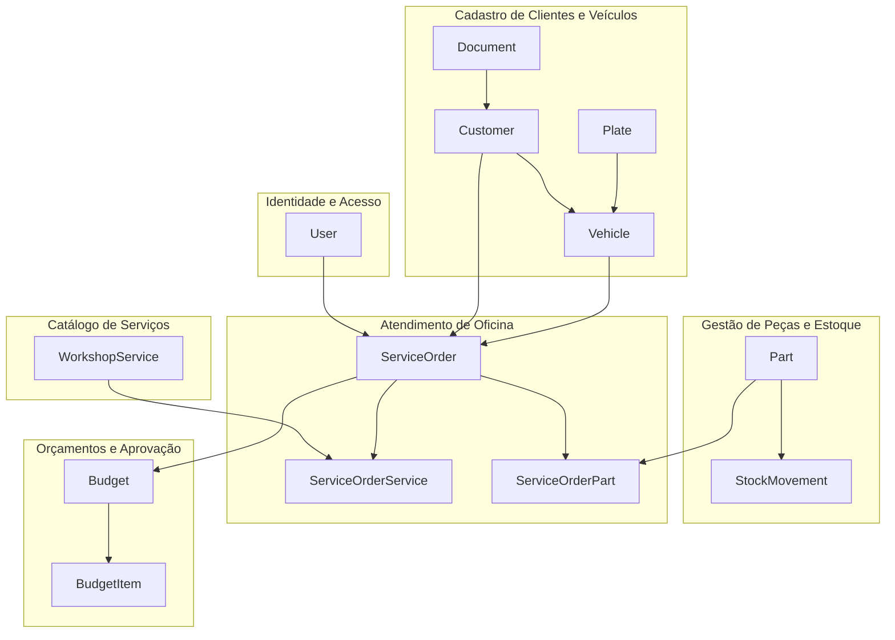
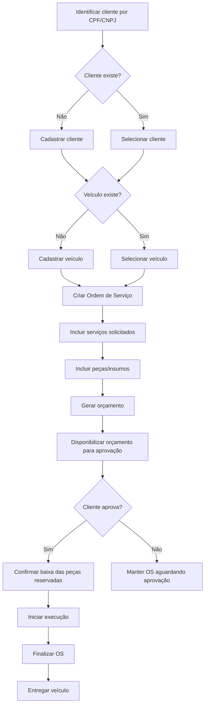
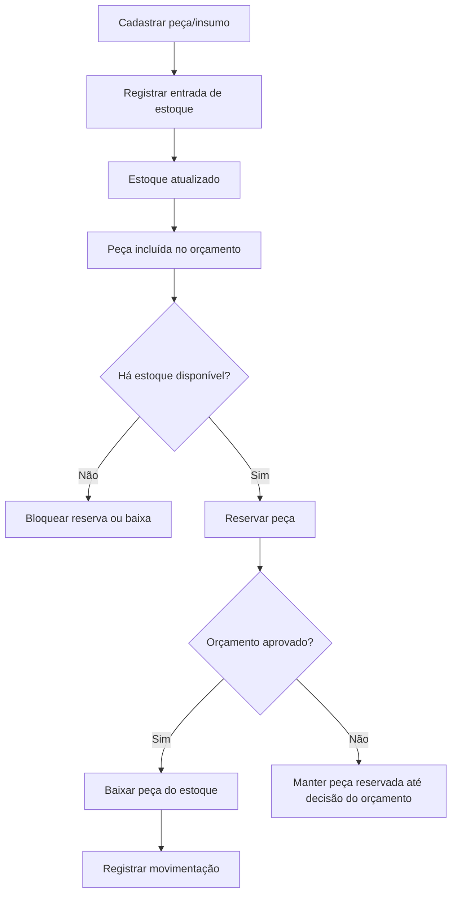
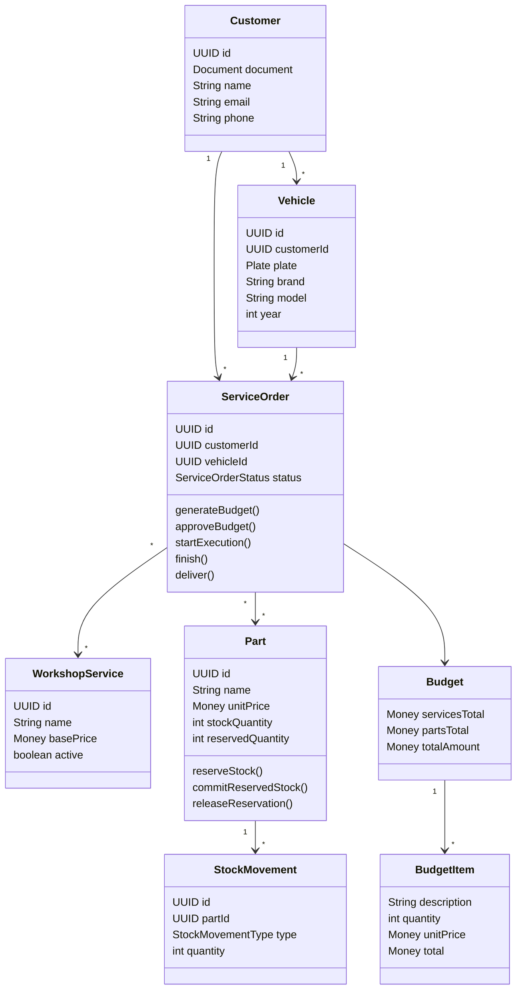

# Documentação DDD - AutoCare Hub

## 1. Introdução

Este documento registra como o Domain-Driven Design foi aplicado no AutoCare Hub, projeto desenvolvido para o Tech Challenge da FIAP.

O sistema foi construído como um back-end monolítico em camadas. A organização do código separa regras de negócio, casos de uso, infraestrutura e interfaces REST, mantendo o domínio da oficina como ponto central da aplicação.

A documentação também serve como apoio para explicar as principais decisões tomadas no MVP: quais são os contextos do negócio, quais entidades fazem parte do domínio, quais regras precisam ser protegidas e como os fluxos principais da oficina acontecem no sistema.

## 2. Contexto do problema

Uma oficina mecânica de médio porte precisa controlar clientes, veículos, ordens de serviço, serviços solicitados, peças, insumos, orçamento, aprovação e estoque. Quando esse controle é feito por planilhas, anotações manuais ou mensagens soltas, o processo fica sujeito a erros de priorização, perda de histórico, divergência de estoque e falta de transparência para o cliente.

O AutoCare Hub foi criado para organizar esse fluxo de atendimento. A aplicação permite identificar o cliente, cadastrar ou vincular o veículo, criar a Ordem de Serviço, incluir serviços e peças, gerar o orçamento, aprovar a execução, acompanhar o status do serviço e registrar a entrega do veículo.

## 3. Objetivo do MVP

O MVP entrega uma API REST para apoiar a operação de uma oficina mecânica, com foco em:

- gestão de clientes;
- gestão de veículos;
- gestão de serviços;
- gestão de peças e insumos;
- controle de estoque;
- criação e acompanhamento de Ordens de Serviço;
- geração automática de orçamento;
- aprovação de orçamento;
- consulta da Ordem de Serviço pelo cliente;
- autenticação JWT para APIs administrativas;
- validação de CPF/CNPJ e placa;
- documentação OpenAPI/Swagger;
- testes automatizados nos fluxos principais.

Pagamentos, agenda, notificações externas, marketplace e integrações com sistemas de terceiros não fazem parte do escopo obrigatório desta primeira versão.

## 4. Visão geral do domínio

O domínio principal do AutoCare Hub é o atendimento de oficina. Nesse domínio, a Ordem de Serviço é o agregado central, pois conecta cliente, veículo, serviços solicitados, peças utilizadas, orçamento, aprovação, status e datas importantes do atendimento.

A arquitetura foi organizada em camadas:

- `br.com.autocarehub.domain`: entidades, value objects, enums, exceções e regras de domínio.
- `br.com.autocarehub.application`: casos de uso, DTOs e portas de repositório.
- `br.com.autocarehub.infrastructure`: persistência, segurança, configurações e adapters.
- `br.com.autocarehub.interfaces`: controllers REST e contratos expostos pela API.

Essa separação ajuda a manter as regras de negócio independentes de detalhes técnicos, como banco de dados, autenticação e formato das requisições HTTP.

## 5. Linguagem Ubíqua

A linguagem ubíqua foi definida a partir dos termos usados no contexto da oficina e refletida nos nomes de classes, métodos, endpoints e documentação.

| Termo de negócio | Nome técnico no código | Definição |
|---|---|---|
| Cliente | `Customer` | Pessoa física ou jurídica atendida pela oficina, identificada por CPF ou CNPJ. |
| Documento | `Document` | CPF ou CNPJ validado, normalizado e usado para evitar duplicidade de cliente. |
| Veículo | `Vehicle` | Veículo pertencente a um cliente, identificado por placa, marca, modelo e ano. |
| Placa | `Plate` | Identificador do veículo, aceitando o formato brasileiro antigo e o padrão Mercosul. |
| Ordem de Serviço | `ServiceOrder` | Registro central do atendimento da oficina. |
| Status da OS | `ServiceOrderStatus` | Estado atual da Ordem de Serviço durante o fluxo de atendimento. |
| Serviço | `WorkshopService` | Atividade executada pela oficina, como troca de óleo, alinhamento ou revisão. |
| Peça/Insumo | `Part` | Item físico usado durante o serviço ou controlado em estoque. |
| Estoque | `Part` | Controle de quantidade total, quantidade reservada e quantidade disponível. |
| Movimentação de estoque | `StockMovement` | Registro de entrada, saída, venda, ajuste ou baixa de peça/insumo. |
| Orçamento | `Budget` | Cálculo financeiro gerado a partir dos serviços e peças vinculados à OS. |
| Item de orçamento | `BudgetItem` | Item calculável do orçamento, com descrição, quantidade, valor unitário e total. |
| Aprovação | `approveBudget` | Ação que registra o aceite do orçamento para continuidade da execução. |
| Baixa de estoque | Métodos de `Part` | Redução definitiva do estoque após aprovação, venda ou saída registrada. |

Os nomes técnicos foram mantidos em inglês para manter consistência com o código, enquanto a documentação apresenta o significado em português.

### Status da Ordem de Serviço

No domínio, os status da OS são representados por:

- `RECEBIDA`
- `EM_DIAGNOSTICO`
- `AGUARDANDO_APROVACAO`
- `EM_EXECUCAO`
- `FINALIZADA`
- `ENTREGUE`

Na API, esses estados são expostos pelos códigos externos:

- `RECEIVED`
- `IN_DIAGNOSIS`
- `WAITING_APPROVAL`
- `IN_PROGRESS`
- `FINISHED`
- `DELIVERED`

## 6. Subdomínios

### Core Domain

O Core Domain concentra as regras que diferenciam o sistema e representam o coração do desafio:

- gestão da Ordem de Serviço;
- geração e aprovação de orçamento;
- controle de status do atendimento;
- controle de peças vinculadas à OS;
- reserva e baixa de estoque.

### Supporting Domains

Os Supporting Domains dão suporte ao fluxo principal:

- cadastro de clientes;
- cadastro de veículos;
- cadastro de serviços da oficina;
- cadastro de peças e insumos;
- gestão de usuários administrativos.

### Generic Domains

Os Generic Domains resolvem necessidades técnicas comuns da aplicação:

- autenticação JWT;
- persistência relacional;
- documentação OpenAPI/Swagger;
- configuração de ambiente local com Docker.

## 7. Bounded Contexts

### Atendimento de Oficina

É o contexto principal do MVP. Nele ficam as regras da Ordem de Serviço, diagnóstico, serviços solicitados, peças vinculadas, orçamento, aprovação, status e acompanhamento do atendimento.

### Cadastro de Clientes e Veículos

Responsável pela identificação do cliente por CPF/CNPJ, manutenção dos dados cadastrais e vínculo dos veículos por placa.

### Catálogo de Serviços

Responsável pelos serviços oferecidos pela oficina. Esses serviços podem ser incluídos em uma Ordem de Serviço e participam do cálculo do orçamento.

### Gestão de Peças e Estoque

Responsável pelo cadastro de peças e insumos, controle de quantidade disponível, reservas, entradas, saídas, ajustes e baixas de estoque.

### Orçamentos e Aprovação

Responsável pelo cálculo automático do orçamento, disponibilização para aprovação e registro do aceite. No MVP, esse contexto trabalha de forma integrada ao fluxo da Ordem de Serviço.

### Identidade e Acesso

Responsável pela autenticação JWT, criação de usuários administrativos e proteção das rotas internas da API.

## 8. Entidades

As principais entidades do domínio são:

- `Customer`: representa o cliente da oficina.
- `Vehicle`: representa o veículo vinculado a um cliente.
- `WorkshopService`: representa um serviço oferecido pela oficina.
- `Part`: representa uma peça ou insumo com controle de preço, estoque e reserva.
- `ServiceOrder`: representa a Ordem de Serviço e funciona como agregado principal do atendimento.
- `StockMovement`: representa uma movimentação de estoque.
- `User`: representa uma conta administrativa autenticável.

## 9. Value Objects

Os principais value objects identificados no projeto são:

- `Document`: valida e normaliza CPF/CNPJ.
- `Plate`: valida e normaliza placa de veículo.
- `Money`: representa valores monetários e evita valores negativos.
- `Address`: estrutura os dados de endereço do cliente.
- `BudgetItem`: representa um item calculável do orçamento.

Esses objetos ajudam a proteger regras importantes do domínio e evitam que validações sensíveis fiquem espalhadas pela aplicação.

## 10. Agregados

### Ordem de Serviço

Raiz do agregado: `ServiceOrder`.

A Ordem de Serviço concentra o fluxo principal do atendimento. Ela é responsável por:

- vincular cliente e veículo;
- controlar serviços solicitados;
- controlar peças e insumos vinculados;
- gerar orçamento;
- registrar aprovação;
- controlar status e transições válidas;
- registrar datas de orçamento, aprovação, execução, finalização e entrega.

Principais invariantes:

- uma OS não pode existir sem cliente;
- uma OS não pode existir sem veículo;
- uma OS precisa ter ao menos um serviço solicitado;
- o veículo da OS precisa pertencer ao cliente informado;
- itens não podem ser alterados após a geração do orçamento;
- a execução exige orçamento aprovado;
- a finalização exige execução iniciada;
- a entrega exige OS finalizada.

### Peça/Insumo

Raiz do agregado: `Part`.

A peça ou insumo concentra as regras de estoque. Suas responsabilidades são:

- controlar estoque total;
- controlar quantidade reservada;
- calcular disponibilidade;
- impedir estoque negativo;
- reservar quantidade para orçamento;
- confirmar reserva como baixa;
- liberar reserva quando necessário;
- liberar reserva expirada quando a disponibilidade, a reserva ou a baixa é avaliada;
- registrar movimentações de entrada, saída, ajuste, venda ou baixa.

Principais invariantes:

- a quantidade em estoque não pode ficar negativa;
- a reserva não pode ser maior que a quantidade disponível;
- a baixa não pode ultrapassar a quantidade disponível ou reservada, conforme o fluxo executado.

### Cliente e Veículo

`Customer` e `Vehicle` possuem identidade própria. O veículo sempre pertence a um cliente, e a placa é tratada como identificador único do veículo.

### Métrica de execução

O tempo médio de execução não foi modelado como value object separado. No código, ele é calculado pelo caso de uso
`GetAverageServiceOrderExecutionTimeUseCase`, usando as datas `startedAt` e `finishedAt` das Ordens de Serviço
concluídas. Essa decisão mantém a métrica como leitura operacional da aplicação, sem criar um conceito de domínio
extra apenas para a entrega do MVP.

## 11. Repositórios

As portas de repositório ficam na camada de aplicação, em `br.com.autocarehub.application.port.out`.

Principais repositórios:

- `CustomerRepository`
- `VehicleRepository`
- `WorkshopServiceRepository`
- `PartRepository`
- `StockMovementRepository`
- `ServiceOrderRepository`
- `UserRepository`

As implementações JPA ficam em `br.com.autocarehub.infrastructure.persistence.adapter`. Essa separação evita que o domínio dependa diretamente da tecnologia de persistência.

## 12. Regras e serviços de domínio

As regras de domínio ficam concentradas principalmente nas entidades e value objects.

Principais pontos protegidos no domínio:

- `ServiceOrder`: controla criação da OS, geração de orçamento, aprovação e transições de status.
- `Part`: controla reserva, liberação, baixa e disponibilidade de estoque.
- `Document`: valida e normaliza CPF/CNPJ.
- `Plate`: valida e normaliza placa.
- `Money`: evita valores monetários inválidos.

Os eventos descritos nesta documentação fazem parte da modelagem DDD e do Event Storming. O projeto não utiliza Event Sourcing nem barramento de eventos no MVP, pois a proposta técnica da fase é um back-end monolítico em camadas.

## 13. Casos de uso da aplicação

Os casos de uso ficam em `br.com.autocarehub.application.usecase` e representam as ações disponíveis no sistema.

### Clientes

- `CreateCustomerUseCase`
- `UpdateCustomerUseCase`
- `FindCustomerUseCase`
- `ListCustomersUseCase`
- `DeleteCustomerUseCase`

### Veículos

- `CreateVehicleUseCase`
- `UpdateVehicleUseCase`
- `FindVehicleUseCase`
- `ListVehiclesUseCase`
- `ListVehiclesByCustomerUseCase`
- `DeleteVehicleUseCase`

### Serviços

- `CreateWorkshopServiceUseCase`
- `UpdateWorkshopServiceUseCase`
- `FindWorkshopServiceUseCase`
- `ListWorkshopServicesUseCase`
- `DeleteWorkshopServiceUseCase`

### Peças e estoque

- `CreatePartUseCase`
- `UpdatePartUseCase`
- `FindPartUseCase`
- `ListPartsUseCase`
- `RegisterPartStockMovementUseCase`
- `ReservePartStockUseCase`
- `ReleasePartReservationUseCase`
- `CommitPartReservationUseCase`
- `UpdatePartStockUseCase`

### Ordens de Serviço

- `CreateServiceOrderUseCase`
- `AddServiceToServiceOrderUseCase`
- `AddPartToServiceOrderUseCase`
- `GenerateServiceOrderBudgetUseCase`
- `ApproveServiceOrderBudgetUseCase`
- `UpdateServiceOrderStatusUseCase`
- `TrackServiceOrderUseCase`
- `GetAverageServiceOrderExecutionTimeUseCase`

### Autenticação e usuários

- `LoginUseCase`
- `CreateUserUseCase`
- `UpdateUserUseCase`
- `ChangeUserPasswordUseCase`

## 14. Eventos de domínio usados no Event Storming

Os eventos abaixo foram usados para modelar os fluxos principais do sistema:

- `ClienteIdentificado`
- `ClienteCadastrado`
- `VeiculoCadastrado`
- `OrdemServicoCriada`
- `DiagnosticoIniciado`
- `ServicoIncluidoNaOrdem`
- `PecaIncluidaNaOrdem`
- `OrcamentoGerado`
- `OrcamentoDisponibilizado`
- `OrcamentoAprovado`
- `OrdemServicoEmExecucao`
- `OrdemServicoFinalizada`
- `VeiculoEntregue`
- `EstoqueAtualizado`
- `PecaReservada`
- `ReservaPecaLiberada`
- `PecaBaixadaDoEstoque`
- `EstoqueInsuficienteIdentificado`

Esses eventos não significam que a aplicação usa Event Sourcing. Eles foram usados como ferramenta de modelagem para entender o domínio, nomear comportamentos e organizar os fluxos.

## 15. Comandos do domínio

Os principais comandos identificados foram:

- `IdentificarCliente`
- `CadastrarCliente`
- `CadastrarVeiculo`
- `CriarOrdemServico`
- `IncluirServicoNaOrdem`
- `IncluirPecaNaOrdem`
- `GerarOrcamento`
- `AprovarOrcamento`
- `IniciarDiagnostico`
- `IniciarExecucao`
- `FinalizarOrdemServico`
- `EntregarVeiculo`
- `CadastrarPeca`
- `RegistrarEntradaEstoque`
- `RegistrarSaidaEstoque`
- `ReservarPeca`
- `LiberarReservaPeca`
- `BaixarPecaDoEstoque`

## 16. Políticas e regras de negócio

As principais regras de negócio do MVP são:

- CPF/CNPJ inválido não pode ser salvo.
- Placa inválida não pode ser salva.
- Cliente não pode ser duplicado por diferença de formatação do documento.
- Veículo precisa estar vinculado a um cliente.
- Ordem de Serviço exige cliente, veículo e ao menos um serviço.
- O veículo da OS deve pertencer ao cliente informado.
- O orçamento é calculado automaticamente a partir dos serviços e peças.
- Após a geração do orçamento, a OS fica em `AGUARDANDO_APROVACAO`.
- O orçamento só pode ser aprovado se tiver sido gerado.
- A execução só pode ser iniciada após a aprovação do orçamento.
- A finalização só pode ocorrer após o início da execução.
- A entrega só pode ocorrer após a finalização.
- Transições inválidas de status geram exceção de domínio.
- O estoque não pode ficar negativo.
- A reserva de peça não pode exceder o estoque disponível.
- A baixa de estoque não pode exceder a quantidade disponível ou reservada, conforme o fluxo.

## 17. Fluxo de criação da Ordem de Serviço

1. O usuário administrativo identifica o cliente por CPF/CNPJ.
2. Se o cliente não existir, o usuário cadastra o cliente.
3. O usuário seleciona ou cadastra o veículo.
4. O sistema valida se o veículo pertence ao cliente informado.
5. O usuário registra o diagnóstico ou problema relatado.
6. O usuário inclui os serviços solicitados.
7. O usuário inclui peças ou insumos, quando necessário.
8. O sistema cria a Ordem de Serviço.
9. O sistema gera o orçamento com base nos serviços e peças vinculados.
10. A OS fica disponível para acompanhamento e aprovação conforme o status do fluxo.

## 18. Fluxo de acompanhamento da Ordem de Serviço

1. O cliente consulta a Ordem de Serviço via API.
2. O sistema valida os dados necessários para localizar a OS.
3. O sistema retorna os dados básicos da OS, veículo, status, serviços, peças e orçamento.
4. O cliente acompanha a evolução pelos status:
    - `RECEBIDA`
    - `EM_DIAGNOSTICO`
    - `AGUARDANDO_APROVACAO`
    - `EM_EXECUCAO`
    - `FINALIZADA`
    - `ENTREGUE`

## 19. Fluxo de aprovação de orçamento

1. A oficina gera o orçamento da Ordem de Serviço.
2. O sistema calcula o total de serviços, o total de peças e o total geral.
3. O sistema reserva as peças vinculadas ao orçamento, quando aplicável.
4. O orçamento fica disponível para aprovação.
5. O cliente aprova o orçamento.
6. O sistema confirma a baixa das peças reservadas.
7. A oficina inicia a execução da OS.
8. O status da OS passa para `EM_EXECUCAO`.

A execução do serviço só acontece após a aprovação do orçamento. Isso evita baixa indevida de peças e impede que uma OS avance para execução sem aceite.

## 20. Fluxo de gestão de peças e insumos

1. O usuário administrativo cadastra a peça ou insumo.
2. O sistema valida nome, preço, quantidade e estoque mínimo.
3. O usuário registra entradas, saídas, vendas ou ajustes.
4. O sistema registra a movimentação de estoque.
5. O sistema impede estoque negativo.
6. O sistema permite identificar peças abaixo do estoque mínimo.

## 21. Fluxo de baixa de estoque

1. A peça é vinculada a um orçamento ou a uma movimentação.
2. Quando a peça entra em um orçamento, ela pode ser reservada antes da baixa definitiva.
3. Quando o orçamento é aprovado, a reserva é confirmada.
4. O sistema reduz o estoque total e a quantidade reservada.
5. O sistema registra a movimentação.
6. Se não houver estoque suficiente, o sistema bloqueia a baixa.

## 22. Diagramas Mermaid

### Context Map

### Relação entre contextos e agregados

### Fluxo da Ordem de Serviço

### Fluxo de Estoque

### Diagrama de estados da OS

### Diagrama conceitual de classes

