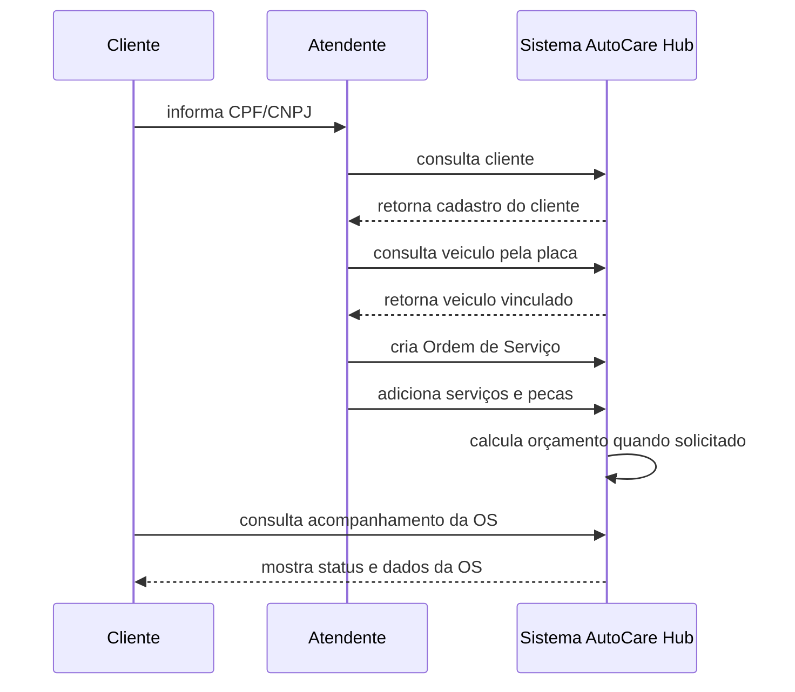
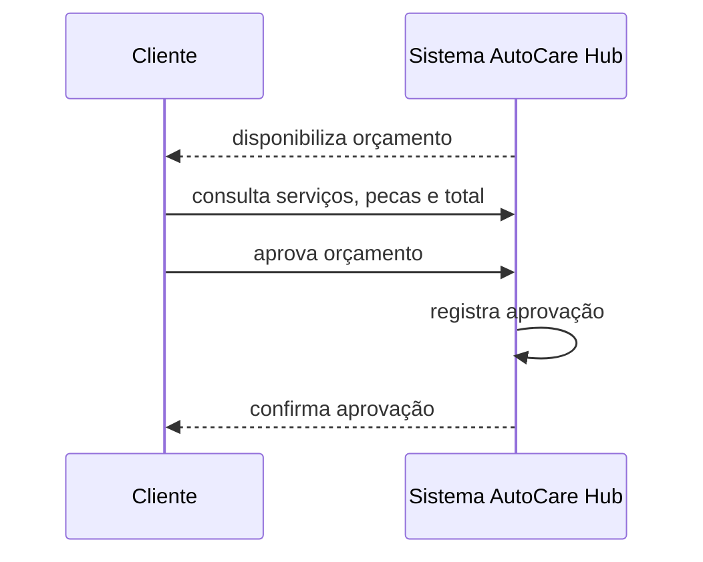
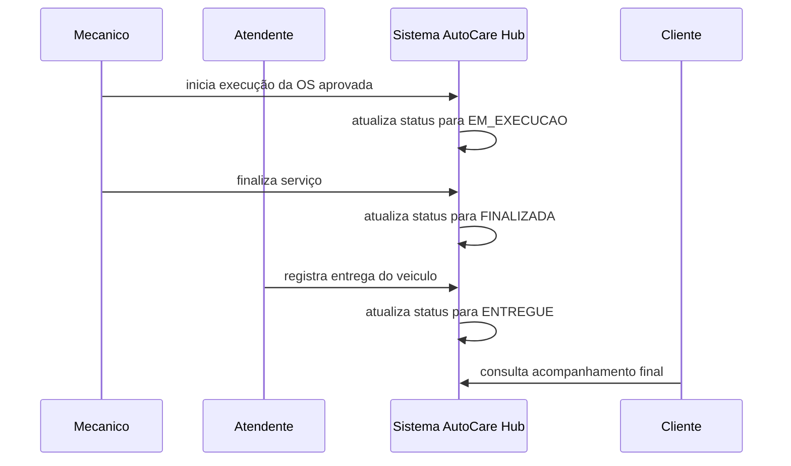
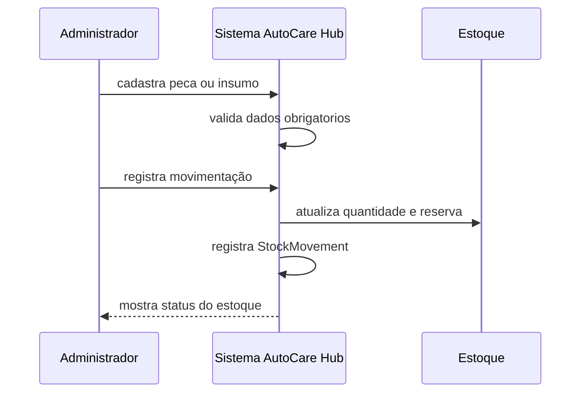

# Domain Storytelling - AutoCare Hub

## 1. Introdução

O Domain Storytelling do AutoCare Hub descreve como cliente, atendente, mecânico, administrador e sistema participam do fluxo de atendimento de uma oficina mecânica.

O objetivo não é mostrar endpoints nem estrutura técnica. A proposta é contar as histórias do domínio: quem faz o quê, com qual objeto de trabalho e em qual ordem.

## 2. Escopo das histórias

As histórias documentadas para o MVP são:

1. Criação e acompanhamento da Ordem de Serviço.
2. Aprovação do orçamento pelo cliente.
3. Execução, finalização e entrega da Ordem de Serviço.
4. Gestão de peças e insumos no estoque.

Essas histórias refletem o que está implementado no backend. Pagamento, agenda, WhatsApp, SMS e integrações externas não fazem parte deste escopo.

## 3. Atores

| Ator | Papel na história |
|---|---|
| Cliente | Informa seus dados, solicita atendimento, aprova orçamento e acompanha a OS. |
| Atendente | Abre a OS, identifica cliente e veículo, registra serviços e entrega o veículo. |
| Mecânico | Analisa o veículo, executa o serviço e finaliza a OS. |
| Administrador da oficina | Mantém cadastros, peças, serviços, estoque e usuários administrativos. |
| Sistema AutoCare Hub | Valida dados, registra informações, calcula orçamento, controla status e disponibiliza acompanhamento. |

### 3.1 Mapeamento para usuários do sistema

No Domain Storytelling, `Atendente`, `Mecânico` e `Responsável pelo estoque` são papéis de negócio. No código, o acesso é controlado por `UserRole` e por campos complementares de perfil.

| Papel na história | Representação técnica |
|---|---|
| Dona do projeto / administradora master | `role=ADMIN`, `profileType=MASTER_ADMIN` |
| Administrador da oficina | `role=ADMIN`, `profileType=WORKSHOP_ADMIN` |
| Responsável pelo estoque | `role=ADMIN`, `profileType=PARTS_STORE_ADMIN` ou `role=EMPLOYEE`, `profileType=PARTS_STORE_EMPLOYEE` |
| Atendente | `role=EMPLOYEE`, com perfil operacional da oficina ou loja |
| Mecânico | `role=EMPLOYEE`, `profileType=WORKSHOP_EMPLOYEE`, `employeeSubRole=MECHANIC` |
| Cliente | `role=CUSTOMER`, `profileType=CUSTOMER_OWNER` |

## 4. Objetos de trabalho

| Objeto de trabalho | Uso no domínio |
|---|---|
| CPF/CNPJ | Identifica o cliente. |
| Cadastro do cliente | Guarda dados do cliente atendido. |
| Placa | Identifica o veículo. |
| Cadastro do veículo | Guarda marca, modelo, ano e vínculo com o cliente. |
| Ordem de Serviço | Concentra o atendimento da oficina. |
| Diagnóstico | Registra o problema relatado ou avaliação inicial. |
| Serviço solicitado | Representa o trabalho que a oficina deve executar. |
| Peça/Insumo | Item usado no serviço ou controlado em estoque. |
| Estoque | Controla quantidade disponível e reservada. |
| Orçamento | Valor calculado a partir dos serviços e peças. |
| Aprovação | Aceite do cliente para iniciar a execução. |
| Status da OS | Indica a etapa atual do atendimento. |
| Histórico de acompanhamento | Mostra ao cliente a evolução da OS. |
| Tempo de execução | Base para a métrica de tempo médio. |

## 5. Atividades usadas nas histórias

As principais atividades do domínio são:

- informa;
- consulta;
- cadastra;
- seleciona;
- cria;
- adiciona;
- calcula;
- disponibiliza;
- aprova;
- reserva;
- baixa;
- inicia;
- finaliza;
- entrega;
- atualiza;
- acompanha.

## 6. História 1 - Criação e acompanhamento da Ordem de Serviço

### Cenário principal

1. O Cliente informa CPF/CNPJ ao Atendente.
2. O Atendente consulta o Cliente no Sistema AutoCare Hub.
3. O Sistema retorna o cadastro existente do Cliente.
4. O Atendente consulta o Veículo pela placa.
5. O Sistema retorna o Veículo vinculado ao Cliente.
6. O Atendente registra o diagnóstico ou problema relatado.
7. O Atendente cria a Ordem de Serviço.
8. O Atendente adiciona os serviços solicitados.
9. O Atendente adiciona peças ou insumos, quando necessário.
10. O Sistema calcula o orçamento quando a geração é solicitada.
11. O Sistema disponibiliza a Ordem de Serviço para acompanhamento.
12. O Cliente consulta a OS pelo identificador, CPF/CNPJ ou placa.
13. O Sistema mostra status, veículo, serviços, peças, orçamento e histórico de acompanhamento.

### Representação visual

## 7. História 2 - Aprovação do orçamento pelo cliente

Esta história fica separada porque muda o ator principal. A oficina monta e disponibiliza o orçamento, mas quem decide aprovar é o Cliente.

### Cenário principal

1. O Sistema apresenta a OS em `AGUARDANDO_APROVACAO`.
2. O Cliente consulta os dados do orçamento.
3. O Cliente confere serviços, peças e valor total.
4. O Cliente aprova o orçamento.
5. O Sistema registra a aprovação.
6. O Sistema mantém a OS pronta para a oficina iniciar a execução.

### Representação visual

## 8. História 3 - Execução, finalização e entrega da OS

Esta história é separada da aprovação porque o ator principal volta a ser a oficina.

### Cenário principal

1. O Mecânico consulta a Ordem de Serviço aprovada.
2. O Mecânico inicia a execução do serviço.
3. O Sistema altera o status da OS para `EM_EXECUCAO`.
4. O Mecânico executa os serviços definidos na OS.
5. O Mecânico finaliza o serviço.
6. O Sistema altera o status da OS para `FINALIZADA`.
7. O Atendente registra a entrega do veículo.
8. O Sistema altera o status da OS para `ENTREGUE`.
9. O Cliente consulta o acompanhamento final da OS.

### Representação visual

## 9. História 4 - Gestão de peças e insumos no estoque

### Cenário principal

1. O Administrador cadastra uma Peça ou Insumo no Sistema.
2. O Sistema valida nome, SKU, categoria, marca, preços e quantidade inicial.
3. O Administrador registra uma entrada, saída, venda, ajuste, reserva ou baixa.
4. O Sistema verifica se a quantidade informada é válida.
5. O Sistema atualiza o estoque total, reservado e disponível.
6. O Sistema registra a movimentação de estoque.
7. O Administrador consulta o status da peça no estoque.

### Representação visual

## 10. Cenários alternativos

### 10.1 Cliente ainda não cadastrado

1. O Cliente informa CPF/CNPJ ao Atendente.
2. O Atendente consulta o Cliente no Sistema.
3. O Sistema informa que não existe cadastro para o documento.
4. O Atendente cadastra o Cliente.
5. O Sistema valida CPF/CNPJ e salva o cadastro.
6. O Atendente continua a abertura da Ordem de Serviço.

### 10.2 Veículo ainda não cadastrado

1. O Atendente consulta o Veículo pela placa.
2. O Sistema informa que o Veículo não existe.
3. O Atendente cadastra placa, marca, modelo e ano.
4. O Sistema valida a placa.
5. O Sistema vincula o Veículo ao Cliente.
6. O Atendente continua a abertura da Ordem de Serviço.

### 10.3 Documento inválido

1. O Cliente informa CPF/CNPJ ao Atendente.
2. O Atendente informa o documento no Sistema.
3. O Sistema valida o documento.
4. O Sistema bloqueia o cadastro ou a criação da OS.
5. O Atendente corrige o documento antes de continuar.

### 10.4 Placa inválida

1. O Atendente informa a placa do Veículo.
2. O Sistema valida o formato da placa.
3. O Sistema bloqueia o cadastro do Veículo.
4. O Atendente corrige a placa antes de continuar.

### 10.5 Estoque insuficiente

1. O Atendente tenta adicionar uma Peça à OS.
2. O Sistema consulta a disponibilidade da Peça.
3. O Sistema identifica que não há quantidade suficiente.
4. O Sistema bloqueia a inclusão ou reserva.
5. A oficina ajusta o estoque ou remove a Peça da OS.

### 10.6 Orçamento ainda não aprovado

1. O Mecânico tenta iniciar a execução da OS.
2. O Sistema verifica a aprovação do orçamento.
3. O Sistema identifica que o orçamento ainda não foi aprovado.
4. O Sistema bloqueia o início da execução.
5. A oficina aguarda a aprovação do Cliente.

### 10.7 Transição inválida de status

1. Um usuário tenta alterar a OS para um status fora da sequência permitida.
2. O Sistema verifica o status atual da OS.
3. O Sistema bloqueia a transição.
4. O usuário mantém a OS no status atual e executa a próxima ação válida.

## 11. Observação sobre código e negócio

Alguns atores, como Atendente e Mecânico, são papéis de negócio usados para contar a história. No código, as operações administrativas são protegidas por `UserRole`, `profileType`, `employeeSubRole` e permissões, sem uma classe separada para cada papel da oficina.

Essa diferença é esperada no Domain Storytelling: a história representa como o trabalho acontece no negócio, enquanto o código implementa esse trabalho com entidades, use cases e controles de acesso.
