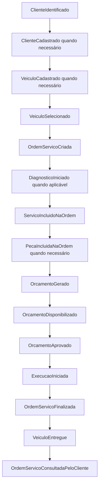
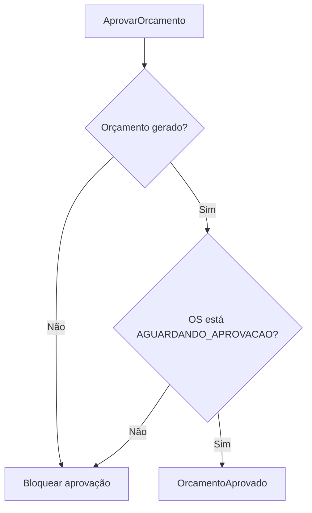
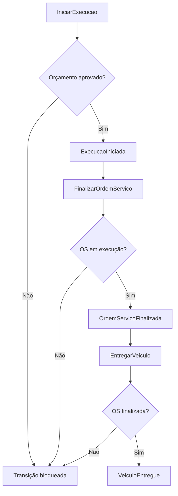
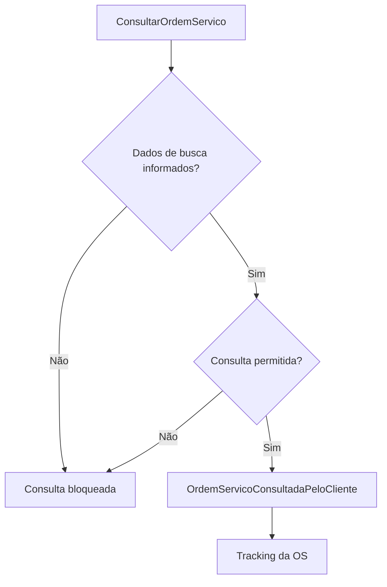
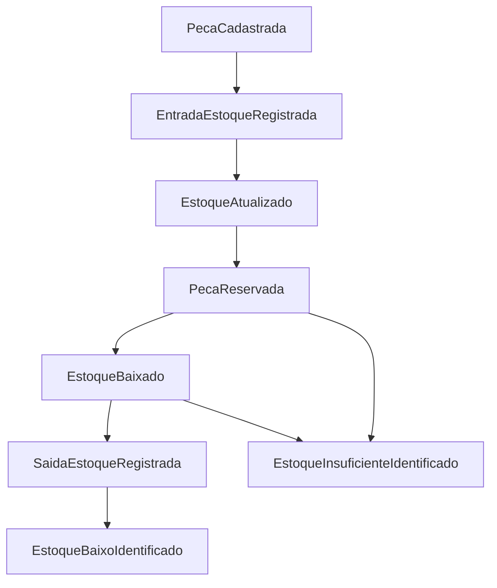

# Event Storming - AutoCare Hub

## 1. Objetivo do Event Storming

O Event Storming foi usado para entender os fluxos principais da oficina antes de olhar para endpoints, tabelas ou
telas. A proposta é registrar os fatos relevantes do negócio, os comandos que disparam esses fatos e as regras que
protegem o processo.

O foco do MVP está em dois fluxos centrais do Tech Challenge:

1. criação e acompanhamento da Ordem de Serviço;
2. gestão de peças, insumos e estoque.

Os eventos descritos neste documento são elementos de modelagem DDD. O AutoCare Hub não implementa Event Sourcing nem
Event Store.

## 2. Papéis considerados na modelagem

Como este é um projeto acadêmico, não houve um workshop real com uma oficina específica. A modelagem foi feita a partir
do enunciado do Tech Challenge e dos papéis normalmente envolvidos na rotina de uma oficina mecânica:

- Cliente;
- Atendente;
- Mecânico;
- Administrador da oficina;
- Responsável pelo estoque;
- Sistema AutoCare Hub.

Esses papéis representam o negócio. No sistema, o acesso é controlado por `UserRole` e pelos campos de perfil do usuário
autenticado.

| Papel de negócio                        | Representação técnica                                                                                |
|-----------------------------------------|------------------------------------------------------------------------------------------------------|
| Dona do projeto / administradora master | `role=ADMIN`, `profileType=MASTER_ADMIN`                                                             |
| Administrador da oficina                | `role=ADMIN`, `profileType=WORKSHOP_ADMIN`                                                           |
| Responsável pelo estoque                | `role=ADMIN`, `profileType=PARTS_STORE_ADMIN` ou `role=EMPLOYEE`, `profileType=PARTS_STORE_EMPLOYEE` |
| Atendente                               | `role=EMPLOYEE`, com perfil operacional da oficina ou loja                                           |
| Mecânico                                | `role=EMPLOYEE`, `profileType=WORKSHOP_EMPLOYEE`, `employeeSubRole=MECHANIC`                         |
| Cliente                                 | `role=CUSTOMER`, `profileType=CUSTOMER_OWNER`                                                        |

## 3. Escopo

### Dentro do escopo

- criação da Ordem de Serviço;
- acompanhamento da Ordem de Serviço;
- geração de orçamento;
- aprovação de orçamento;
- controle de status da OS;
- gestão de peças e insumos;
- controle de estoque;
- consulta administrativa;
- consulta da OS pelo cliente.

### Fora do escopo

- pagamento online;
- envio real de e-mail, SMS ou WhatsApp;
- integração com fornecedores;
- agenda externa;
- Event Store;
- Event Sourcing;
- microserviços;
- mensageria.

Esses itens não são pendências da entrega. Eles apenas ficaram fora do limite do MVP proposto para esta fase.

## 4. Legenda usada

| Elemento            | Significado no Event Storming                           |
|---------------------|---------------------------------------------------------|
| Evento              | Algo relevante que já aconteceu no domínio.             |
| Comando             | Ação ou intenção que causa um evento.                   |
| Política            | Regra que orienta uma decisão do sistema.               |
| Ponto de atenção    | Risco, exceção ou cuidado importante no fluxo.          |
| Modelo de leitura   | Consulta usada para visualizar o andamento do processo. |
| Agregado            | Objeto principal que protege regras de negócio.         |
| Contexto delimitado | Fronteira conceitual do domínio dentro do monolito.     |

## 5. Brainstorming de eventos

Os eventos foram escritos no passado, como recomendado na técnica de Event Storming.

### Ordem de Serviço e orçamento

- `ClienteIdentificado`
- `ClienteCadastrado`
- `VeiculoCadastrado`
- `VeiculoSelecionado`
- `OrdemServicoCriada`
- `ServicoIncluidoNaOrdem`
- `PecaIncluidaNaOrdem`
- `OrcamentoGerado`
- `OrcamentoDisponibilizado`
- `OrcamentoAprovado`
- `DiagnosticoIniciado`
- `ExecucaoIniciada`
- `OrdemServicoFinalizada`
- `VeiculoEntregue`
- `OrdemServicoConsultadaPeloCliente`

### Peças, insumos e estoque

- `PecaCadastrada`
- `PecaAtualizada`
- `EntradaEstoqueRegistrada`
- `SaidaEstoqueRegistrada`
- `PecaReservada`
- `ReservaLiberada`
- `EstoqueBaixado`
- `EstoqueAtualizado`
- `EstoqueBaixoIdentificado`
- `EstoqueInsuficienteIdentificado`

## 6. Linha do tempo

### 6.1 Fluxo 1 - Criação e acompanhamento da OS

1. `ClienteIdentificado`
2. `ClienteCadastrado`, quando o cliente ainda não existe
3. `VeiculoCadastrado`, quando o veículo ainda não existe
4. `VeiculoSelecionado`
5. `OrdemServicoCriada`
6. `DiagnosticoIniciado`, quando a oficina usa a etapa de diagnóstico
7. `ServicoIncluidoNaOrdem`
8. `PecaIncluidaNaOrdem`, quando há peças ou insumos no atendimento
9. `OrcamentoGerado`
10. `OrcamentoDisponibilizado`
11. `OrcamentoAprovado`
12. `ExecucaoIniciada`
13. `OrdemServicoFinalizada`
14. `VeiculoEntregue`
15. `OrdemServicoConsultadaPeloCliente`

### 6.2 Fluxo 2 - Gestão de peças e insumos

1. `PecaCadastrada`
2. `EntradaEstoqueRegistrada`
3. `EstoqueAtualizado`
4. `PecaReservada`, quando a peça é vinculada a uma OS ou orçamento
5. `EstoqueBaixado`, quando a reserva ou saída é confirmada
6. `SaidaEstoqueRegistrada`, quando há saída administrativa
7. `EstoqueAtualizado`
8. `EstoqueBaixoIdentificado`, quando a disponibilidade fica menor ou igual ao estoque mínimo cadastrado

## 7. Pontos de atenção

| Ponto de atenção                                     | Onde aparece no fluxo                              |
|------------------------------------------------------|----------------------------------------------------|
| CPF/CNPJ inválido                                    | Identificação e cadastro do cliente.               |
| Placa inválida                                       | Cadastro ou seleção do veículo.                    |
| Cliente inexistente                                  | Abertura da OS.                                    |
| Veículo não pertence ao cliente                      | Vínculo do veículo à OS.                           |
| Serviço inativo                                      | Inclusão de serviço na OS.                         |
| Peça inativa                                         | Inclusão de peça na OS ou movimentação de estoque. |
| Estoque insuficiente                                 | Inclusão, reserva ou baixa de peça.                |
| Reserva maior que estoque disponível                 | Reserva de peça.                                   |
| Orçamento ainda não aprovado                         | Tentativa de iniciar execução.                     |
| Tentativa de iniciar execução sem aprovação          | Transição para `EM_EXECUCAO`.                      |
| Tentativa de finalizar OS que não está em execução   | Transição para `FINALIZADA`.                       |
| Tentativa de entregar OS não finalizada              | Transição para `ENTREGUE`.                         |
| Usuário sem JWT acessando API administrativa         | Rotas administrativas.                             |
| Consulta de OS com dados inválidos ou não permitidos | Acompanhamento da OS pelo cliente.                 |

## 8. Eventos pivotais

| Evento pivotal           | Por que muda a fase do processo                                            |
|--------------------------|----------------------------------------------------------------------------|
| `OrdemServicoCriada`     | Inicia formalmente o atendimento da oficina.                               |
| `OrcamentoGerado`        | Fecha a composição de serviços e peças e coloca a OS na fase de aprovação. |
| `OrcamentoAprovado`      | Libera a OS para seguir para execução.                                     |
| `ExecucaoIniciada`       | Indica que a oficina começou o trabalho técnico.                           |
| `OrdemServicoFinalizada` | Marca a conclusão técnica do serviço.                                      |
| `VeiculoEntregue`        | Encerra o atendimento para o cliente.                                      |
| `EstoqueBaixado`         | Confirma o consumo ou a saída efetiva de peça/insumo.                      |

## 9. Comandos

| Comando                   | Evento esperado                     | Implementação relacionada                                        |
|---------------------------|-------------------------------------|------------------------------------------------------------------|
| `IdentificarCliente`      | `ClienteIdentificado`               | `Document`, `CustomerRepository`                                 |
| `CadastrarCliente`        | `ClienteCadastrado`                 | `CreateCustomerUseCase`                                          |
| `CadastrarVeiculo`        | `VeiculoCadastrado`                 | `CreateVehicleUseCase`                                           |
| `CriarOrdemServico`       | `OrdemServicoCriada`                | `CreateServiceOrderUseCase`                                      |
| `IncluirServicoNaOrdem`   | `ServicoIncluidoNaOrdem`            | `AddServiceToServiceOrderUseCase`                                |
| `IncluirPecaNaOrdem`      | `PecaIncluidaNaOrdem`               | `AddPartToServiceOrderUseCase`                                   |
| `GerarOrcamento`          | `OrcamentoGerado`                   | `GenerateServiceOrderBudgetUseCase`                              |
| `AprovarOrcamento`        | `OrcamentoAprovado`                 | `ApproveServiceOrderBudgetUseCase`                               |
| `IniciarDiagnostico`      | `DiagnosticoIniciado`               | `ServiceOrder.startDiagnosis`, `UpdateServiceOrderStatusUseCase` |
| `IniciarExecucao`         | `ExecucaoIniciada`                  | `ServiceOrder.startExecution`, `UpdateServiceOrderStatusUseCase` |
| `FinalizarOrdemServico`   | `OrdemServicoFinalizada`            | `ServiceOrder.finish`                                            |
| `EntregarVeiculo`         | `VeiculoEntregue`                   | `ServiceOrder.deliver`                                           |
| `CadastrarPeca`           | `PecaCadastrada`                    | `CreatePartUseCase`                                              |
| `RegistrarEntradaEstoque` | `EntradaEstoqueRegistrada`          | `RegisterPartStockMovementUseCase`                               |
| `RegistrarSaidaEstoque`   | `SaidaEstoqueRegistrada`            | `RegisterPartStockMovementUseCase`                               |
| `ReservarPeca`            | `PecaReservada`                     | `ReservePartStockUseCase`, `GenerateServiceOrderBudgetUseCase`   |
| `LiberarReservaPeca`      | `ReservaLiberada`                   | `ReleasePartReservationUseCase`                                  |
| `BaixarEstoque`           | `EstoqueBaixado`                    | `CommitPartReservationUseCase`, `Part.reduceStock`               |
| `ConsultarOrdemServico`   | `OrdemServicoConsultadaPeloCliente` | `TrackServiceOrderUseCase`, `FindServiceOrderUseCase`            |

## 10. Políticas

| Política                                                                       | Regra aplicada                                                                           |
|--------------------------------------------------------------------------------|------------------------------------------------------------------------------------------|
| Ao gerar orçamento, a OS fica aguardando aprovação.                            | `ServiceOrder.generateBudget` define `AGUARDANDO_APROVACAO`.                             |
| Ao aprovar orçamento, a OS fica liberada para execução.                        | `ServiceOrder.approveBudget` registra `approvedAt`.                                      |
| Ao iniciar execução, a aprovação é obrigatória.                                | `ServiceOrder.startExecution` bloqueia execução sem aprovação.                           |
| Ao incluir peça, o sistema valida estoque disponível.                          | A regra de peça e disponibilidade é aplicada antes de seguir com o fluxo.                |
| Ao gerar orçamento com peças, o sistema reserva ou valida as peças vinculadas. | O fluxo passa por `GenerateServiceOrderBudgetUseCase` e pelas regras de `Part`.          |
| Ao confirmar reserva ou saída, o estoque é baixado.                            | `CommitPartReservationUseCase` e as regras de `Part` registram a baixa quando aplicável. |
| O estoque não pode ficar negativo.                                             | `Part` bloqueia baixa sem disponibilidade.                                               |
| Transições inválidas de status são bloqueadas.                                 | `ServiceOrder` lança exceção de domínio.                                                 |
| APIs administrativas exigem autenticação JWT.                                  | `SecurityConfig` protege rotas administrativas.                                          |
| Cliente só acompanha a OS por consulta permitida.                              | `TrackServiceOrderUseCase` valida os dados exigidos para consulta.                       |

## 11. Modelos de leitura

| Modelo de leitura                   | Finalidade                                                    | Endpoint/consulta                                           |
|-------------------------------------|---------------------------------------------------------------|-------------------------------------------------------------|
| Detalhe da Ordem de Serviço         | Ver dados completos da OS.                                    | `GET /api/v1/service-orders/{serviceOrderId}`               |
| Listagem de Ordens de Serviço       | Consultar OS por filtros administrativos.                     | `GET /api/v1/service-orders`                                |
| Acompanhamento da OS pelo cliente   | Permitir que o cliente acompanhe status, itens e histórico.   | `GET /api/v1/service-orders/tracking`                       |
| Consulta de orçamento               | Ver valores de serviços, peças e total dentro da OS.          | Resposta de detalhe/tracking da OS.                         |
| Consulta de estoque                 | Ver quantidade total, reservada, disponível e status da peça. | `GET /api/v1/parts` e `GET /api/v1/parts/{partId}`          |
| Consulta de tempo médio de execução | Apoiar monitoramento operacional.                             | `GET /api/v1/service-orders/metrics/average-execution-time` |

## 12. Sistemas externos

O fluxo principal do MVP não depende de sistemas externos. A aplicação usa PostgreSQL, Swagger/OpenAPI e autenticação
JWT como recursos técnicos locais, mas não possui integração real com e-mail, WhatsApp, SMS, pagamento, agenda, ERP ou
fornecedores.

## 13. Agregados

### 13.1 `ServiceOrder`

Comandos e eventos relacionados:

- criar OS;
- incluir serviço;
- incluir peça;
- gerar orçamento;
- aprovar orçamento;
- iniciar diagnóstico;
- iniciar execução;
- finalizar OS;
- entregar veículo.

Invariantes:

- a OS precisa ter cliente e veículo;
- o orçamento precisa ser gerado antes da aprovação;
- a execução depende da aprovação;
- a finalização depende da execução;
- a entrega depende da finalização.

### 13.2 `Part`

Comandos e eventos relacionados:

- cadastrar peça;
- registrar entrada;
- registrar saída;
- reservar;
- liberar reserva;
- baixar estoque.

Invariantes:

- o estoque não pode ficar negativo;
- a reserva não pode exceder a disponibilidade;
- a baixa não pode exceder o estoque disponível ou reservado.

### 13.3 `Customer`

Comandos e eventos relacionados:

- identificar cliente;
- cadastrar cliente;
- validar CPF/CNPJ.

Invariantes:

- o documento precisa ser CPF ou CNPJ válido;
- o documento normalizado evita duplicidade por máscara.

### 13.4 `Vehicle`

Comandos e eventos relacionados:

- cadastrar veículo;
- validar placa;
- vincular veículo ao cliente.

Invariantes:

- o veículo precisa estar vinculado a um cliente;
- a placa precisa ter formato válido;
- marca, modelo e ano são obrigatórios.

## 14. Contextos delimitados

O projeto é um monolito em camadas. Os contextos delimitados são usados para organização conceitual do domínio e da
documentação, não como microserviços separados.

| Contexto delimitado             | Eventos principais                                                                                           | Agregados relacionados   |
|---------------------------------|--------------------------------------------------------------------------------------------------------------|--------------------------|
| Atendimento de Oficina          | `OrdemServicoCriada`, `DiagnosticoIniciado`, `ExecucaoIniciada`, `OrdemServicoFinalizada`, `VeiculoEntregue` | `ServiceOrder`           |
| Cadastro de Clientes e Veículos | `ClienteIdentificado`, `ClienteCadastrado`, `VeiculoCadastrado`                                              | `Customer`, `Vehicle`    |
| Catálogo de Serviços            | `ServicoIncluidoNaOrdem`                                                                                     | `WorkshopService`        |
| Gestão de Peças e Estoque       | `PecaCadastrada`, `EntradaEstoqueRegistrada`, `PecaReservada`, `EstoqueBaixado`, `EstoqueAtualizado`         | `Part`, `StockMovement`  |
| Orçamentos e Aprovação          | `OrcamentoGerado`, `OrcamentoDisponibilizado`, `OrcamentoAprovado`                                           | `ServiceOrder`, `Budget` |
| Identidade e Acesso             | Usuário autenticado e acesso autorizado                                                                      | `User`                   |

## 15. Fluxos exigidos pelo Tech Challenge

| Requisito do Tech Challenge      | Onde aparece no Event Storming                                              |
|----------------------------------|-----------------------------------------------------------------------------|
| Criação e acompanhamento da OS   | Linha do tempo 6.1, modelos de leitura e diagramas 16.2 a 16.5.             |
| Gestão de peças e insumos        | Linha do tempo 6.2, agregado `Part` e diagrama 16.6.                        |
| Identificação por CPF/CNPJ       | Eventos `ClienteIdentificado` e `ClienteCadastrado`.                        |
| Cadastro de veículo              | Evento `VeiculoCadastrado`.                                                 |
| Inclusão de serviços solicitados | Evento `ServicoIncluidoNaOrdem`.                                            |
| Inclusão de peças e insumos      | Evento `PecaIncluidaNaOrdem`.                                               |
| Geração automática de orçamento  | Evento `OrcamentoGerado`.                                                   |
| Aprovação de orçamento           | Evento `OrcamentoAprovado`.                                                 |
| Acompanhamento pelo cliente      | Evento `OrdemServicoConsultadaPeloCliente` e modelo de leitura de tracking. |
| Controle de status               | Eventos pivotais e máquina de estados.                                      |
| Controle de estoque              | Eventos de estoque, políticas e agregado `Part`.                            |
| Tempo médio de execução          | Modelo de leitura de métrica.                                               |
| JWT para APIs administrativas    | Política de autenticação e contexto Identidade e Acesso.                    |

## 16. Diagramas Mermaid

Os diagramas usam `flowchart` e `stateDiagram-v2` para facilitar a renderização em ferramentas compatíveis com Mermaid.

### 16.1 Visão geral de comandos e eventos

### 16.2 Linha do tempo da OS

### 16.3 Aprovação do orçamento

### 16.4 Execução e entrega

### 16.5 Acompanhamento pelo cliente

### 16.6 Linha do tempo de estoque

### 16.7 Máquina de estados da Ordem de Serviço

## 17. Conclusão

O Event Storming do AutoCare Hub mostra os principais acontecimentos do domínio da oficina, os comandos que causam esses
eventos, as políticas que protegem o fluxo e os agregados responsáveis por manter as regras consistentes.

A modelagem cobre os pontos exigidos no Tech Challenge: criação e acompanhamento da OS, identificação do cliente por
CPF/CNPJ, cadastro de veículo, inclusão de serviços e peças, geração e aprovação de orçamento, controle de status,
gestão de estoque, consulta pelo cliente, tempo médio de execução e autenticação JWT nas APIs administrativas.
