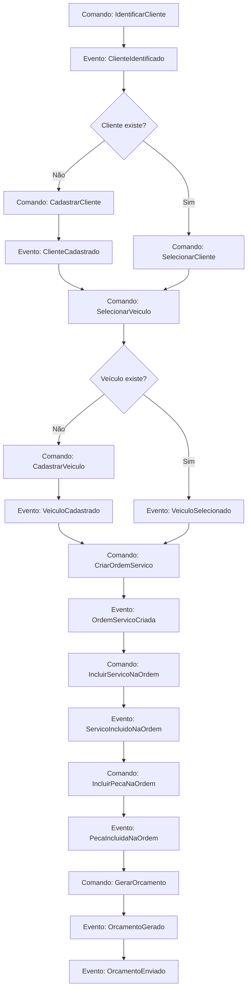
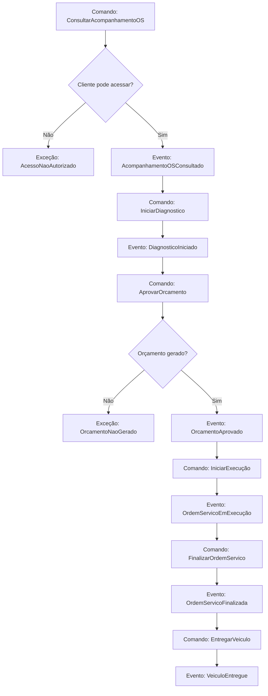
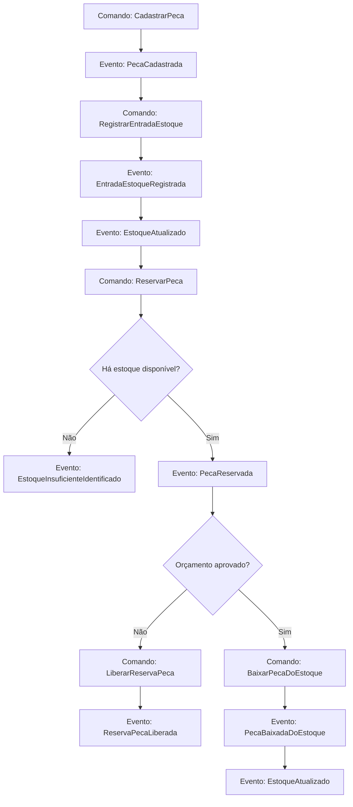
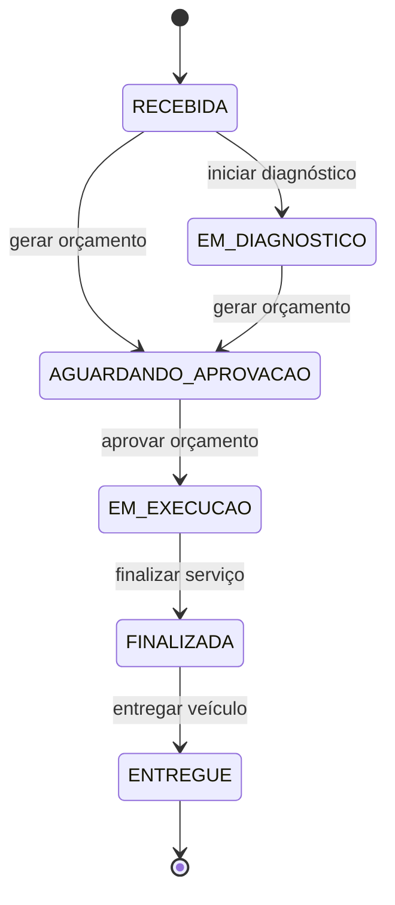

# Event Storming - AutoCare Hub

Este documento apresenta o Event Storming dos fluxos exigidos no MVP do Tech Challenge:

1. Criação e acompanhamento da Ordem de Serviço.
2. Gestão de peças e insumos.

Os nomes seguem a linguagem ubíqua do projeto. Quando uma etapa ainda não está materializada como evento persistido ou automação explícita no código, ela é marcada como `prevista no domínio` ou `melhoria futura`.

## Fluxo 1 - Criação da Ordem de Serviço

### Atores

- Admin da oficina.
- Funcionário autorizado da oficina.
- Cliente final.
- Sistema AutoCare Hub.

### Comandos

- `IdentificarCliente`
- `CadastrarCliente`
- `SelecionarCliente`
- `CadastrarVeiculo`
- `SelecionarVeiculo`
- `CriarOrdemServico`
- `IncluirServicoNaOrdem`
- `IncluirPecaNaOrdem`
- `GerarOrcamento`
- `DisponibilizarOrcamento`

### Eventos de domínio

- `ClienteIdentificado`
- `ClienteCadastrado`
- `VeiculoCadastrado`
- `VeiculoSelecionado`
- `OrdemServicoCriada`
- `ServicoIncluidoNaOrdem`
- `PecaIncluidaNaOrdem`
- `OrcamentoGerado`
- `OrcamentoEnviado`

No MVP, esses eventos são usados como linguagem de modelagem. O sistema não possui event store dedicado.

### Agregados

- `Customer` - Cliente.
- `Vehicle` - Veículo.
- `ServiceOrder` - Ordem de Serviço.
- `WorkshopService` - Serviço.
- `Part` - Peça/Insumo.
- `Budget` - Orçamento.

### Políticas

- Se o cliente não existir, deve ser cadastrado antes da criação da OS.
- Se o veículo não existir, deve ser cadastrado e vinculado ao cliente.
- Se o veículo existir, ele deve pertencer ao cliente informado.
- A OS deve ter ao menos um serviço solicitado.
- Peças e insumos são opcionais na OS.
- Ao gerar orçamento, a OS passa para `AGUARDANDO_APROVACAO`.
- Peças vinculadas a orçamento podem ser reservadas antes da aprovação.

### Regras de negócio

- CPF/CNPJ deve ser válido.
- Placa deve estar em formato válido.
- Cliente não pode ser duplicado por diferença de máscara no documento.
- Veículo não pode existir sem cliente.
- OS não pode existir sem cliente e veículo.
- OS não pode ser criada sem serviço solicitado.
- Orçamento calcula total de serviços, total de peças e total geral.
- Itens da OS não devem ser alterados após geração do orçamento.

### Exceções

- `DocumentoInvalido`
- `PlacaInvalida`
- `ClienteNaoEncontrado`
- `VeiculoNaoEncontrado`
- `VeiculoNaoPertenceAoCliente`
- `ServicoNaoEncontrado`
- `ServicoInativo`
- `PecaNaoEncontrada`
- `PecaInativa`
- `EstoqueInsuficiente`
- `OrdemServicoInvalida`

### Fluxo principal

1. Funcionário identifica o cliente por CPF/CNPJ.
2. Sistema valida e normaliza o documento.
3. Sistema encontra o cliente ou permite cadastro.
4. Funcionário seleciona ou cadastra o veículo.
5. Sistema valida a placa e o vínculo com o cliente.
6. Funcionário cria a Ordem de Serviço.
7. Funcionário inclui serviços solicitados.
8. Funcionário inclui peças ou insumos, se necessário.
9. Sistema gera o orçamento.
10. Sistema disponibiliza o orçamento para aprovação do cliente.
11. OS fica em `AGUARDANDO_APROVACAO`.

### Fluxos alternativos

- Cliente não encontrado: cadastrar cliente e continuar.
- Veículo não encontrado: cadastrar veículo e vincular ao cliente.
- Veículo pertence a outro cliente: bloquear criação da OS.
- Serviço inativo: bloquear inclusão do serviço.
- Peça sem estoque disponível: bloquear reserva ou baixa.
- Orçamento não gerado: OS permanece em etapa anterior do atendimento.

### Pontos de decisão

- Cliente já existe?
- Veículo já existe?
- Veículo pertence ao cliente?
- Há ao menos um serviço solicitado?
- Há peças/insumos vinculados?
- Há estoque disponível para reservar peça?
- Orçamento deve ser gerado agora?

### Dados necessários

- CPF/CNPJ do cliente.
- Nome, telefone e e-mail do cliente.
- Placa, marca, modelo e ano do veículo.
- Diagnóstico ou problema percebido.
- Serviços solicitados.
- Peças/insumos e quantidades.
- Preço dos serviços e peças.

## Fluxo 2 - Acompanhamento da Ordem de Serviço

### Atores

- Cliente final.
- Admin da oficina.
- Funcionário autorizado da oficina.
- Sistema AutoCare Hub.

### Comandos

- `ConsultarAcompanhamentoOS`
- `IniciarDiagnostico`
- `AprovarOrcamento`
- `IniciarExecução`
- `FinalizarOrdemServico`
- `EntregarVeiculo`

### Eventos de domínio

- `AcompanhamentoOSConsultado`
- `DiagnosticoIniciado`
- `OrcamentoAprovado`
- `OrdemServicoEmExecução`
- `OrdemServicoFinalizada`
- `VeiculoEntregue`

### Agregados

- `ServiceOrder` - Ordem de Serviço.
- `Vehicle` - Veículo.
- `Customer` - Cliente.
- `Budget` - Orçamento.
- `Part` - Peça/Insumo, quando houver baixa de estoque após aprovação.

### Políticas

- Cliente só pode consultar OS vinculada ao seu cadastro.
- APIs administrativas exigem autenticação JWT.
- Transições de status devem respeitar a máquina de estados da OS.
- Aprovação de orçamento libera a OS para execução.
- Finalização exige OS em execução.
- Entrega exige OS finalizada.

### Regras de negócio

- `RECEBIDA` pode ir para `EM_DIAGNOSTICO`.
- `RECEBIDA` ou `EM_DIAGNOSTICO` podem ir para `AGUARDANDO_APROVACAO` quando o orçamento é gerado.
- `AGUARDANDO_APROVACAO` pode ir para `EM_EXECUCAO` após aprovação.
- `EM_EXECUCAO` pode ir para `FINALIZADA`.
- `FINALIZADA` pode ir para `ENTREGUE`.
- OS entregue encerra o fluxo principal de atendimento.
- Status não pode retroceder para `RECEBIDA`.

### Exceções

- `OrdemServicoNaoEncontrada`
- `AcessoNaoAutorizado`
- `OrcamentoNaoGerado`
- `OrcamentoJaAprovado`
- `TransiçãoStatusInvalida`
- `ClienteNaoVinculadoAOrdem`

### Fluxo principal

1. Cliente consulta a OS via API.
2. Sistema valida se o cliente tem acesso à OS.
3. Sistema retorna dados básicos da OS, veículo, status, serviços, peças e orçamento.
4. Oficina inicia diagnóstico quando aplicável.
5. Sistema atualiza status para `EM_DIAGNOSTICO`.
6. Orçamento é gerado e disponibilizado.
7. Cliente aprova o orçamento.
8. Sistema libera a OS para execução.
9. Oficina inicia execução.
10. Oficina finaliza a OS.
11. Oficina registra entrega do veículo.

### Fluxos alternativos

- Cliente tenta consultar OS de outro cliente: acesso negado.
- Orçamento ainda não foi gerado: acompanhamento retorna status atual sem aprovação disponível.
- Cliente não aprova orçamento: OS permanece aguardando aprovação. Recusa explícita e expiração automática são melhorias futuras quando não estiverem ativas no fluxo executado.
- Tentativa de transição inválida: sistema bloqueia a alteração.

### Pontos de decisão

- Cliente está autenticado ou validado?
- OS pertence ao cliente?
- Orçamento já foi gerado?
- Orçamento foi aprovado?
- Status atual permite próxima transição?
- Veículo já pode ser entregue?

### Dados necessários

- Identificador da OS.
- Identificador do cliente ou CPF/CNPJ, conforme endpoint.
- Placa do veículo, quando usada na consulta.
- Status atual.
- Datas de criação, diagnóstico, orçamento, aprovação, execução, finalização e entrega.
- Serviços e peças vinculados.
- Situação do orçamento.

## Fluxo 3 - Gestão de Peças e Insumos

### Atores

- Admin da oficina.
- Funcionário autorizado.
- Sistema AutoCare Hub.

### Comandos

- `CadastrarPeca`
- `EditarPeca`
- `RegistrarEntradaEstoque`
- `RegistrarSaidaEstoque`
- `VenderPecaIsolada`
- `ReservarPeca`
- `LiberarReservaPeca`
- `BaixarPecaDoEstoque`
- `ConsultarEstoqueBaixo`

### Eventos de domínio

- `PecaCadastrada`
- `PecaAtualizada`
- `EntradaEstoqueRegistrada`
- `SaidaEstoqueRegistrada`
- `VendaPecaRegistrada`
- `PecaReservada`
- `ReservaPecaLiberada`
- `PecaBaixadaDoEstoque`
- `EstoqueAtualizado`
- `EstoqueBaixoIdentificado`
- `EstoqueInsuficienteIdentificado`

### Agregados

- `Part` - Peça/Insumo.
- `StockMovement` - Movimentação de estoque.
- `ServiceOrder` - Ordem de Serviço, quando a peça é usada no atendimento.
- `Budget` - Orçamento, quando há reserva antes da aprovação.

### Políticas

- Quantidade não pode ser negativa.
- Preço não pode ser negativo.
- Estoque mínimo não pode ser negativo.
- Estoque disponível considera estoque total menos reservado.
- Peça vinculada a orçamento deve ser reservada, não baixada imediatamente.
- Peça é baixada quando o orçamento é aprovado ou quando uma saída/venda é registrada.
- Baixa maior que estoque disponível deve ser bloqueada.
- Estoque baixo é identificado quando disponibilidade é menor ou igual ao estoque mínimo.

### Regras de negócio

- Nome da peça é obrigatório.
- Preço de venda não pode ser negativo.
- Quantidade de movimentação deve ser maior que zero.
- Entrada aumenta estoque total.
- Saída reduz estoque disponível.
- Reserva reduz disponibilidade, mas não reduz estoque total.
- Confirmação de reserva reduz estoque total e quantidade reservada.
- Liberação de reserva reduz apenas a quantidade reservada.
- Estoque não pode ficar negativo.

### Exceções

- `PecaNaoEncontrada`
- `PecaInativa`
- `QuantidadeInvalida`
- `PrecoInvalido`
- `EstoqueInsuficiente`
- `ReservaInexistente`
- `MovimentaçãoEstoqueInvalida`

### Fluxo principal

1. Admin cadastra peça ou insumo.
2. Sistema valida dados obrigatórios.
3. Funcionário registra entrada de estoque.
4. Sistema registra movimentação e atualiza estoque.
5. Peça é vinculada a orçamento.
6. Sistema verifica disponibilidade.
7. Sistema reserva a quantidade necessária.
8. Cliente aprova orçamento.
9. Sistema confirma reserva e baixa estoque.
10. Sistema registra movimentação de baixa.

### Fluxos alternativos

- Estoque insuficiente: sistema bloqueia reserva ou baixa.
- Saída administrativa: sistema reduz estoque disponível e registra movimentação.
- Venda isolada: sistema baixa estoque sem depender de OS.
- Orçamento não aprovado: reserva pode ser liberada.
- Expiração automática de orçamento: melhoria futura se não estiver ativa no fluxo executado.
- Integração com fornecedores: melhoria futura.

### Pontos de decisão

- Peça já existe?
- Peça está ativa?
- Quantidade informada é válida?
- Há estoque disponível?
- A movimentação é entrada, saída, venda, reserva ou baixa?
- A peça está vinculada a orçamento?
- O orçamento foi aprovado?
- Estoque ficou abaixo do mínimo?

### Dados necessários

- Nome da peça ou insumo.
- Categoria, marca, SKU e descrição, quando disponíveis.
- Preço de venda e custo.
- Quantidade em estoque.
- Quantidade reservada.
- Estoque mínimo.
- Tipo de movimentação.
- Quantidade movimentada.
- Referência da OS ou orçamento, quando aplicável.

## Diagramas Mermaid

### 1. Event Storming da criação da OS

### 2. Event Storming do acompanhamento da OS

### 3. Event Storming da gestão de estoque

### 4. Diagrama de estados da OS

