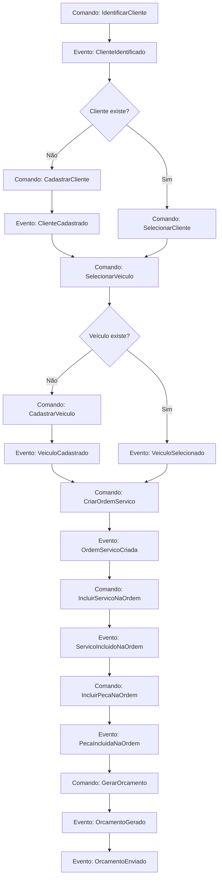
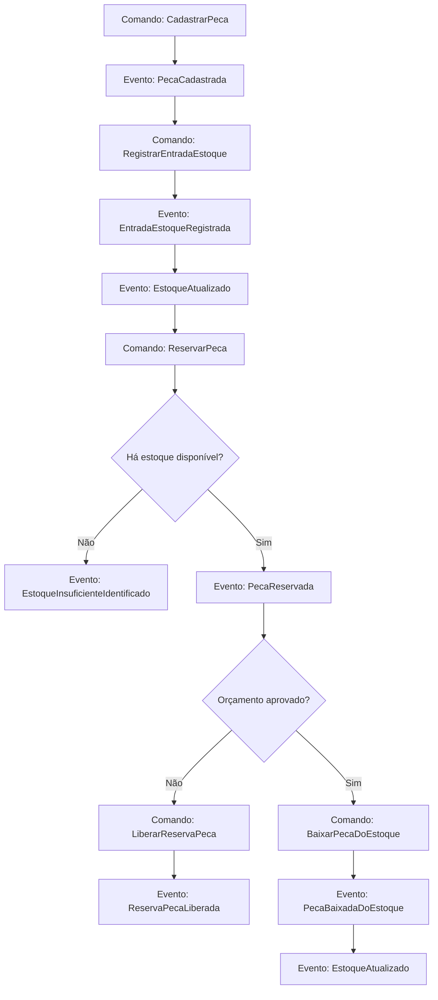

# Event Storming - AutoCare Hub

Este documento apresenta o Event Storming dos fluxos exigidos no MVP do Tech Challenge:

1. Criação e acompanhamento da Ordem de Serviço.
2. Gestão de peças e insumos.

Os nomes seguem a linguagem ubíqua do projeto. Quando uma etapa ainda não está materializada como evento persistido ou
automação explícita no código, ela é marcada como `prevista no domínio` ou `melhoria futura`.

Observação sobre status: os nomes internos do domínio aparecem em português, como `AGUARDANDO_APROVACAO` e
`EM_EXECUCAO`; a API expõe os códigos externos equivalentes, como `WAITING_APPROVAL` e `IN_PROGRESS`.

## Fluxo 1 - Criação da Ordem de Serviço

### Atores

- Admin da oficina.
- Funcionário autorizado da oficina.
- Cliente final.
- Sistema AutoCare Hub.

### Comandos

- `IdentificarCliente`
- `CadastrarCliente`
- `SelecionarCliente`
- `CadastrarVeiculo`
- `SelecionarVeiculo`
- `CriarOrdemServico`
- `IncluirServicoNaOrdem`
- `IncluirPecaNaOrdem`
- `GerarOrcamento`
- `DisponibilizarOrcamento`

### Eventos de domínio

- `ClienteIdentificado`
- `ClienteCadastrado`
- `VeiculoCadastrado`
- `VeiculoSelecionado`
- `OrdemServicoCriada`
- `ServicoIncluidoNaOrdem`
- `PecaIncluidaNaOrdem`
- `OrcamentoGerado`
- `OrcamentoEnviado`

No MVP, esses eventos são usados como linguagem de modelagem. O sistema não possui um event store dedicado.

### Agregados

- `Customer` - Cliente.
- `Vehicle` - Veículo.
- `ServiceOrder` - Ordem de Serviço.
- `WorkshopService` - Serviço.
- `Part` - Peça/Insumo.
- `Budget` - Orçamento.

### Políticas

- Se o cliente não existir, ele deve ser cadastrado antes da criação da OS.
- Se o veículo não existir, ele deve ser cadastrado e vinculado ao cliente.
- Se o veículo existir, ele deve pertencer ao cliente informado.
- A OS deve ter ao menos um serviço solicitado.
- Peças e insumos são opcionais na OS.
- Ao gerar o orçamento, a OS passa para `AGUARDANDO_APROVACAO`.
- Peças vinculadas ao orçamento podem ser reservadas antes da aprovação.

### Regras de negócio

- O CPF/CNPJ deve ser válido.
- A placa deve estar em formato válido.
- O cliente não pode ser duplicado por diferença de máscara no documento.
- O veículo não pode existir sem cliente.
- A OS não pode existir sem cliente e veículo.
- A OS não pode ser criada sem serviço solicitado.
- O orçamento calcula o total de serviços, o total de peças e o total geral.
- Os itens da OS não devem ser alterados após a geração do orçamento.

### Exceções

- `DocumentoInvalido`
- `PlacaInvalida`
- `ClienteNaoEncontrado`
- `VeiculoNaoEncontrado`
- `VeiculoNaoPertenceAoCliente`
- `ServicoNaoEncontrado`
- `ServicoInativo`
- `PecaNaoEncontrada`
- `PecaInativa`
- `EstoqueInsuficiente`
- `OrdemServicoInvalida`

### Fluxo principal

1. O funcionário identifica o cliente por CPF/CNPJ.
2. O sistema valida e normaliza o documento.
3. O sistema encontra o cliente ou permite o cadastro.
4. O funcionário seleciona ou cadastra o veículo.
5. O sistema valida a placa e o vínculo com o cliente.
6. O funcionário cria a Ordem de Serviço.
7. O funcionário inclui os serviços solicitados.
8. O funcionário inclui peças ou insumos, se necessário.
9. O sistema gera o orçamento.
10. O sistema disponibiliza o orçamento para aprovação do cliente.
11. A OS fica em `AGUARDANDO_APROVACAO`.

### Fluxos alternativos

- Cliente não encontrado: cadastrar o cliente e continuar.
- Veículo não encontrado: cadastrar o veículo e vinculá-lo ao cliente.
- Veículo pertencente a outro cliente: bloquear a criação da OS.
- Serviço inativo: bloquear a inclusão do serviço.
- Peça sem estoque disponível: bloquear a reserva ou a baixa.
- Orçamento não gerado: a OS permanece na etapa anterior do atendimento.

### Pontos de decisão

- O cliente já existe?
- O veículo já existe?
- O veículo pertence ao cliente?
- Há ao menos um serviço solicitado?
- Há peças/insumos vinculados?
- Há estoque disponível para reservar a peça?
- O orçamento deve ser gerado agora?

### Dados necessários

- CPF/CNPJ do cliente.
- Nome, telefone e e-mail do cliente.
- Placa, marca, modelo e ano do veículo.
- Diagnóstico ou problema percebido.
- Serviços solicitados.
- Peças/insumos e respectivas quantidades.
- Preço dos serviços e das peças.

## Fluxo 2 - Acompanhamento da Ordem de Serviço

### Atores

- Cliente final.
- Admin da oficina.
- Funcionário autorizado da oficina.
- Sistema AutoCare Hub.

### Comandos

- `ConsultarAcompanhamentoOS`
- `IniciarDiagnostico`
- `AprovarOrcamento`
- `IniciarExecucao`
- `FinalizarOrdemServico`
- `EntregarVeiculo`

### Eventos de domínio

- `AcompanhamentoOSConsultado`
- `DiagnosticoIniciado`
- `OrcamentoAprovado`
- `OrdemServicoEmExecucao`
- `OrdemServicoFinalizada`
- `VeiculoEntregue`

### Agregados

- `ServiceOrder` - Ordem de Serviço.
- `Vehicle` - Veículo.
- `Customer` - Cliente.
- `Budget` - Orçamento.
- `Part` - Peça/Insumo, quando houver baixa de estoque após a aprovação.

### Políticas

- O cliente só pode consultar uma OS vinculada ao seu cadastro.
- APIs administrativas exigem autenticação JWT.
- As transições de status devem respeitar a máquina de estados da OS.
- A aprovação do orçamento libera a OS para execução.
- A finalização exige que a OS esteja em execução.
- A entrega exige que a OS esteja finalizada.

### Regras de negócio

- `RECEBIDA` pode ir para `EM_DIAGNOSTICO`.
- `RECEBIDA` ou `EM_DIAGNOSTICO` podem ir para `AGUARDANDO_APROVACAO` quando o orçamento é gerado.
- `AGUARDANDO_APROVACAO` pode ir para `EM_EXECUCAO` somente em uma transição explícita após a aprovação.
- `EM_EXECUCAO` pode ir para `FINALIZADA`.
- `FINALIZADA` pode ir para `ENTREGUE`.
- A OS entregue encerra o fluxo principal de atendimento.
- O status não pode retroceder para `RECEBIDA`.

### Exceções

- `OrdemServicoNaoEncontrada`
- `AcessoNaoAutorizado`
- `OrcamentoNaoGerado`
- `OrcamentoJaAprovado`
- `TransicaoStatusInvalida`
- `ClienteNaoVinculadoAOrdem`

### Fluxo principal

1. O cliente consulta a OS via API.
2. O sistema valida se o cliente tem acesso à OS.
3. O sistema retorna os dados básicos da OS, veículo, status, serviços, peças e orçamento.
4. A oficina inicia o diagnóstico, quando aplicável.
5. O sistema atualiza o status para `EM_DIAGNOSTICO`.
6. O orçamento é gerado e disponibilizado.
7. O cliente aprova o orçamento.
8. O sistema registra a aprovação e libera a OS para a próxima transição.
9. A oficina inicia a execução em uma ação separada.
10. A oficina finaliza a OS.
11. A oficina registra a entrega do veículo.

### Fluxos alternativos

- Cliente tenta consultar uma OS de outro cliente: acesso negado.
- Orçamento ainda não foi gerado: o acompanhamento retorna o status atual, sem aprovação disponível.
- Cliente não aprova o orçamento: a OS permanece aguardando aprovação. A recusa explícita e a expiração automática são
  melhorias futuras, caso ainda não estejam ativas no fluxo executado.
- Tentativa de transição inválida: o sistema bloqueia a alteração.

### Pontos de decisão

- O cliente está autenticado ou validado?
- A OS pertence ao cliente?
- O orçamento já foi gerado?
- O orçamento foi aprovado?
- O status atual permite a próxima transição?
- O veículo já pode ser entregue?

### Dados necessários

- Identificador da OS.
- Identificador do cliente ou CPF/CNPJ, conforme o endpoint.
- Placa do veículo, quando usada na consulta.
- Status atual.
- Datas de criação, diagnóstico, orçamento, aprovação, execução, finalização e entrega.
- Serviços e peças vinculados.
- Situação do orçamento.

## Fluxo 3 - Gestão de Peças e Insumos

### Atores

- Admin da oficina.
- Funcionário autorizado.
- Sistema AutoCare Hub.

### Comandos

- `CadastrarPeca`
- `EditarPeca`
- `RegistrarEntradaEstoque`
- `RegistrarSaidaEstoque`
- `VenderPecaIsolada`
- `ReservarPeca`
- `LiberarReservaPeca`
- `BaixarPecaDoEstoque`
- `ConsultarEstoqueBaixo`

### Eventos de domínio

- `PecaCadastrada`
- `PecaAtualizada`
- `EntradaEstoqueRegistrada`
- `SaidaEstoqueRegistrada`
- `VendaPecaRegistrada`
- `PecaReservada`
- `ReservaPecaLiberada`
- `PecaBaixadaDoEstoque`
- `EstoqueAtualizado`
- `EstoqueBaixoIdentificado`
- `EstoqueInsuficienteIdentificado`

### Agregados

- `Part` - Peça/Insumo.
- `StockMovement` - Movimentação de estoque.
- `ServiceOrder` - Ordem de Serviço, quando a peça é usada no atendimento.
- `Budget` - Orçamento, quando há reserva antes da aprovação.

### Políticas

- A quantidade não pode ser negativa.
- O preço não pode ser negativo.
- O estoque mínimo não pode ser negativo.
- O estoque disponível considera o estoque total menos o estoque reservado.
- A peça vinculada ao orçamento deve ser reservada, não baixada imediatamente.
- A peça é baixada quando o orçamento é aprovado ou quando uma saída/venda é registrada.
- A baixa maior que o estoque disponível deve ser bloqueada.
- O estoque baixo é identificado quando a disponibilidade é menor ou igual ao estoque mínimo.

### Regras de negócio

- O nome da peça é obrigatório.
- O preço de venda não pode ser negativo.
- A quantidade da movimentação deve ser maior que zero.
- A entrada aumenta o estoque total.
- A saída reduz o estoque disponível.
- A reserva reduz a disponibilidade, mas não reduz o estoque total.
- A confirmação da reserva reduz o estoque total e a quantidade reservada.
- A liberação da reserva reduz apenas a quantidade reservada.
- O estoque não pode ficar negativo.

### Exceções

- `PecaNaoEncontrada`
- `PecaInativa`
- `QuantidadeInvalida`
- `PrecoInvalido`
- `EstoqueInsuficiente`
- `ReservaInexistente`
- `MovimentacaoEstoqueInvalida`

### Fluxo principal

1. O admin cadastra a peça ou o insumo.
2. O sistema valida os dados obrigatórios.
3. O funcionário registra a entrada de estoque.
4. O sistema registra a movimentação e atualiza o estoque.
5. A peça é vinculada a um orçamento.
6. O sistema verifica a disponibilidade.
7. O sistema reserva a quantidade necessária.
8. O cliente aprova o orçamento.
9. O sistema confirma a reserva e baixa o estoque.
10. O sistema registra a movimentação de baixa.

### Fluxos alternativos

- Estoque insuficiente: o sistema bloqueia a reserva ou a baixa.
- Saída administrativa: o sistema reduz o estoque disponível e registra a movimentação.
- Venda isolada: o sistema baixa o estoque sem depender de OS.
- Orçamento não aprovado: a reserva pode ser liberada.
- Expiração automática de orçamento: melhoria futura, caso ainda não esteja ativa no fluxo executado.
- Integração com fornecedores: melhoria futura.

### Pontos de decisão

- A peça já existe?
- A peça está ativa?
- A quantidade informada é válida?
- Há estoque disponível?
- A movimentação é entrada, saída, venda, reserva ou baixa?
- A peça está vinculada ao orçamento?
- O orçamento foi aprovado?
- O estoque ficou abaixo do mínimo?

### Dados necessários

- Nome da peça ou do insumo.
- Categoria, marca, SKU e descrição, quando disponíveis.
- Preço de venda e custo.
- Quantidade em estoque.
- Quantidade reservada.
- Estoque mínimo.
- Tipo de movimentação.
- Quantidade movimentada.
- Referência da OS ou do orçamento, quando aplicável.

## Diagramas Mermaid

### 1. Event Storming da criação da OS

### 2. Event Storming do acompanhamento da OS

### 3. Event Storming da gestão de estoque

### 4. Diagrama de estados da OS

