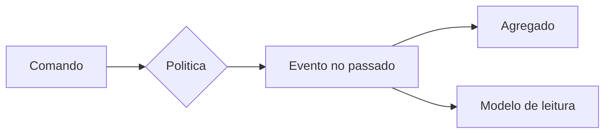
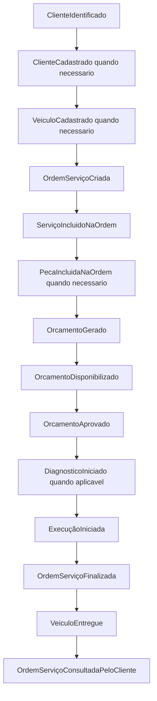
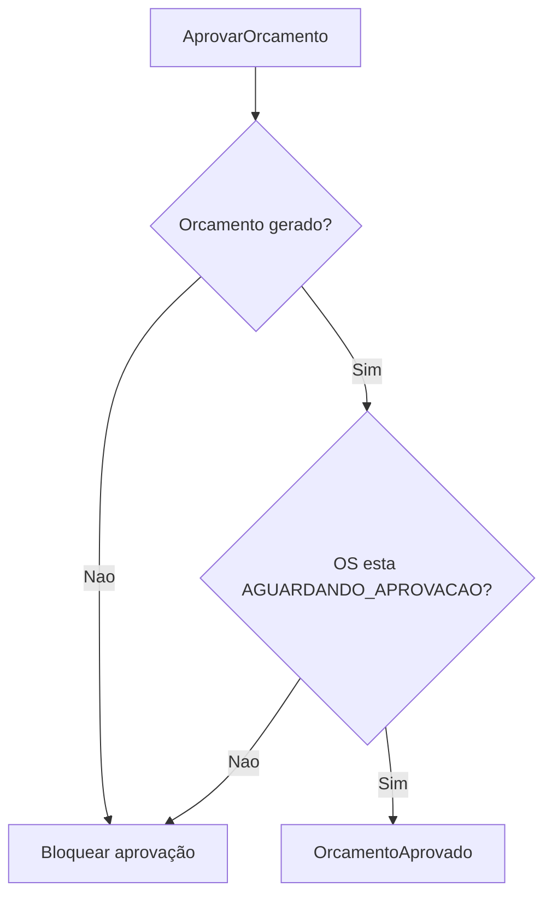
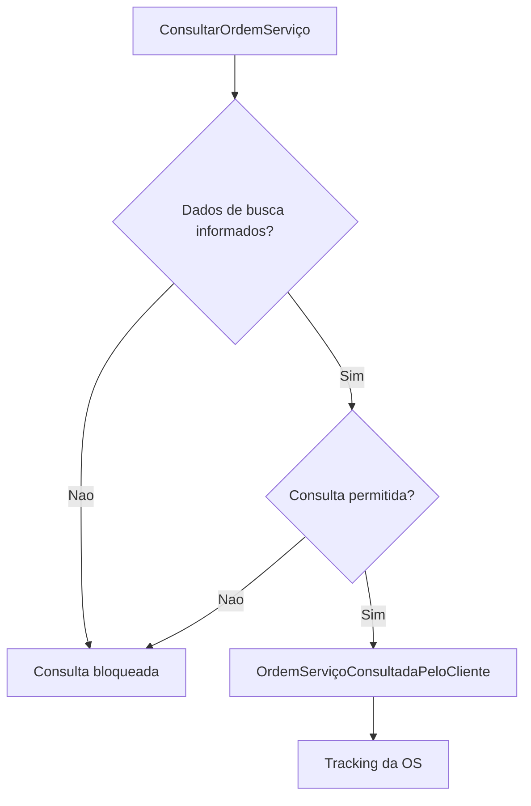
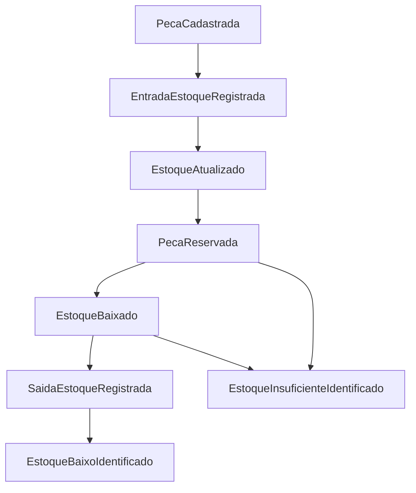

# Event Storming - AutoCare Hub

## 1. Objetivo do Event Storming

O Event Storming foi usado para modelar os fluxos principais da oficina mecânica antes de olhar apenas para endpoints ou tabelas. A ideia foi entender quais fatos importantes acontecem no negócio, quais comandos causam esses fatos e quais regras protegem o processo.

O foco do MVP está em dois fluxos exigidos no Tech Challenge:

1. criação e acompanhamento da Ordem de Serviço;
2. gestão de peças, insumos e estoque.

Os eventos deste documento são elementos de modelagem DDD. O AutoCare Hub não implementa Event Sourcing nem Event Store.

## 2. Papéis participantes

Como este é um projeto acadêmico, não foi documentado um workshop real com uma oficina específica. A modelagem considera os papéis do domínio descritos no enunciado e no fluxo de uma oficina:

- Cliente;
- Atendente;
- Mecânico;
- Administrador da oficina;
- Responsável pelo estoque;
- Sistema AutoCare Hub;
- domain expert simulado a partir do enunciado;
- desenvolvedora responsável pelo MVP.

Os papéis acima são papéis de negócio. No sistema, eles são representados por `UserRole` e campos de perfil:

| Papel de negócio | Representação técnica |
|---|---|
| Dona do projeto / administradora master | `role=ADMIN`, `profileType=MASTER_ADMIN` |
| Administrador da oficina | `role=ADMIN`, `profileType=WORKSHOP_ADMIN` |
| Responsável pelo estoque | `role=ADMIN`, `profileType=PARTS_STORE_ADMIN` ou `role=EMPLOYEE`, `profileType=PARTS_STORE_EMPLOYEE` |
| Atendente | `role=EMPLOYEE`, com perfil operacional da oficina ou loja |
| Mecânico | `role=EMPLOYEE`, `profileType=WORKSHOP_EMPLOYEE`, `employeeSubRole=MECHANIC` |
| Cliente | `role=CUSTOMER`, `profileType=CUSTOMER_OWNER` |

## 3. Escopo

### Dentro do escopo

- criação da OS;
- acompanhamento da OS;
- geração de orçamento;
- aprovação de orçamento;
- mudança de status;
- gestão de peças e insumos;
- controle de estoque;
- consulta administrativa e consulta do cliente.

### Fora do escopo

- pagamento online;
- envio real de e-mail, SMS ou WhatsApp;
- integração com fornecedores;
- agendamento externo;
- Event Store;
- microserviços.

Esses itens ficam fora do escopo do MVP e não fazem parte da entrega desta fase.

## 4. Legenda usada

| Elemento | Significado no Event Storming |
|---|---|
| Evento | Algo relevante que já aconteceu no domínio. |
| Comando | Ação ou intenção que causa um evento. |
| Política | Regra que orienta uma decisão ou reação do sistema. |
| Ponto de atenção | Risco, exceção ou dúvida do fluxo. |
| Modelo de leitura | Consulta usada para acompanhar o processo. |
| Agregado | Objeto principal que protege regras de negócio. |
| Contexto delimitado | Fronteira conceitual do domínio dentro do monolito. |

## 5. Brainstorming de eventos

Os eventos foram escritos no passado, seguindo a orientação da aula.

### Ordem de Serviço e orçamento

- `ClienteIdentificado`
- `ClienteCadastrado`
- `VeiculoCadastrado`
- `VeiculoSelecionado`
- `OrdemServiçoCriada`
- `ServiçoIncluidoNaOrdem`
- `PecaIncluidaNaOrdem`
- `OrcamentoGerado`
- `OrcamentoDisponibilizado`
- `OrcamentoAprovado`
- `DiagnosticoIniciado`
- `ExecuçãoIniciada`
- `OrdemServiçoFinalizada`
- `VeiculoEntregue`
- `OrdemServiçoConsultadaPeloCliente`

### Peças, insumos e estoque

- `PecaCadastrada`
- `PecaAtualizada`
- `EntradaEstoqueRegistrada`
- `SaidaEstoqueRegistrada`
- `PecaReservada`
- `ReservaLiberada`
- `EstoqueBaixado`
- `EstoqueAtualizado`
- `EstoqueBaixoIdentificado`
- `EstoqueInsuficienteIdentificado`

## 6. Linha do tempo

### 6.1 Fluxo 1 - Criação e acompanhamento da OS

1. `ClienteIdentificado`
2. `ClienteCadastrado`, quando necessário
3. `VeiculoCadastrado`, quando necessário
4. `VeiculoSelecionado`
5. `OrdemServiçoCriada`
6. `ServiçoIncluidoNaOrdem`
7. `PecaIncluidaNaOrdem`, quando necessário
8. `OrcamentoGerado`
9. `OrcamentoDisponibilizado`
10. `OrcamentoAprovado`
11. `DiagnosticoIniciado`, quando a oficina usa essa etapa antes do orçamento ou da execução
12. `ExecuçãoIniciada`
13. `OrdemServiçoFinalizada`
14. `VeiculoEntregue`
15. `OrdemServiçoConsultadaPeloCliente`

### 6.2 Fluxo 2 - Gestão de peças e insumos

1. `PecaCadastrada`
2. `EntradaEstoqueRegistrada`
3. `EstoqueAtualizado`
4. `PecaReservada`, quando vinculada a orçamento ou reserva administrativa
5. `EstoqueBaixado`
6. `SaidaEstoqueRegistrada`, quando há saída administrativa
7. `EstoqueAtualizado`
8. `EstoqueBaixoIdentificado`, quando a disponibilidade fica menor ou igual ao estoque mínimo

## 7. Pontos de atenção

| Ponto de atenção | Onde aparece no fluxo |
|---|---|
| CPF/CNPJ inválido | Identificação e cadastro do cliente. |
| Placa inválida | Cadastro ou seleção do veículo. |
| Cliente inexistente | Abertura da OS. |
| Veículo não pertence ao cliente | Vínculo do veículo à OS. |
| Serviço inativo | Inclusão de serviço na OS. |
| Peça inativa | Inclusão de peça na OS ou movimentação de estoque. |
| Estoque insuficiente | Inclusão, reserva ou baixa de peça. |
| Reserva maior que estoque disponível | Reserva de peça. |
| Orçamento ainda não aprovado | Tentativa de iniciar execução. |
| Tentativa de iniciar execução sem aprovação | Transição para `EM_EXECUCAO`. |
| Tentativa de finalizar OS que não está em execução | Transição para `FINALIZADA`. |
| Tentativa de entregar OS não finalizada | Transição para `ENTREGUE`. |
| Usuário sem JWT acessando API administrativa | Rotas administrativas. |
| Cliente tentando consultar OS sem permissão | Acompanhamento da OS pelo cliente. |

## 8. Eventos pivotais

| Evento pivotal | Por que muda a fase do processo |
|---|---|
| `OrdemServiçoCriada` | Inicia formalmente o atendimento da oficina. |
| `OrcamentoGerado` | Fecha a composição de serviços e peças e coloca a OS em aprovação. |
| `OrcamentoAprovado` | Muda a OS da fase comercial/autorização para a fase de execução. |
| `ExecuçãoIniciada` | Indica que a oficina começou o trabalho técnico. |
| `OrdemServiçoFinalizada` | Marca o fim técnico do serviço. |
| `VeiculoEntregue` | Encerra o atendimento para o cliente. |
| `EstoqueBaixado` | Confirma consumo ou saída efetiva de peça/insumo. |

## 9. Comandos

| Comando | Evento esperado | Implementação relacionada |
|---|---|---|
| `IdentificarCliente` | `ClienteIdentificado` | `Document`, `CustomerRepository` |
| `CadastrarCliente` | `ClienteCadastrado` | `CreateCustomerUseCase` |
| `CadastrarVeiculo` | `VeiculoCadastrado` | `CreateVehicleUseCase` |
| `CriarOrdemServiço` | `OrdemServiçoCriada` | `CreateServiceOrderUseCase` |
| `IncluirServiçoNaOrdem` | `ServiçoIncluidoNaOrdem` | `AddServiceToServiceOrderUseCase` |
| `IncluirPecaNaOrdem` | `PecaIncluidaNaOrdem` | `AddPartToServiceOrderUseCase` |
| `GerarOrcamento` | `OrcamentoGerado` | `GenerateServiceOrderBudgetUseCase` |
| `AprovarOrcamento` | `OrcamentoAprovado` | `ApproveServiceOrderBudgetUseCase` |
| `IniciarDiagnostico` | `DiagnosticoIniciado` | `ServiceOrder.startDiagnosis`, `UpdateServiceOrderStatusUseCase` |
| `IniciarExecução` | `ExecuçãoIniciada` | `ServiceOrder.startExecution`, `UpdateServiceOrderStatusUseCase` |
| `FinalizarOrdemServiço` | `OrdemServiçoFinalizada` | `ServiceOrder.finish` |
| `EntregarVeiculo` | `VeiculoEntregue` | `ServiceOrder.deliver` |
| `CadastrarPeca` | `PecaCadastrada` | `CreatePartUseCase` |
| `RegistrarEntradaEstoque` | `EntradaEstoqueRegistrada` | `RegisterPartStockMovementUseCase` |
| `RegistrarSaidaEstoque` | `SaidaEstoqueRegistrada` | `RegisterPartStockMovementUseCase` |
| `ReservarPeca` | `PecaReservada` | `ReservePartStockUseCase`, `GenerateServiceOrderBudgetUseCase` |
| `LiberarReservaPeca` | `ReservaLiberada` | `ReleasePartReservationUseCase` |
| `BaixarEstoque` | `EstoqueBaixado` | `CommitPartReservationUseCase`, `Part.reduceStock` |
| `ConsultarOrdemServiço` | `OrdemServiçoConsultadaPeloCliente` | `TrackServiceOrderUseCase`, `FindServiceOrderUseCase` |

## 10. Políticas

| Política | Regra aplicada |
|---|---|
| Ao gerar orçamento, a OS fica aguardando aprovação. | `ServiceOrder.generateBudget` define `AGUARDANDO_APROVACAO`. |
| Ao aprovar orçamento, a OS fica liberada para execução. | `ServiceOrder.approveBudget` registra `approvedAt`. |
| Ao iniciar execução, a aprovação é obrigatória. | `ServiceOrder.startExecution` bloqueia execução sem aprovação. |
| Ao incluir peça, o sistema valida estoque disponível. | `ServiceOrder.addPart` consulta disponibilidade da `Part`. |
| Ao gerar orçamento com peças, o sistema reserva peças. | `GenerateServiceOrderBudgetUseCase` reserva itens vinculados. |
| Ao confirmar reserva, o estoque é baixado. | `CommitPartReservationUseCase` registra baixa e movimentação. |
| O estoque não pode ficar negativo. | `Part` bloqueia baixa sem disponibilidade. |
| Transições inválidas de status são bloqueadas. | `ServiceOrder` lança exceção de domínio. |
| APIs administrativas exigem autenticação JWT. | `SecurityConfig` protege rotas administrativas. |
| Cliente só acompanha OS por consulta permitida. | `TrackServiceOrderUseCase` e autorização validam a consulta. |

## 11. Modelos de leitura

| Modelo de leitura | Finalidade | Endpoint/consulta |
|---|---|---|
| Detalhe da Ordem de Serviço | Ver dados completos da OS. | `GET /api/v1/service-orders/{serviceOrderId}` |
| Listagem de Ordens de Serviço | Consultar OS por filtros administrativos. | `GET /api/v1/service-orders` |
| Acompanhamento da OS pelo cliente | Permitir que o cliente acompanhe status, itens e histórico. | `GET /api/v1/service-orders/tracking` |
| Consulta de orçamento | Ver valores de serviços, peças e total dentro da OS. | Resposta de detalhe/tracking da OS. |
| Consulta de estoque | Ver quantidade total, reservada, disponível e status da peça. | `GET /api/v1/parts` e `GET /api/v1/parts/{partId}` |
| Consulta de tempo médio de execução | Apoiar monitoramento operacional. | `GET /api/v1/service-orders/metrics/average-execution-time` |

## 12. Sistemas externos

O fluxo principal do MVP não depende de sistemas externos. A aplicação usa PostgreSQL, Swagger/OpenAPI e autenticação JWT como infraestrutura local, mas não possui integração real com e-mail, WhatsApp, SMS, pagamento, agenda, ERP ou fornecedores.

## 13. Agregados

### 13.1 `ServiceOrder`

Comandos e eventos relacionados:

- criar OS;
- incluir serviço;
- incluir peça;
- gerar orçamento;
- aprovar orçamento;
- iniciar diagnóstico;
- iniciar execução;
- finalizar OS;
- entregar veículo.

Invariantes:

- OS precisa ter cliente e veículo;
- orçamento precisa ser gerado antes da aprovação;
- execução depende da aprovação;
- finalização depende da execução;
- entrega depende da finalização.

### 13.2 `Part`

Comandos e eventos relacionados:

- cadastrar peça;
- registrar entrada;
- registrar saída;
- reservar;
- liberar reserva;
- baixar estoque.

Invariantes:

- estoque não pode ficar negativo;
- reserva não pode exceder disponibilidade;
- baixa não pode exceder estoque disponível ou reservado.

### 13.3 `Customer`

Comandos e eventos relacionados:

- identificar cliente;
- cadastrar cliente;
- validar CPF/CNPJ.

Invariantes:

- documento precisa ser CPF ou CNPJ válido;
- documento normalizado evita duplicidade por máscara.

### 13.4 `Vehicle`

Comandos e eventos relacionados:

- cadastrar veículo;
- validar placa;
- vincular a cliente.

Invariantes:

- veículo precisa estar vinculado a um cliente;
- placa precisa ter formato válido;
- marca, modelo e ano são obrigatórios.

## 14. Contextos delimitados

O projeto é um monolito em camadas. Os contextos delimitados são usados para organização conceitual do domínio e da documentação, não como microserviços separados.

| Contexto delimitado | Eventos principais | Agregados relacionados |
|---|---|---|
| Atendimento de Oficina | `OrdemServiçoCriada`, `DiagnosticoIniciado`, `ExecuçãoIniciada`, `OrdemServiçoFinalizada`, `VeiculoEntregue` | `ServiceOrder` |
| Cadastro de Clientes e Veículos | `ClienteIdentificado`, `ClienteCadastrado`, `VeiculoCadastrado` | `Customer`, `Vehicle` |
| Catálogo de Serviços | `ServiçoIncluidoNaOrdem` | `WorkshopService` |
| Gestão de Peças e Estoque | `PecaCadastrada`, `EntradaEstoqueRegistrada`, `PecaReservada`, `EstoqueBaixado`, `EstoqueAtualizado` | `Part`, `StockMovement` |
| Orçamentos e Aprovação | `OrcamentoGerado`, `OrcamentoDisponibilizado`, `OrcamentoAprovado` | `ServiceOrder`, `Budget` |
| Identidade e Acesso | Usuário autenticado e acesso autorizado | `User` |

## 15. Fluxos exigidos pelo Tech Challenge

| Requisito do Tech Challenge | Onde aparece no Event Storming |
|---|---|
| Criação e acompanhamento da OS | Linha do tempo 6.1, modelos de leitura e diagramas 16.2 a 16.5 |
| Gestão de peças e insumos | Linha do tempo 6.2, agregado `Part` e diagrama 16.6 |
| Identificação por CPF/CNPJ | Eventos `ClienteIdentificado` e `ClienteCadastrado` |
| Cadastro de veículo | Evento `VeiculoCadastrado` |
| Inclusão de serviços solicitados | Evento `ServiçoIncluidoNaOrdem` |
| Inclusão de peças e insumos | Evento `PecaIncluidaNaOrdem` |
| Geração automática de orçamento | Evento `OrcamentoGerado` |
| Aprovação de orçamento | Evento `OrcamentoAprovado` |
| Acompanhamento pelo cliente | Evento `OrdemServiçoConsultadaPeloCliente` e modelo de leitura de tracking |
| Controle de status | Eventos pivotais e máquina de estados |
| Controle de estoque | Eventos de estoque, políticas e agregado `Part` |
| Tempo médio de execução | Modelo de leitura de métrica |
| JWT para APIs administrativas | Política de autenticação e contexto Identidade e Acesso |

## 16. Diagramas Mermaid

Os diagramas usam `flowchart` e `stateDiagram-v2` para facilitar renderização no IntelliJ com plugin Mermaid.

### 16.1 Visão geral de comandos e eventos

### 16.2 Linha do tempo da OS

### 16.3 Aprovação do orçamento

### 16.4 Execução e entrega

### 16.5 Acompanhamento pelo cliente

### 16.6 Linha do tempo de estoque

### 16.7 Máquina de estados da Ordem de Serviço

