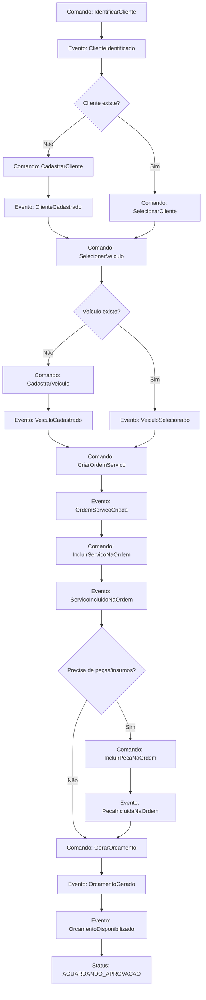
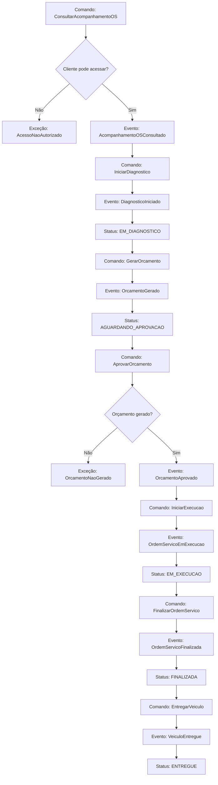
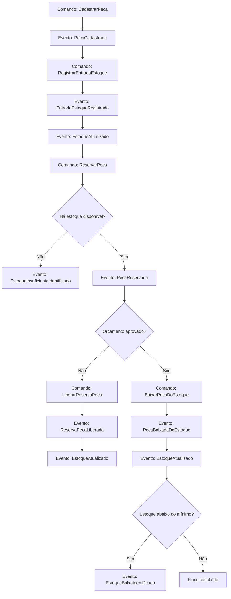

# Event Storming - AutoCare Hub

Este documento apresenta o Event Storming dos fluxos principais do AutoCare Hub, sistema desenvolvido para apoiar o atendimento de uma oficina mecânica.

O foco do MVP está em dois fluxos exigidos no Tech Challenge:

1. Criação e acompanhamento da Ordem de Serviço.
2. Gestão de peças, insumos e estoque.

Os nomes utilizados seguem a linguagem ubíqua definida para o projeto. Os eventos descritos aqui representam a modelagem do domínio e ajudam a explicar as mudanças importantes que acontecem no sistema. O MVP não foi desenhado como uma aplicação baseada em Event Sourcing, por isso esses eventos não dependem de um event store para existir.

Os status da Ordem de Serviço são descritos na linguagem de negócio como `RECEBIDA`, `EM_DIAGNOSTICO`, `AGUARDANDO_APROVACAO`, `EM_EXECUCAO`, `FINALIZADA` e `ENTREGUE`. Quando a API utiliza códigos externos em inglês, eles representam os mesmos estados do domínio.

## 1. Legenda usada no Event Storming

- **Atores:** pessoas ou sistemas que iniciam ações no fluxo.
- **Comandos:** intenções executadas no sistema, normalmente disparadas por uma ação do usuário ou por uma regra da aplicação.
- **Eventos:** fatos relevantes que aconteceram no domínio depois da execução de um comando.
- **Políticas:** regras que orientam decisões do fluxo.
- **Agregados:** objetos principais afetados por comandos e eventos.
- **Exceções:** situações em que o sistema bloqueia a ação para proteger uma regra de negócio.
- **Dados necessários:** informações mínimas para executar ou consultar cada etapa.

## 2. Fluxo 1 - Criação da Ordem de Serviço

### Objetivo do fluxo

Registrar o atendimento inicial da oficina, identificar o cliente, vincular o veículo, incluir serviços e peças, gerar o orçamento e deixar a Ordem de Serviço pronta para aprovação.

### Atores

- Administrador da oficina.
- Funcionário autorizado da oficina.
- Cliente final.
- Sistema AutoCare Hub.

### Comandos

- `IdentificarCliente`
- `CadastrarCliente`
- `SelecionarCliente`
- `CadastrarVeiculo`
- `SelecionarVeiculo`
- `CriarOrdemServico`
- `IncluirServicoNaOrdem`
- `IncluirPecaNaOrdem`
- `GerarOrcamento`
- `DisponibilizarOrcamento`

### Eventos de domínio

- `ClienteIdentificado`
- `ClienteCadastrado`
- `VeiculoCadastrado`
- `VeiculoSelecionado`
- `OrdemServicoCriada`
- `ServicoIncluidoNaOrdem`
- `PecaIncluidaNaOrdem`
- `OrcamentoGerado`
- `OrcamentoDisponibilizado`

### Agregados envolvidos

- `Customer`: representa o cliente atendido pela oficina.
- `Vehicle`: representa o veículo vinculado ao cliente.
- `ServiceOrder`: representa a Ordem de Serviço e concentra o fluxo principal do atendimento.
- `WorkshopService`: representa os serviços oferecidos pela oficina.
- `Part`: representa peças e insumos usados no serviço.
- `Budget`: representa o orçamento calculado a partir dos serviços e peças.

### Políticas de domínio

- O cliente precisa ser identificado por CPF ou CNPJ antes da criação da OS.
- Quando o cliente ainda não existe, ele deve ser cadastrado antes de seguir com o atendimento.
- O veículo precisa estar cadastrado e vinculado ao cliente correto.
- A OS precisa ser criada com pelo menos um serviço solicitado.
- Serviços adicionais podem ser incluídos enquanto o orçamento ainda não foi gerado.
- Peças e insumos podem ser incluídos quando forem necessários para o atendimento.
- O orçamento é calculado com base nos serviços e peças vinculados à OS.
- Depois da geração do orçamento, a OS passa para `AGUARDANDO_APROVACAO`.
- Quando há peças vinculadas ao orçamento, o sistema precisa respeitar a disponibilidade de estoque.

### Regras de negócio

- CPF e CNPJ devem ser válidos.
- A placa do veículo deve estar em formato válido.
- O mesmo cliente não pode ser duplicado por diferença de máscara no documento.
- Um veículo não pode ser cadastrado sem cliente.
- A OS não pode ser criada sem cliente e veículo.
- A OS não pode ser criada sem serviço solicitado.
- O veículo informado na OS deve pertencer ao cliente.
- O orçamento deve calcular total de serviços, total de peças e total geral.
- Depois da geração do orçamento, os itens da OS ficam protegidos contra alterações indevidas.

### Exceções mapeadas

- `DocumentoInvalido`
- `PlacaInvalida`
- `ClienteNaoEncontrado`
- `VeiculoNaoEncontrado`
- `VeiculoNaoPertenceAoCliente`
- `ServicoNaoEncontrado`
- `ServicoInativo`
- `PecaNaoEncontrada`
- `PecaInativa`
- `EstoqueInsuficiente`
- `OrdemServicoInvalida`

### Fluxo principal

1. O funcionário informa o CPF ou CNPJ do cliente.
2. O sistema valida e normaliza o documento.
3. O sistema localiza o cliente existente ou permite o cadastro de um novo cliente.
4. O funcionário seleciona ou cadastra o veículo.
5. O sistema valida a placa e confirma se o veículo pertence ao cliente informado.
6. O funcionário informa os serviços solicitados no comando de criação da Ordem de Serviço.
7. O sistema cria a Ordem de Serviço com os serviços iniciais.
8. O funcionário inclui peças ou insumos, quando necessário.
9. O sistema calcula o orçamento com base nos serviços e peças vinculados.
10. O orçamento fica disponível para aprovação do cliente.
11. A OS passa para `AGUARDANDO_APROVACAO`.

### Fluxos alternativos

- Se o cliente não for encontrado, o funcionário cadastra o cliente e continua o atendimento.
- Se o veículo não for encontrado, o funcionário cadastra o veículo e o vincula ao cliente.
- Se o veículo pertencer a outro cliente, o sistema bloqueia a criação da OS.
- Se o serviço estiver inativo, o sistema bloqueia a inclusão do serviço.
- Se a peça estiver inativa ou não tiver estoque suficiente, o sistema bloqueia a inclusão ou reserva conforme a regra do fluxo.
- Se o orçamento ainda não tiver sido gerado, a OS permanece no status anterior.

### Pontos de decisão

- O cliente já existe?
- O documento informado é válido?
- O veículo já existe?
- O veículo pertence ao cliente?
- Existe ao menos um serviço solicitado?
- Existem peças ou insumos vinculados?
- Há estoque disponível para a peça?
- O orçamento já pode ser gerado?

### Dados necessários

- CPF ou CNPJ do cliente.
- Nome, telefone e e-mail do cliente.
- Placa, marca, modelo e ano do veículo.
- Diagnóstico inicial ou problema informado.
- Serviços solicitados.
- Peças e insumos necessários.
- Quantidade de cada peça ou insumo.
- Preço dos serviços e das peças.

## 3. Fluxo 2 - Acompanhamento da Ordem de Serviço

### Objetivo do fluxo

Permitir que a oficina controle o andamento da OS e que o cliente acompanhe o progresso do atendimento pelo status da Ordem de Serviço.

### Atores

- Cliente final.
- Administrador da oficina.
- Funcionário autorizado da oficina.
- Sistema AutoCare Hub.

### Comandos

- `ConsultarAcompanhamentoOS`
- `IniciarDiagnostico`
- `AprovarOrcamento`
- `IniciarExecucao`
- `FinalizarOrdemServico`
- `EntregarVeiculo`

### Eventos de domínio

- `AcompanhamentoOSConsultado`
- `DiagnosticoIniciado`
- `OrcamentoAprovado`
- `OrdemServicoEmExecucao`
- `OrdemServicoFinalizada`
- `VeiculoEntregue`

### Agregados envolvidos

- `ServiceOrder`: controla o status, as datas e as transições da OS.
- `Vehicle`: identifica o veículo em atendimento.
- `Customer`: identifica o cliente dono da OS.
- `Budget`: guarda os valores do orçamento e a situação de aprovação.
- `Part`: participa do fluxo quando existe confirmação de reserva ou baixa de estoque.

### Políticas de domínio

- O cliente só pode consultar uma OS vinculada ao seu cadastro.
- As APIs administrativas exigem autenticação JWT.
- As transições de status precisam respeitar a máquina de estados da OS.
- A aprovação do orçamento é obrigatória antes da execução.
- A execução só pode iniciar depois da aprovação do orçamento.
- A finalização só pode ocorrer quando a OS está em execução.
- A entrega só pode ocorrer quando a OS está finalizada.

### Regras de transição de status

- `RECEBIDA` pode ir para `EM_DIAGNOSTICO`.
- `RECEBIDA` pode ir para `AGUARDANDO_APROVACAO` quando o orçamento é gerado.
- `EM_DIAGNOSTICO` pode ir para `AGUARDANDO_APROVACAO` quando o orçamento é gerado.
- `AGUARDANDO_APROVACAO` pode ir para `EM_EXECUCAO` depois da aprovação do orçamento.
- `EM_EXECUCAO` pode ir para `FINALIZADA`.
- `FINALIZADA` pode ir para `ENTREGUE`.
- `ENTREGUE` encerra o fluxo principal da OS.
- O status não pode voltar para uma etapa anterior.

### Exceções mapeadas

- `OrdemServicoNaoEncontrada`
- `AcessoNaoAutorizado`
- `OrcamentoNaoGerado`
- `TransicaoStatusInvalida`
- `ClienteNaoVinculadoAOrdem`

### Fluxo principal

1. O cliente consulta a OS pela API de acompanhamento.
2. O sistema valida se o cliente tem permissão para acessar aquela OS.
3. O sistema retorna os dados principais da OS, incluindo veículo, status, serviços, peças e orçamento.
4. A oficina inicia o diagnóstico, quando essa etapa se aplica ao atendimento.
5. O sistema atualiza a OS para `EM_DIAGNOSTICO`.
6. O orçamento é gerado e disponibilizado para aprovação.
7. O cliente aprova o orçamento.
8. O sistema registra a aprovação.
9. A oficina inicia a execução da OS.
10. O sistema atualiza a OS para `EM_EXECUCAO`.
11. A oficina finaliza o serviço.
12. O sistema atualiza a OS para `FINALIZADA`.
13. A oficina registra a entrega do veículo.
14. O sistema atualiza a OS para `ENTREGUE`.

### Fluxos alternativos

- Se o cliente tentar consultar uma OS que não pertence a ele, o sistema nega o acesso.
- Se o orçamento ainda não foi gerado, o acompanhamento retorna o status atual da OS.
- Se o orçamento ainda não foi aprovado, a OS permanece em `AGUARDANDO_APROVACAO`.
- Se houver tentativa de transição inválida, o sistema bloqueia a alteração.
- Se a OS já estiver entregue, o sistema mantém o fluxo encerrado.

### Pontos de decisão

- O cliente pode acessar a OS?
- A OS pertence ao cliente informado?
- O orçamento já foi gerado?
- O orçamento foi aprovado?
- O status atual permite a próxima ação?
- A OS já pode ser finalizada?
- O veículo já pode ser entregue?

### Dados necessários

- Identificador da OS.
- Identificador do cliente ou documento usado para consulta.
- Placa do veículo, quando aplicável.
- Status atual da OS.
- Datas de criação, diagnóstico, orçamento, aprovação, execução, finalização e entrega.
- Serviços vinculados.
- Peças vinculadas.
- Valores do orçamento.
- Situação da aprovação.

## 4. Fluxo 3 - Gestão de Peças e Insumos

### Objetivo do fluxo

Controlar o cadastro de peças e insumos, manter o estoque atualizado e garantir que uma peça só seja usada em uma OS quando houver quantidade disponível.

### Atores

- Administrador da oficina.
- Funcionário autorizado.
- Sistema AutoCare Hub.

### Comandos

- `CadastrarPeca`
- `EditarPeca`
- `RegistrarEntradaEstoque`
- `RegistrarSaidaEstoque`
- `ReservarPeca`
- `LiberarReservaPeca`
- `BaixarPecaDoEstoque`
- `ConsultarEstoqueBaixo`

### Eventos de domínio

- `PecaCadastrada`
- `PecaAtualizada`
- `EntradaEstoqueRegistrada`
- `SaidaEstoqueRegistrada`
- `PecaReservada`
- `ReservaPecaLiberada`
- `PecaBaixadaDoEstoque`
- `EstoqueAtualizado`
- `EstoqueBaixoIdentificado`
- `EstoqueInsuficienteIdentificado`

### Agregados envolvidos

- `Part`: controla dados da peça, preço, estoque total, estoque reservado e disponibilidade.
- `StockMovement`: registra entradas, saídas, baixas e ajustes de estoque.
- `ServiceOrder`: usa peças e insumos no atendimento.
- `Budget`: relaciona peças ao orçamento quando existe reserva antes da execução.

### Políticas de domínio

- A quantidade em estoque não pode ser negativa.
- O preço da peça não pode ser negativo.
- O estoque mínimo não pode ser negativo.
- O estoque disponível é calculado a partir do estoque total menos a quantidade reservada.
- Uma peça vinculada ao orçamento pode ser reservada antes da aprovação.
- A baixa definitiva acontece quando a peça é consumida no fluxo da OS ou quando uma saída administrativa é registrada.
- A baixa maior que o estoque disponível deve ser bloqueada.
- O estoque baixo é identificado quando a disponibilidade fica menor ou igual ao estoque mínimo. No código, isso aparece
  como filtro `lowStock=true` na listagem de peças e como `stockStatus` calculado pelo agregado `Part`.

### Regras de negócio

- O nome da peça ou insumo é obrigatório.
- O preço de venda precisa ser válido.
- A quantidade de uma movimentação precisa ser maior que zero.
- A entrada aumenta o estoque total.
- A saída reduz o estoque disponível.
- A reserva reduz a disponibilidade, mas não reduz o estoque total.
- A confirmação da reserva reduz o estoque total e a quantidade reservada.
- A liberação da reserva reduz apenas a quantidade reservada.
- O estoque não pode ficar negativo.

### Exceções mapeadas

- `PecaNaoEncontrada`
- `PecaInativa`
- `QuantidadeInvalida`
- `PrecoInvalido`
- `EstoqueInsuficiente`
- `MovimentacaoEstoqueInvalida`

### Fluxo principal

1. O administrador cadastra a peça ou o insumo.
2. O sistema valida os dados obrigatórios.
3. O funcionário registra uma entrada de estoque.
4. O sistema registra a movimentação.
5. O sistema atualiza a quantidade disponível.
6. A peça é vinculada a uma OS ou a um orçamento.
7. O sistema verifica se há estoque disponível.
8. O sistema reserva a quantidade necessária, quando o fluxo exige reserva.
9. Após a aprovação do orçamento, o sistema confirma o uso da peça.
10. O sistema baixa o estoque.
11. O sistema registra a movimentação correspondente.
12. Se a disponibilidade ficar baixa, o sistema identifica a peça como item de baixo estoque.

### Fluxos alternativos

- Se não houver estoque suficiente, o sistema bloqueia a reserva ou a baixa.
- Se a movimentação for uma entrada, o sistema aumenta o estoque total.
- Se a movimentação for uma saída administrativa, o sistema reduz o estoque disponível e registra a movimentação.
- Se uma reserva precisar ser desfeita, o sistema libera a quantidade reservada.
- Se a peça estiver inativa, o sistema bloqueia sua utilização em novos fluxos.

### Pontos de decisão

- A peça já existe?
- A peça está ativa?
- A quantidade informada é válida?
- Há estoque disponível?
- A movimentação é entrada, saída, reserva, baixa ou ajuste?
- A peça está vinculada a uma OS?
- A peça está vinculada a um orçamento?
- O orçamento foi aprovado?
- O estoque ficou abaixo do mínimo?

### Dados necessários

- Nome da peça ou do insumo.
- Categoria, marca, SKU e descrição, quando disponíveis.
- Preço de venda.
- Custo, quando controlado pelo cadastro.
- Quantidade em estoque.
- Quantidade reservada.
- Estoque mínimo.
- Tipo da movimentação.
- Quantidade movimentada.
- Referência da OS ou do orçamento, quando aplicável.

## 5. Diagramas Mermaid

### 5.1 Event Storming da criação da OS

### 5.2 Event Storming do acompanhamento da OS

### 5.3 Event Storming da gestão de peças e estoque

### 5.4 Máquina de estados da Ordem de Serviço

## 6. Relação com os requisitos do MVP

| Requisito do Tech Challenge | Onde aparece neste Event Storming |
|---|---|
| Identificação do cliente por CPF/CNPJ | Fluxo 1, comandos `IdentificarCliente` e `CadastrarCliente` |
| Cadastro de veículo | Fluxo 1, comando `CadastrarVeiculo` |
| Inclusão dos serviços solicitados | Fluxo 1, comando `IncluirServicoNaOrdem` |
| Inclusão de peças e insumos | Fluxo 1 e Fluxo 3 |
| Orçamento gerado automaticamente | Fluxo 1, comando `GerarOrcamento` |
| Envio/disponibilização do orçamento ao cliente | Fluxo 1, evento `OrcamentoDisponibilizado` |
| Acompanhamento da OS | Fluxo 2 |
| Controle de status da OS | Fluxo 2 e máquina de estados |
| CRUD de peças e insumos com estoque | Fluxo 3 |
| Controle de estoque | Fluxo 3 |
| Autenticação JWT para APIs administrativas | Política do Fluxo 2 |
| Validação de CPF/CNPJ e placa | Regras do Fluxo 1 |
| Consulta do cliente via API | Fluxo 2, comando `ConsultarAcompanhamentoOS` |
