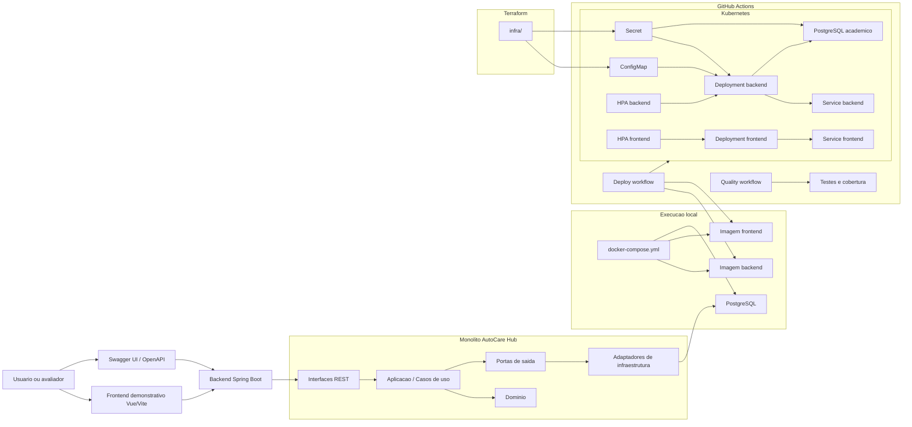

# Desenho de arquitetura - Fase 2

O AutoCare Hub permanece como monolito modular com Arquitetura Hexagonal/Clean Architecture. A evolucao da Fase 2
adiciona automacao, infraestrutura como codigo, Kubernetes e escalabilidade horizontal sem transformar o sistema em
microsservicos.

## Diagrama

## Componentes

- Frontend: demonstracao visual em Vue/Vite.
- Backend: API REST Spring Boot com Clean Architecture/Hexagonal dentro de um monolito.
- Dominio: entidades, value objects, status e regras de negocio.
- Aplicacao: casos de uso, politicas de aplicacao e portas de saida.
- Infraestrutura: JPA, repositories, seguranca JWT, BCrypt e configuracoes.
- Docker: execucao local reproduzivel.
- Kubernetes: Deployments, Services, ConfigMaps, Secrets e HPA.
- Terraform: provisionamento base do namespace, ConfigMap e Secret em cluster local/acadêmico.
- CI/CD: qualidade, testes, build de imagens e deploy opcional no cluster.

## Refatoracao de aplicacao

- `UsersController` atua como adaptador REST e delega gestao de usuarios para casos de uso especificos.
- `CreateManagedUserUseCase`, `UpdateManagedUserUseCase`, `ListManageableUsersUseCase`,
  `ListManageableCompaniesUseCase` e `ListPartnerUsersUseCase` concentram regras de escopo, perfil e empresa.
- `UserManagementPolicy` centraliza a politica de administracao de usuarios por perfil e empresa.
- `AuthenticationGateway` e uma porta de saida da aplicacao; `SpringSecurityAuthenticationGateway` adapta
  `AuthenticationManager` e `JwtService`.
- `PasswordHasher` e uma porta de saida da aplicacao; `BCryptPasswordHasher` e o adaptador de infraestrutura baseado em
  Spring Security/BCrypt.
- `application` e `domain` nao importam Spring nem classes de `infrastructure`.
- Endpoints, Flyway, Swagger/OpenAPI e Docker permanecem sem mudanca de contrato por causa da refatoracao.

## Decisao de ambiente

Nao foi assumida uma cloud especifica. A Fase 2 esta preparada para demonstracao local/acadêmica com Kubernetes e
Terraform, mantendo placeholders onde credenciais ou ambiente real precisam ser definidos.
