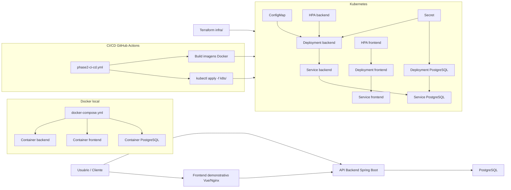

# Documento final da Fase 2 - AutoCare Hub

## Identificação

| Campo                      | Valor                                               |
|----------------------------|-----------------------------------------------------|
| Projeto                    | AutoCare Hub                                        |
| Responsável                | Yasmin Barcelos Pires                               |
| RM                         | RM370897                                            |
| Repositório                | <https://github.com/yxsbx/SOAT-FIAP>                |
| Acesso `soat-architecture` | Confirmado no GitHub                                |
| Vídeo demonstrativo        | [INSERIR LINK DO YOUTUBE OU VIMEO ANTES DA ENTREGA] |

## Arquitetura



## Recursos escolhidos

| Status           | Recurso                                                                                                       |
|------------------|---------------------------------------------------------------------------------------------------------------|
| ATENDIDO         | Backend Java 21/Spring Boot com arquitetura hexagonal, JWT, Flyway, PostgreSQL e Swagger/OpenAPI.             |
| ATENDIDO         | Frontend demonstrativo Vue/Vite servido por Nginx.                                                            |
| ATENDIDO         | Docker Compose local com backend, frontend e PostgreSQL.                                                      |
| ATENDIDO         | Kubernetes local com Namespace, ConfigMap, Secret de exemplo, Deployments, Services, probes, resources e HPA. |
| ATENDIDO         | Terraform local em `infra/` para cluster `kind` opcional, Namespace, ConfigMap, Secret e PVC.                 |
| ATENDIDO         | CI/CD em `.github/workflows/phase2-ci-cd.yml` com build, testes, Docker e deploy protegido por secrets.       |
| ATENDIDO         | Acesso do usuário `soat-architecture` ao repositório privado confirmado.                                      |
| BLOQUEIA ENTREGA | Link real do vídeo ainda deve ser inserido antes do envio.                                                    |

## Execução resumida

```powershell
Copy-Item .env.example .env
docker compose config --quiet
docker compose up -d --build
docker compose ps
docker compose logs --tail=100 app
```

Swagger local: <http://localhost:8080/swagger-ui.html>

OpenAPI versionado: `docs/api/openapi/openapi.yaml`

Collection Postman: `docs/api/postman/autocarehub-phase2.postman_collection.json`

## Terraform resumido

```powershell
$env:TF_VAR_postgres_password = "substituir-localmente"
$env:TF_VAR_jwt_secret = "segredo-com-pelo-menos-32-bytes"
$env:TF_VAR_external_service_token = "token-local-dos-webhooks"
cd infra
terraform init
terraform plan
terraform apply
cd ..
```

O Terraform prepara a infraestrutura base. O PostgreSQL é executado como workload Kubernetes demonstrativo; o PVC e os
secrets são provisionados pelo Terraform quando esse fluxo for usado.

## Kubernetes resumido

```powershell
kubectl apply -f k8s/
kubectl get pods -n autocarehub
kubectl get svc -n autocarehub
kubectl get hpa -n autocarehub
```

Antes de deploy real, substituir `k8s/secret.example.yaml` por secrets seguros do ambiente ou criar o Secret via CI/CD.

## CI/CD resumido

O workflow `.github/workflows/phase2-ci-cd.yml` executa checkout, Java 21, cache Maven, testes, `mvn verify`, Node 22,
`npm ci`, lint, build, `npm audit`, build das imagens Docker, validação do Docker Compose e deploy Kubernetes.

O deploy real só roda em `main` ou `workflow_dispatch` quando `KUBE_CONFIG`, `POSTGRES_PASSWORD`, `JWT_SECRET` e
`EXTERNAL_SERVICE_TOKEN` estiverem configurados como GitHub Actions Secrets. Sem esses valores, o workflow registra que
o deploy foi pulado.

## PDF final

O PDF enviado no portal deve conter:

- link do repositório compartilhado com `soat-architecture`;
- desenho da arquitetura;
- link real do vídeo demonstrativo.
