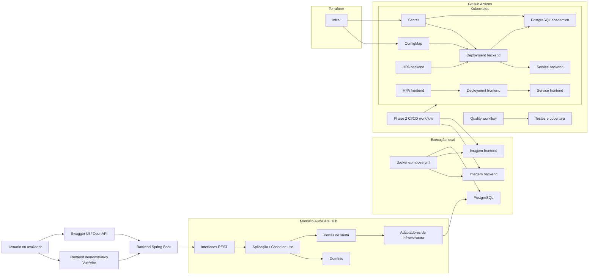

# Desenho de arquitetura - Fase 2

O AutoCare Hub permanece como monolito modular com Arquitetura Hexagonal/Clean Architecture. A evolução da Fase 2
adiciona automação, infraestrutura como código, Kubernetes e escalabilidade horizontal sem transformar o sistema em
microsserviços.

## Diagrama

## Componentes

- Frontend: demonstração visual em Vue/Vite.
- Backend: API REST Spring Boot com Clean Architecture/Hexagonal dentro de um monolito.
- Domínio: entidades, value objects, status e regras de negocio.
- Aplicação: casos de uso, políticas de aplicação e portas de saída.
- Infraestrutura: JPA, repositories, segurança JWT, BCrypt e configurações.
- Docker: execução local reproduzível.
- Kubernetes: Deployments, Services, ConfigMaps, Secrets e HPA.
- Terraform: criação opcional de cluster local `kind` e provisionamento base de namespace, ConfigMap, Secret e PVC em cluster local/acadêmico.
- CI/CD: qualidade, testes, build de imagens e deploy opcional no cluster.

## Refatoração de aplicação

- `UsersController` atua como adaptador REST e delega gestão de usuários para casos de uso específicos.
- `CreateManagedUserUseCase`, `UpdateManagedUserUseCase`, `ListManageableUsersUseCase`,
  `ListManageableCompaniesUseCase` e `ListPartnerUsersUseCase` concentram regras de escopo, perfil e empresa.
- `UserManagementPolicy` centraliza a política de administração de usuários por perfil e empresa.
- `AuthenticationGateway` e uma porta de saída da aplicação; `SpringSecurityAuthenticationGateway` adapta
  `AuthenticationManager` e `JwtService`.
- `PasswordHasher` e uma porta de saída da aplicação; `BCryptPasswordHasher` e o adaptador de infraestrutura baseado em
  Spring Security/BCrypt.
- `application` e `domain` não importam Spring nem classes de `infrastructure`.
- Endpoints, Flyway, Swagger/OpenAPI e Docker permanecem sem mudança de contrato por causa da refatoração.

## Decisão de ambiente

Não foi assumida uma cloud especifica. A Fase 2 esta preparada para demonstração local/acadêmica com Kubernetes e
Terraform, incluindo modo opcional de cluster local `kind`, mantendo placeholders onde credenciais ou ambiente real
precisam ser definidos.
