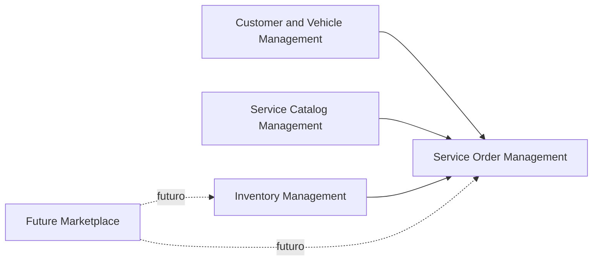

# Context Map

## Relação entre Contextos

## Customer and Vehicle Management -> Service Order Management

Service Order Management depende de Customer and Vehicle Management para validar que uma ordem de serviço pertence a um
cliente e a um veículo existentes.

No MVP, essa relação aparece quando uma ordem de serviço e criada. O caso de uso verifica cliente e veículo e impede
criar ordem se o veículo nao pertencer ao cliente.

## Service Catalog Management -> Service Order Management

Service Order Management depende do catálogo de serviços para adicionar serviços existentes a uma ordem de serviço.

No MVP, ao adicionar um serviço a uma ordem, o sistema usa dados do serviço cadastrado, como nome e preco base, para
compor os itens da ordem.

## Inventory Management -> Service Order Management

Service Order Management depende de Inventory Management para adicionar peças a uma ordem de serviço e baixar estoque.

No MVP, ao adicionar uma peça a ordem, a peça precisa existir e ter quantidade disponivel. A peça pode ser reservada
durante o orçamento e a baixa definitiva acontece quando a reserva e confirmada ou quando o orçamento e aprovado.

## Future Marketplace -> Inventory Management

Future Marketplace nao esta implementado no MVP.

Em uma evolução futura, o marketplace poderia alimentar o contexto de estoque com cotacoes, fornecedores, lojas
parceiras e disponibilidade externa de peças.

## Future Marketplace -> Service Order Management

Future Marketplace nao esta implementado no MVP.

Em uma evolução futura, a ordem de serviço poderia solicitar cotação de peças, aplicar cupons ou contratar serviços
parceiros, mas isso deve ser tratado como integração futura e nao como regra atual do MVP.
