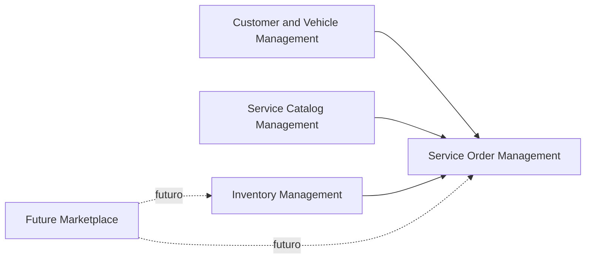

# Context Map

## Relacao entre Contextos

## Customer and Vehicle Management -> Service Order Management

Service Order Management depende de Customer and Vehicle Management para validar que uma ordem de servico pertence a um cliente e a um veiculo existentes.

No MVP, essa relacao aparece quando uma ordem de servico e criada. O caso de uso verifica cliente e veiculo e impede criar ordem se o veiculo nao pertencer ao cliente.

## Service Catalog Management -> Service Order Management

Service Order Management depende do catálogo de serviços para adicionar serviços existentes a uma ordem de servico.

No MVP, ao adicionar um servico a uma ordem, o sistema usa dados do servico cadastrado, como nome e preco base, para compor os itens da ordem.

## Inventory Management -> Service Order Management

Service Order Management depende de Inventory Management para adicionar pecas a uma ordem de servico e baixar estoque.

No MVP, ao adicionar uma peca a ordem, a peca precisa existir e ter estoque disponivel. O estoque e reduzido como parte do caso de uso.

## Future Marketplace -> Inventory Management

Future Marketplace nao esta implementado no MVP.

Em uma evolucao futura, o marketplace poderia alimentar o contexto de estoque com cotacoes, fornecedores, lojas parceiras e disponibilidade externa de pecas.

## Future Marketplace -> Service Order Management

Future Marketplace nao esta implementado no MVP.

Em uma evolucao futura, a ordem de servico poderia solicitar cotacao de pecas, aplicar cupons ou contratar servicos parceiros, mas isso deve ser tratado como integracao futura e nao como regra atual do MVP.
