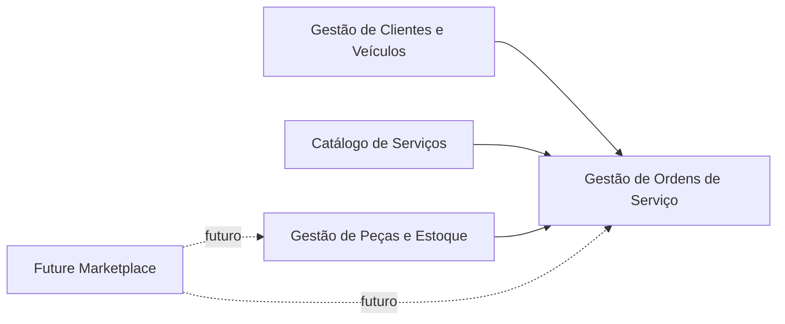

# Mapa de Contextos

## Relação entre Contextos

## Gestão de Clientes e Veículos -> Gestão de Ordens de Serviço

Gestão de Ordens de Serviço depende de Gestão de Clientes e Veículos para validar que uma Ordem de Serviço pertence a um
cliente e a um veículo existentes.

No MVP, essa relação aparece quando uma Ordem de Serviço é criada. O caso de uso verifica cliente e veículo e impede
criar ordem se o veículo não pertencer ao cliente.

## Catálogo de Serviços -> Gestão de Ordens de Serviço

Gestão de Ordens de Serviço depende do Catálogo de Serviços para adicionar serviços existentes a uma Ordem de Serviço.

No MVP, ao adicionar um serviço a uma ordem, o sistema usa dados do serviço cadastrado, como nome e preço base, para
compor os itens da ordem.

## Gestão de Peças e Estoque -> Gestão de Ordens de Serviço

Gestão de Ordens de Serviço depende de Gestão de Peças e Estoque para adicionar peças a uma Ordem de Serviço e baixar estoque.

No MVP, ao adicionar uma peça à ordem, a peça precisa existir e ter quantidade disponível. A peça pode ser reservada
durante o orçamento e a baixa definitiva acontece quando a reserva é confirmada ou quando o orçamento é aprovado.

## Future Marketplace -> Gestão de Peças e Estoque

Future Marketplace não está implementado no MVP.

Em uma evolução futura, o marketplace poderia alimentar o contexto de estoque com cotações, fornecedores, lojas
parceiras e disponibilidade externa de peças.

## Future Marketplace -> Gestão de Ordens de Serviço

Future Marketplace não está implementado no MVP.

Em uma evolução futura, a ordem de serviço poderia solicitar cotação de peças, aplicar cupons ou contratar serviços
parceiros, mas isso deve ser tratado como integração futura e não como regra atual do MVP.
