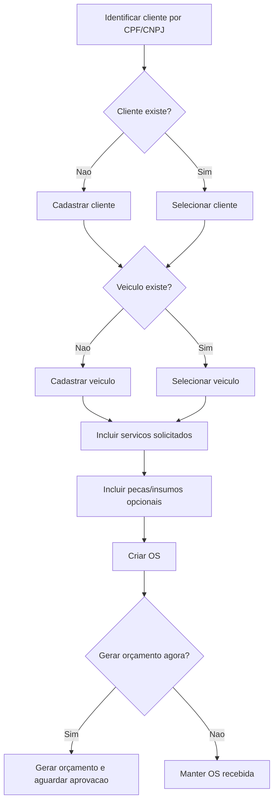
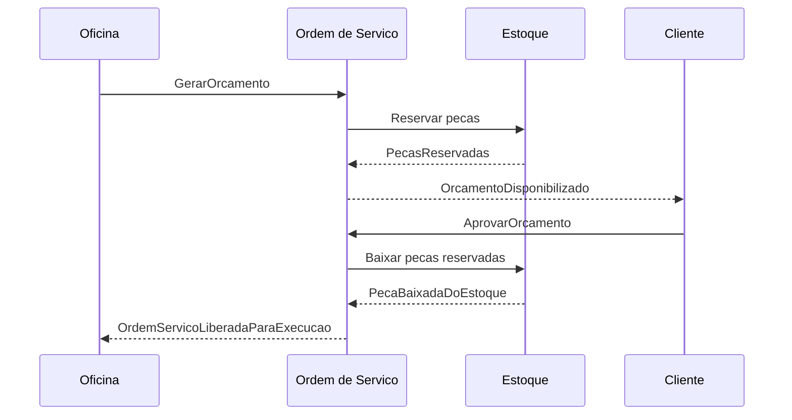
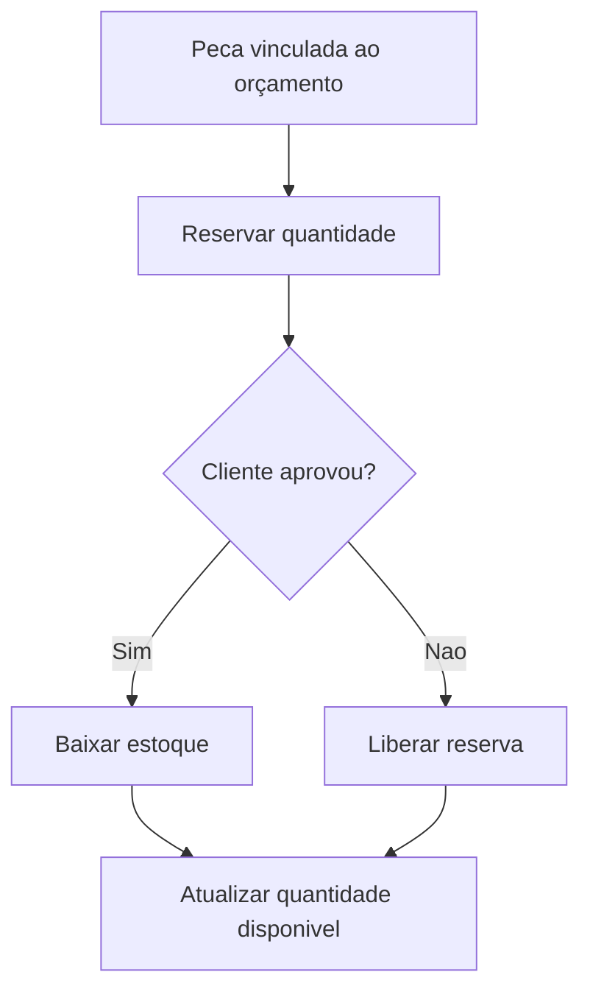
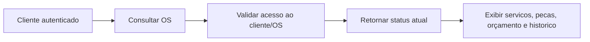
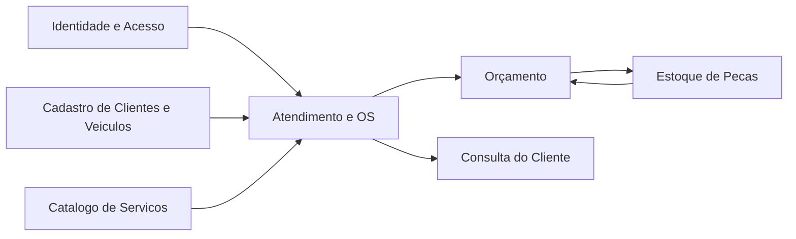
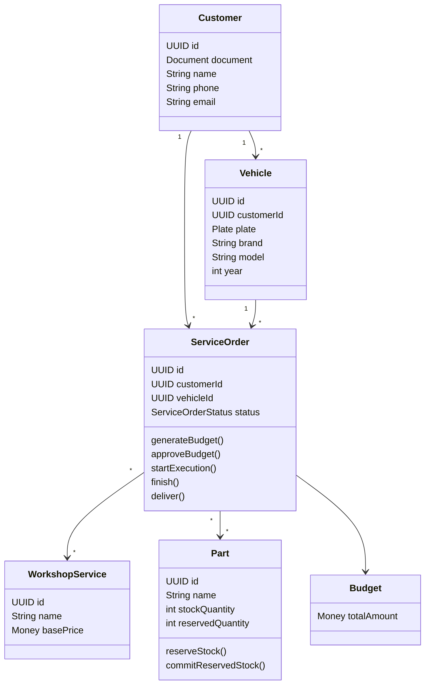
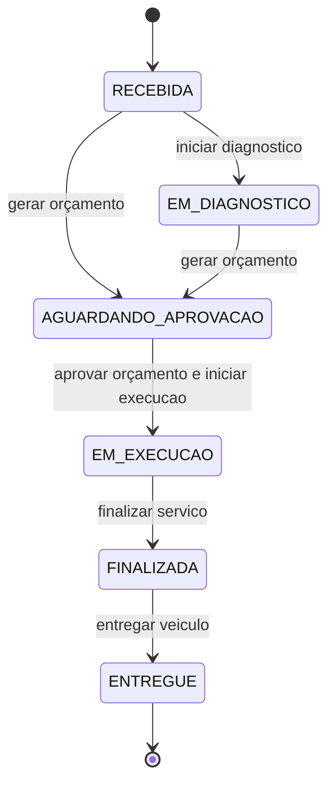

# Documentacao DDD - AutoCare Hub

## Visao Geral do Dominio

AutoCare Hub atua no dominio de gestao operacional de oficinas mecanicas. O nucleo do dominio e acompanhar o ciclo de
atendimento de um veiculo, desde a identificacao do cliente ate a entrega final, passando por diagnostico, orçamento,
aprovacao, execucao de servicos e consumo de pecas/insumos.

Embora o projeto seja um monolito em camadas, a modelagem separa conceitos de dominio, casos de uso, persistencia e
interface HTTP para manter a linguagem de negocio protegida de detalhes tecnicos.

## Problema de Negocio

Oficinas precisam controlar clientes, veiculos, ordens de servico, orçamentos e estoque de forma integrada. Sem essa
integracao, e comum ocorrer:

- perda de historico de atendimento;
- orçamentos sem rastreabilidade;
- uso de pecas sem baixa correta;
- dificuldade para o cliente acompanhar a OS;
- divergencia entre estoque fisico e sistema;
- falta de padronizacao no fluxo operacional.

## Objetivo do Sistema

Fornecer uma API backend que permita:

- registrar clientes e veiculos;
- criar ordens de servico;
- vincular servicos, pecas e insumos;
- gerar orçamentos automaticamente;
- aprovar orçamentos;
- controlar transicoes de status da OS;
- reservar e baixar pecas do estoque;
- disponibilizar acompanhamento da OS ao cliente.

## Linguagem Ubiqua

| Termo              | Definicao                                                            |
|--------------------|----------------------------------------------------------------------|
| Cliente            | Pessoa fisica ou juridica atendida pela oficina.                     |
| Documento          | CPF ou CNPJ usado para identificar cliente.                          |
| Veiculo            | Bem do cliente atendido pela oficina.                                |
| Placa              | Identificador do veiculo nos formatos brasileiro antigo ou Mercosul. |
| Ordem de Servico   | Registro central do atendimento.                                     |
| Diagnostico        | Etapa de avaliacao inicial do problema.                              |
| Servico Solicitado | Servico da oficina incluido na OS.                                   |
| Peca/Insumo        | Item de estoque usado em servico ou vendido separadamente.           |
| Orçamento          | Total calculado com servicos e pecas.                                |
| Aprovacao          | Aceite do cliente para execucao do orçamento.                        |
| Execucao           | Etapa em que o servico e realizado.                                  |
| Finalizacao        | Servico concluido pela oficina.                                      |
| Entrega            | Veiculo entregue ao cliente.                                         |
| Reserva de Estoque | Bloqueio temporario de peca para orçamento.                          |
| Baixa de Estoque   | Reducao definitiva da quantidade em estoque.                         |

## Subdominios

### Core Domain

- Gestao de Ordem de Servico.
- Orçamento e aprovacao.
- Controle de estoque associado a servicos.

### Supporting Domains

- Cadastro de clientes.
- Cadastro de veiculos.
- Cadastro de servicos.
- Cadastro de usuarios e permissoes.

### Generic Domains

- Autenticacao JWT.
- Persistencia relacional.
- Documentacao OpenAPI.
- Relatorios de vulnerabilidade.

## Bounded Contexts Sugeridos

1. **Atendimento e OS**
    - Cliente, Veiculo, Ordem de Servico, Status da OS.
2. **Orçamento**
    - Orçamento, Item de Orçamento, Aprovacao.
3. **Estoque**
    - Peca, Insumo, Movimentacao, Reserva, Baixa.
4. **Identidade e Acesso**
    - Usuario, Role, Perfil, Permissoes, JWT.
5. **Catalogo Operacional**
    - Servicos oferecidos pela oficina e pecas cadastradas.

No MVP, esses contextos convivem no mesmo monolito, mas a separacao por camadas e nomes preserva fronteiras conceituais.

## Entidades

- `Customer`: mantem identidade do cliente, documento, contato e endereco.
- `Vehicle`: mantem placa, marca, modelo, ano, quilometragem e cliente vinculado.
- `WorkshopService`: representa servico executavel pela oficina.
- `Part`: representa peca ou insumo com preco, estoque, estoque minimo e reserva.
- `ServiceOrder`: agregado principal do atendimento.
- `User`: representa conta autenticavel e autorizavel.
- `StockMovement`: registra entradas, saidas, vendas e baixas.

## Value Objects

- `Document`: CPF/CNPJ validado e normalizado.
- `Plate`: placa validada e normalizada.
- `Money`: valor monetario nao negativo.
- `Address`: endereco estruturado.
- `BudgetItem`: item calculavel do orçamento.

## Agregados

### ServiceOrder

Raiz: `ServiceOrder`

Contem:

- servicos solicitados;
- pecas vinculadas;
- status atual;
- timestamps de orçamento, aprovacao, execucao, finalizacao e entrega.

Invariantes:

- OS exige cliente e veiculo.
- Itens nao podem ser alterados apos orçamento gerado.
- Execucao exige orçamento aprovado.
- Entrega exige OS finalizada.

### Part

Raiz: `Part`

Controla:

- quantidade total;
- quantidade reservada;
- quantidade disponivel;
- estoque minimo;
- prazo de reserva.

Invariantes:

- estoque nao pode ser negativo;
- reserva nao pode ultrapassar disponibilidade;
- baixa nao pode exceder estoque disponivel/reservado.

### Customer / Vehicle

Clientes e veiculos possuem identidade propria. O veiculo sempre pertence a um cliente e a placa e unica no sistema.

## Repositorios

Portas de repositorio ficam na camada `application.repository`:

- `CustomerRepository`
- `VehicleRepository`
- `WorkshopServiceRepository`
- `PartRepository`
- `ServiceOrderRepository`
- `UserRepository`
- `UserPreferenceRepository`

Adapters JPA ficam em `infrastructure.persistence.adapter`.

## Servicos de Dominio

- `PlatformFeePolicy`: calcula taxa da plataforma por tiers de faturamento.
- Regras internas de `ServiceOrder`: transicoes de status e criacao de orçamento.
- Regras internas de `Part`: reserva, liberacao, baixa e status de estoque.

## Eventos de Dominio

Eventos mapeados conceitualmente:

- ClienteIdentificado
- ClienteCadastrado
- VeiculoCadastrado
- OrdemServicoCriada
- DiagnosticoIniciado
- ServicoSolicitadoIncluido
- PecaIncluidaNaOrdem
- OrcamentoGerado
- OrcamentoEnviado
- OrcamentoAprovado
- OrdemServicoLiberadaParaExecucao
- ExecucaoIniciada
- ServicoFinalizado
- VeiculoEntregue
- EstoqueAtualizado
- PecaReservada
- PecaBaixadaDoEstoque
- EstoqueInsuficienteIdentificado

No MVP, esses eventos nao sao persistidos como event store; eles orientam modelagem, testes e fluxos.

## Comandos

- IdentificarCliente
- CadastrarCliente
- CadastrarVeiculo
- CriarOrdemServico
- IncluirServicoSolicitado
- IncluirPecaNaOrdem
- GerarOrcamento
- AprovarOrcamento
- IniciarDiagnostico
- IniciarExecucao
- FinalizarServico
- EntregarVeiculo
- RegistrarEntradaEstoque
- RegistrarSaidaEstoque
- ReservarPeca
- LiberarReserva
- BaixarPecaDoEstoque

## Politicas e Regras

- CPF/CNPJ invalido nao pode ser salvo.
- Placa invalida nao pode ser salva.
- Cliente nao pode ser duplicado por documento formatado/digitos.
- Veiculo exige cliente.
- OS exige cliente, veiculo e ao menos um servico.
- Orçamento soma servicos e pecas.
- OS vai para `AGUARDANDO_APROVACAO` apos orçamento.
- Orçamento so pode ser aprovado se foi gerado.
- Execucao so inicia apos aprovacao.
- Peca em orçamento e reservada antes da aprovacao.
- Peca reservada e baixada quando o orçamento e aprovado.
- Estoque negativo nao e permitido.

## Event Storming Textual - OS

1. `IdentificarCliente` -> `ClienteIdentificado`
2. `CadastrarCliente` -> `ClienteCadastrado`, se necessario
3. `CadastrarVeiculo` -> `VeiculoCadastrado`, se necessario
4. `CriarOrdemServico` -> `OrdemServicoCriada`
5. `IncluirServicoSolicitado` -> `ServicoSolicitadoIncluido`
6. `IncluirPecaNaOrdem` -> `PecaIncluidaNaOrdem`
7. `GerarOrcamento` -> `OrcamentoGerado`
8. Politica: reservar pecas -> `PecaReservada`
9. `AprovarOrcamento` -> `OrcamentoAprovado`
10. Politica: baixar pecas -> `PecaBaixadaDoEstoque`
11. `IniciarExecucao` -> `ExecucaoIniciada`
12. `FinalizarServico` -> `ServicoFinalizado`
13. `EntregarVeiculo` -> `VeiculoEntregue`

## Event Storming Textual - Estoque

1. `CadastrarPeca` -> `PecaCadastrada`
2. `RegistrarEntradaEstoque` -> `EstoqueAtualizado`
3. `ReservarPeca` -> `PecaReservada`
4. Politica: se indisponivel -> `EstoqueInsuficienteIdentificado`
5. `LiberarReserva` -> `ReservaLiberada`
6. `BaixarPecaDoEstoque` -> `PecaBaixadaDoEstoque`
7. `RegistrarSaidaEstoque` -> `EstoqueAtualizado`

## Fluxo de Criacao da OS

## Fluxo de Aprovacao de Orçamento

## Fluxo de Baixa de Estoque

## Fluxo de Acompanhamento pelo Cliente

## Context Map

## Diagrama Conceitual de Classes

## Diagrama de Estados da OS

