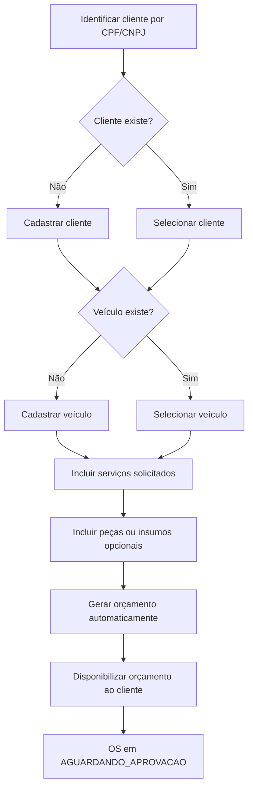
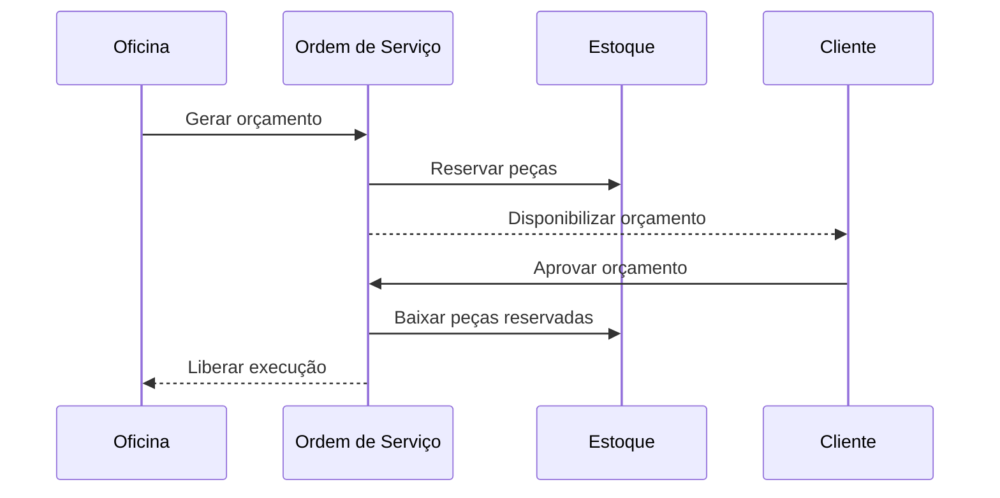
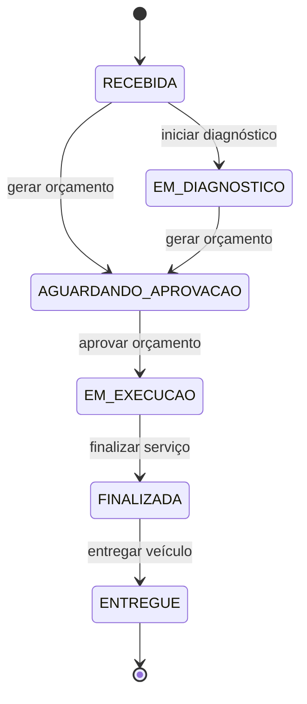

# Documentação DDD - AutoCare Hub

## Visão do domínio

O AutoCare Hub atua no domínio de gestão operacional de oficinas mecânicas. O núcleo do domínio é o atendimento de um veículo, desde a identificação do cliente até a entrega final, passando por diagnóstico, orçamento, aprovação, execução dos serviços e consumo de peças ou insumos.

O projeto continua sendo um monolito em camadas, como permitido pelo Tech Challenge, mas organiza o código para proteger a linguagem de negócio:

- `domain`: entidades, value objects, enums, exceções e regras do domínio.
- `application`: casos de uso, serviços de aplicação, DTOs e portas de repositório.
- `infrastructure`: persistência, segurança, configurações e integrações técnicas.
- `interfaces`: controllers REST, requests, responses e contrato OpenAPI.

Os nomes técnicos principais permanecem em inglês por estabilidade do código e compatibilidade com o contrato atual, mas a documentação abaixo explicita a linguagem ubíqua em português usada pelo domínio.

## Linguagem ubíqua

| Termo de negócio | Nome técnico no código | Definição |
| --- | --- | --- |
| Cliente | `Customer` | Pessoa física ou jurídica atendida pela oficina, identificada por CPF ou CNPJ. |
| Documento | `Document` | CPF ou CNPJ validado, normalizado e usado para evitar duplicidade de clientes. |
| Veículo | `Vehicle` | Veículo pertencente a um cliente, identificado por placa, marca, modelo e ano. |
| Placa | `Plate` | Identificador do veículo nos formatos brasileiros antigo e Mercosul. |
| Ordem de Serviço | `ServiceOrder` | Registro central do atendimento da oficina para um cliente e um veículo. |
| Status da OS | `ServiceOrderStatus` | Estado controlado da Ordem de Serviço: recebida, em diagnóstico, aguardando aprovação, em execução, finalizada ou entregue. |
| Serviço | `WorkshopService` | Atividade executável pela oficina, com nome, descrição, preço e tempo estimado. |
| Peça/Insumo | `Part` | Item físico usado em serviço ou vendido separadamente, com preço, custo e controle de estoque. |
| Estoque | `Part` + `StockMovement` | Quantidade total, reservada e disponível de peças ou insumos. |
| Movimentação de estoque | `StockMovement` | Registro de entrada, saída, venda, reserva confirmada ou ajuste de estoque. |
| Orçamento | `Budget` | Cálculo financeiro gerado a partir de serviços e peças vinculados à OS. |
| Item de orçamento | `BudgetItem` | Item calculável do orçamento, representando serviço, peça ou insumo. |
| Aprovação | métodos de `ServiceOrder` | Aceite do cliente para executar o orçamento. |
| Baixa de estoque | métodos de `Part` | Redução definitiva do estoque após aprovação do orçamento ou saída registrada. |

## Entidades

- `Customer`: mantém identidade do cliente, documento, contato, endereço e status.
- `Vehicle`: mantém placa, marca, modelo, ano, quilometragem, status e vínculo com o cliente.
- `WorkshopService`: representa um serviço oferecido pela oficina.
- `Part`: representa peça ou insumo com preço, custo, estoque, reserva e estoque mínimo.
- `ServiceOrder`: agregado principal do fluxo de atendimento.
- `StockMovement`: registra movimentações de estoque para rastreabilidade.
- `User`: representa conta autenticável e autorizável.
- `DemoLead`: representa interessado em parceria capturado pela área pública.

## Value Objects

- `Document`: valida e normaliza CPF/CNPJ.
- `Plate`: valida e normaliza placa de veículo.
- `Money`: representa valor monetário não negativo e centraliza operações financeiras básicas.
- `Address`: estrutura endereço do cliente.
- `BudgetItem`: item imutável de cálculo do orçamento.

O conceito de período de execução ainda não é um value object próprio. No MVP, ele é representado por datas da OS, como início e finalização. Se a regra de prazo, SLA ou tempo médio crescer, a recomendação é criar um value object `ExecutionPeriod`.

## Agregados

### Ordem de Serviço

Raiz do agregado: `ServiceOrder`.

Responsabilidades:

- garantir que uma OS sempre tenha cliente e veículo;
- controlar serviços solicitados e peças vinculadas;
- gerar orçamento com totais de serviços, peças e total geral;
- controlar status e transições válidas;
- registrar datas relevantes do ciclo de atendimento;
- impedir alterações de itens quando a OS já está em fase que não permite edição.

Invariantes principais:

- uma OS não pode existir sem cliente;
- uma OS não pode existir sem veículo;
- uma OS precisa de ao menos um serviço solicitado;
- itens não podem ser alterados depois da geração do orçamento;
- execução só pode iniciar após orçamento aprovado;
- finalização só pode ocorrer após execução;
- entrega só pode ocorrer após finalização.

### Peça/Insumo e Estoque

Raiz do agregado: `Part`.

Responsabilidades:

- controlar estoque total;
- controlar quantidade reservada;
- calcular estoque disponível;
- impedir estoque negativo;
- impedir reserva acima da disponibilidade;
- confirmar reserva como baixa definitiva;
- liberar reserva quando orçamento for recusado ou expirado.

### Cliente e Veículo

`Customer` e `Vehicle` possuem identidade própria. O veículo sempre pertence a um cliente e a placa é tratada como identificador único do veículo.

## Eventos de domínio

No MVP, os eventos abaixo são usados como linguagem de modelagem, testes e documentação. O projeto ainda não implementa um event store ou dispatcher de eventos, mas os estados, timestamps e regras de domínio refletem estes acontecimentos.

- `ClienteIdentificado`
- `VeiculoCadastrado`
- `OrdemServicoCriada`
- `ServicoIncluidoNaOrdem`
- `PecaIncluidaNaOrdem`
- `OrcamentoGerado`
- `OrcamentoEnviado`
- `OrcamentoAprovado`
- `OrdemServicoEmExecucao`
- `OrdemServicoFinalizada`
- `VeiculoEntregue`
- `EstoqueAtualizado`
- `PecaBaixadaDoEstoque`

Eventos complementares usados no Event Storming:

- `ClienteCadastrado`
- `DiagnosticoIniciado`
- `PecaReservada`
- `ReservaPecaLiberada`
- `EstoqueInsuficienteIdentificado`

## Regras de negócio

- CPF/CNPJ inválido não pode ser salvo.
- Placa inválida não pode ser salva.
- Cliente não pode ser duplicado por diferença de formatação do documento.
- Veículo exige cliente vinculado.
- Veículo não pode ser criado com placa inválida.
- Ordem de Serviço exige cliente, veículo e ao menos um serviço.
- Orçamento é calculado automaticamente a partir de serviços e peças da OS.
- Após a geração do orçamento, a OS vai para `AGUARDANDO_APROVACAO`.
- Orçamento só pode ser aprovado se já foi gerado.
- Ao aprovar o orçamento, peças reservadas são baixadas do estoque.
- Execução só inicia após aprovação.
- OS em execução pode ser finalizada.
- OS finalizada pode ser entregue.
- Transições inválidas de status geram exceção de domínio.
- Estoque não pode ficar negativo.
- Baixa de estoque não pode exceder a quantidade disponível ou reservada, conforme o fluxo.

## Bounded Contexts sugeridos

### Atendimento de Oficina

Contexto principal do MVP. Contém Ordem de Serviço, status da OS, diagnóstico, serviços solicitados, peças vinculadas, orçamento e acompanhamento pelo cliente.

### Cadastro de Clientes e Veículos

Contexto de apoio responsável por identificar clientes por CPF/CNPJ, manter seus dados básicos e vincular veículos por placa.

### Catálogo de Serviços

Contexto de apoio responsável pelos serviços que a oficina oferece e que podem ser incluídos em uma Ordem de Serviço.

### Gestão de Peças e Estoque

Contexto de apoio responsável por peças, insumos, reservas, entradas, saídas, baixa e consulta de baixo estoque.

### Orçamentos e Aprovação

Contexto fortemente ligado ao Atendimento de Oficina. Controla geração automática do orçamento, disponibilização ao cliente, aprovação e liberação da OS para execução.

### Identidade e Acesso

Contexto genérico responsável por autenticação JWT, usuários, perfis e autorização das APIs administrativas.

## Fluxo de criação da OS

## Fluxo de aprovação de orçamento

## Diagrama de estados da OS

