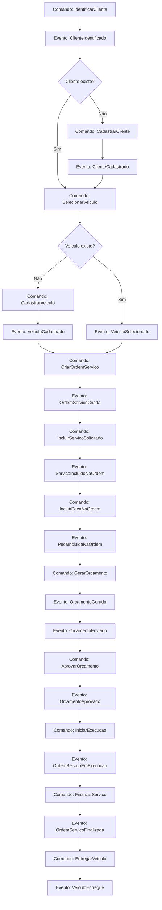
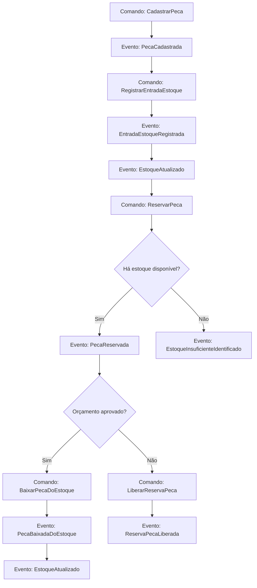
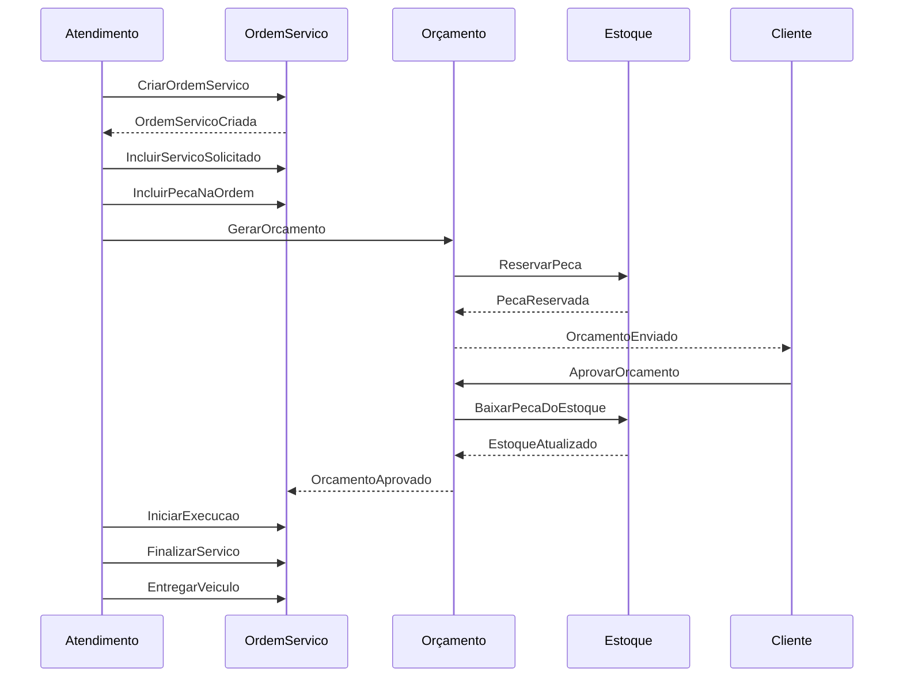

# Event Storming - AutoCare Hub

Este documento descreve os fluxos de Event Storming exigidos para o MVP: criação/acompanhamento da Ordem de Serviço e
gestão de peças e insumos.

## Fluxo 1 - Criação e Acompanhamento da Ordem de Serviço

### Atores

- Cliente final
- Atendente da oficina
- Mecânico
- Admin da oficina
- Sistema AutoCare Hub

### Comandos

- IdentificarCliente
- CadastrarCliente
- ConfirmarDadosCliente
- CadastrarVeiculo
- SelecionarVeiculo
- CriarOrdemServico
- IniciarDiagnostico
- IncluirServicoSolicitado
- IncluirPecaNaOrdem
- GerarOrcamento
- EnviarOrcamento
- AprovarOrcamento
- RecusarOrcamento
- IniciarExecucao
- FinalizarServico
- EntregarVeiculo
- ConsultarAcompanhamentoOS

### Eventos de Domínio

- ClienteIdentificado
- ClienteCadastrado
- VeiculoCadastrado
- VeiculoSelecionado
- OrdemServicoCriada
- DiagnosticoIniciado
- ServicoIncluidoNaOrdem
- PecaIncluidaNaOrdem
- OrcamentoGerado
- OrcamentoEnviado
- OrcamentoAprovado
- OrcamentoRecusado
- OrdemServicoEmExecucao
- OrdemServicoFinalizada
- VeiculoEntregue
- AcompanhamentoOSConsultado

### Agregados Envolvidos

- Customer
- Vehicle
- ServiceOrder
- WorkshopService
- Part
- Budget

### Políticas

- Se o cliente não existir, deve ser cadastrado antes da OS.
- Se o veículo não existir, deve ser cadastrado e vinculado ao cliente.
- Se o orçamento for gerado, a OS deve ir para `AGUARDANDO_APROVACAO`.
- Se o orçamento for aprovado, a OS pode iniciar execução.
- Se houver peças no orçamento, elas devem ser reservadas antes da aprovação.
- Se a OS não pertence ao cliente autenticado, a consulta deve ser negada.

### Sistemas Externos

No MVP não há integração externa real. Possíveis sistemas futuros:

- gateway de pagamento;
- envio de e-mail;
- WhatsApp/SMS;
- catálogo externo de peças.

### Regras de Negócio

- OS deve ter cliente e veículo.
- OS deve ter ao menos um serviço solicitado.
- Documento deve ser CPF/CNPJ válido.
- Placa deve estar em formato brasileiro antigo ou Mercosul.
- Orçamento deve calcular total de serviços, peças e total geral.
- Execução não pode iniciar sem aprovação.
- OS finalizada não pode voltar para diagnóstico.
- Itens da OS não podem ser alterados após geração do orçamento.

### Possíveis Exceções

- ClienteNaoEncontrado
- VeiculoNaoEncontrado
- VeiculoNaoPertenceAoCliente
- DocumentoInvalido
- PlacaInvalida
- ServicoInativo
- PecaInativa
- EstoqueInsuficiente
- TransicaoStatusInvalida
- AcessoNaoAutorizado

### Fluxo Principal

1. Atendente identifica cliente por CPF/CNPJ.
2. Sistema emite `ClienteIdentificado`.
3. Se necessário, atendente cadastra cliente.
4. Sistema emite `ClienteCadastrado`.
5. Atendente seleciona ou cadastra veículo.
6. Sistema emite `VeiculoSelecionado` ou `VeiculoCadastrado`.
7. Atendente cria OS com defeitos percebidos.
8. Sistema emite `OrdemServicoCriada`.
9. Serviços e peças são incluídos.
10. Sistema emite `ServicoIncluidoNaOrdem` e `PecaIncluidaNaOrdem`.
11. Orçamento é gerado.
12. Sistema emite `OrcamentoGerado` e `OrcamentoEnviado`.
13. Cliente aprova.
14. Sistema emite `OrcamentoAprovado`.
15. Oficina inicia execução.
16. Sistema emite `OrdemServicoEmExecucao`.
17. Serviço é finalizado e veículo entregue.
18. Sistema emite `OrdemServicoFinalizada` e `VeiculoEntregue`.

### Fluxos Alternativos

- Cliente não existe: cadastrar cliente antes da OS.
- Veículo não existe: cadastrar veículo antes da OS.
- Cliente recusa orçamento: manter OS sem execução e liberar peças reservadas.
- Estoque insuficiente: impedir inclusão/reserva da peça e alertar atendente.
- Cliente consulta OS de outro cliente: retornar acesso negado.

### Diagrama

## Fluxo 2 - Gestão de Peças e Insumos

### Atores

- Admin da oficina
- Funcionário autorizado
- Sistema AutoCare Hub

### Comandos

- CadastrarPeca
- EditarPeca
- RegistrarEntradaEstoque
- RegistrarSaidaEstoque
- VenderPecaIsolada
- ReservarPeca
- LiberarReservaPeca
- BaixarPecaDoEstoque
- ConfigurarPrazoReserva
- ConsultarEstoqueBaixo

### Eventos de Domínio

- PecaCadastrada
- PecaAtualizada
- EstoqueAtualizado
- EntradaEstoqueRegistrada
- SaidaEstoqueRegistrada
- VendaPecaRegistrada
- PecaReservada
- ReservaPecaLiberada
- PecaBaixadaDoEstoque
- PrazoReservaConfigurado
- EstoqueBaixoIdentificado
- EstoqueInsuficienteIdentificado

### Agregados Envolvidos

- Part
- StockMovement
- ServiceOrder
- Budget

### Políticas

- Quantidade não pode ser negativa.
- Preço não pode ser negativo.
- Estoque disponível considera estoque total menos reservado.
- Peça vinculada a orçamento deve ser reservada, não baixada imediatamente.
- Peça é baixada quando orçamento é aprovado ou venda é registrada.
- Reserva deve ser liberada se orçamento for recusado ou expirar.
- Estoque baixo deve ser identificado quando disponibilidade for menor ou igual ao estoque mínimo.

### Sistemas Externos

Não há sistemas externos no MVP. Futuramente podem existir fornecedores, marketplaces e sistemas fiscais.

### Regras de Negócio

- Nome, SKU, categoria, marca e preço de venda são obrigatórios.
- Estoque mínimo não pode ser negativo.
- Baixa maior que estoque disponível deve ser bloqueada.
- Reserva maior que disponibilidade deve ser bloqueada.
- Confirmação de reserva reduz estoque total e reserva.
- Liberação de reserva reduz apenas a quantidade reservada.

### Possíveis Exceções

- PecaNaoEncontrada
- PecaInativa
- QuantidadeInvalida
- PrecoInvalido
- EstoqueInsuficiente
- ReservaInexistente
- PrazoReservaInvalido

### Fluxo Principal

1. Admin cadastra peça.
2. Sistema emite `PecaCadastrada`.
3. Funcionário registra entrada.
4. Sistema emite `EntradaEstoqueRegistrada` e `EstoqueAtualizado`.
5. Peça é incluída em orçamento.
6. Sistema tenta reservar.
7. Se houver disponibilidade, emite `PecaReservada`.
8. Cliente aprova orçamento.
9. Sistema emite `PecaBaixadaDoEstoque`.
10. Sistema atualiza quantidade disponível.

### Fluxos Alternativos

- Estoque insuficiente: emitir `EstoqueInsuficienteIdentificado` e impedir reserva/baixa.
- Orçamento recusado: liberar reserva.
- Venda isolada: baixar estoque sem OS.
- Entrada de estoque: aumentar quantidade total.
- Saída administrativa: reduzir quantidade, respeitando disponibilidade.

### Diagrama

## Visao Integrada dos Eventos

